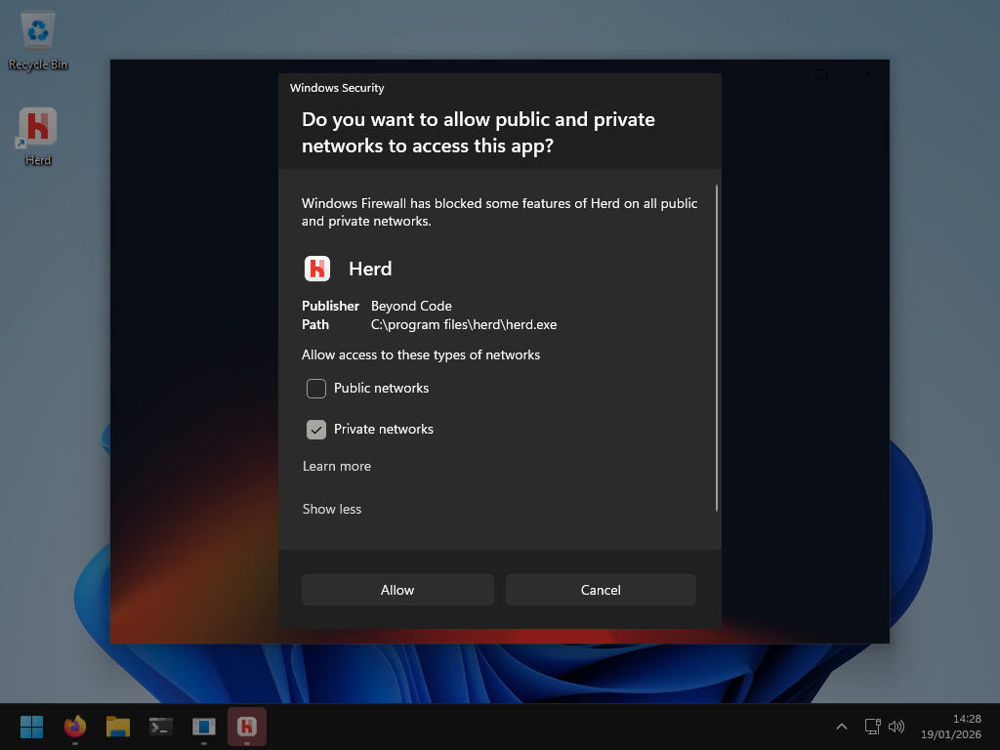
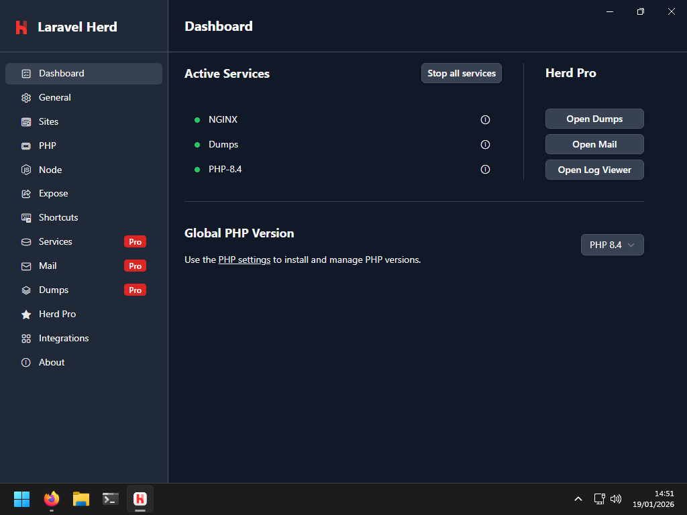
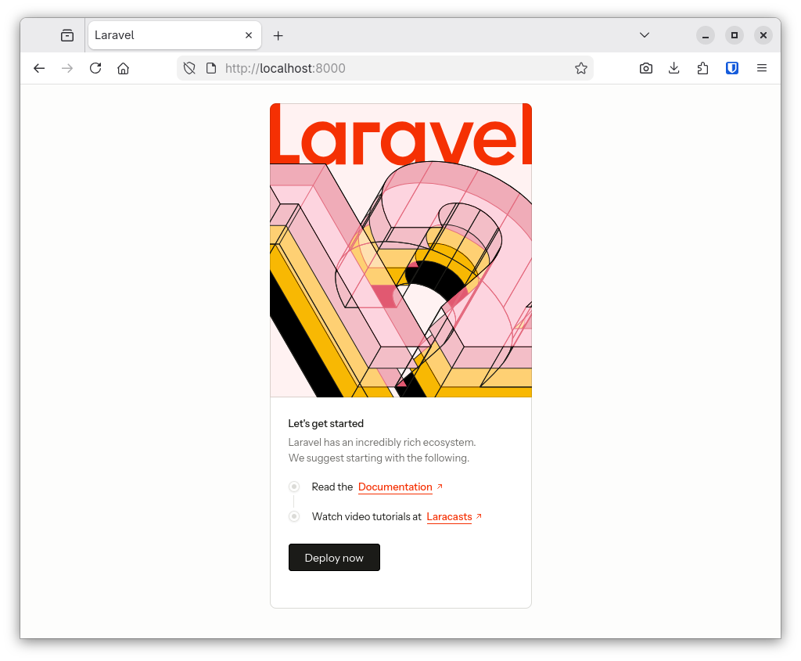

# PHP, Composer et Laravel - Mini-projet

L. Delafontaine, avec l'aide de
[GitHub Copilot](https://github.com/features/copilot).

Ce travail est sous licence [CC BY-SA 4.0][licence].

> [!TIP]
>
> Trouvez d'autres informations relatives à ce contenu dans le
> [contenu parent](../README.md).

## Table des matières

- [Table des matières](#table-des-matières)
- [Objectifs](#objectifs)
- [Avertissements et alertes](#avertissements-et-alertes)
- [Mettre en place l'environnement de développement](#mettre-en-place-lenvironnement-de-développement)
  - [Installer et configurer Laravel Herd](#installer-et-configurer-laravel-herd)
  - [Installer et configurer Visual Studio Code](#installer-et-configurer-visual-studio-code)
  - [Configurer Git et GitHub](#configurer-git-et-github)
  - [Valider l'installation et la configuration de l'environnement de développement](#valider-linstallation-et-la-configuration-de-lenvironnement-de-développement)
- [Démarrer le mini-projet](#démarrer-le-mini-projet)
  - [Initialiser le projet Laravel](#initialiser-le-projet-laravel)
  - [Démarrer le serveur de développement Laravel](#démarrer-le-serveur-de-développement-laravel)
  - [Naviguer dans la structure du projet](#naviguer-dans-la-structure-du-projet)
  - [Effectuer une modification simple](#effectuer-une-modification-simple)
  - [Initialiser le dépôt Git et le lier à GitHub](#initialiser-le-dépôt-git-et-le-lier-à-github)
  - [Commencer le développement depuis un dépôt GitHub](#commencer-le-développement-depuis-un-dépôt-github)
  - [Mettre à jour la documentation pour lancer le projet](#mettre-à-jour-la-documentation-pour-lancer-le-projet)
- [Conclusion](#conclusion)
- [Solution](#solution)

## Objectifs

Bienvenue dans la première session du mini-projet qui va vous accompagner durant
toute la durée du cours _"Développement de produit média (DévProdMéd)"_ !

Lors du cours
_"[Programmation serveur 1 (ProgServ1)](https://github.com/heig-vd-progserv-course/heig-vd-progserv1-course)"_,
vous avez appris les bases de PHP et de la programmation serveur à l'aide d'un
mini-projet pour créer un gestionnaire d'animaux de compagnie.

Lors du cours
_"[Programmation serveur 2 (ProgServ2)](https://github.com/heig-vd-progserv-course/heig-vd-progserv2-course)"_,
vous avez approfondi vos connaissances en programmation serveur à l'aide d'un
projet libre.

Dans ce cours _"Développement de produit média (DévProdMéd)"_, vous allez créer
une application web complète en utilisant le framework Laravel. Le mini-projet
reprendra les concepts étudiés en _"Programmation serveur 1 (ProgServ1)"_ et
_"Programmation serveur 2 (ProgServ2)"_, mais cette fois-ci en utilisant Laravel
pour structurer et simplifier le développement.

Le mini-projet du cours est un petit réseau social. Vous allez créer une
application web qui permettra aux personnes d'effectuer les actions suivantes
sur celle-ci :

- Se créer un compte sur la plateforme.
- Se connecter et se déconnecter.
- Modifier son profil utilisateur.
- Créer et partager des posts avec un titre et une description.
- Interagir avec les posts des autres personnes qui utilisent l'application
  (aimer un post).

Si le temps le permet, des fonctionnalités supplémentaires pourront être
ajoutées, comme la possibilité de rajouter une ou des images aux posts, de
commenter les posts ou de suivre d'autres utilisateur.trices.

L'objectif est de construire une application web complète pour remplir ces
fonctionnalités en utilisant Laravel.

Nous construirons cette application web ensemble durant la durée du cours en
plusieurs étapes. Dans cette séance, nous allons mettre en place l'environnement
de développement et initialiser le projet PHP pour le mini-projet.

De façon plus concise, à l'issue de cette séance, les personnes qui étudient
devraient avoir pu :

- Mettre en place un environnement de développement PHP pour Laravel.
- Initialiser un projet Laravel.
- Lancer le serveur de développement Laravel.
- Explorer la structure d'un projet Laravel.
- Partager le code source du projet sur GitHub.

## Avertissements et alertes

En lisant les contenus préparés pour les sessions de mini-projet, vous trouverez
peut-être ce que l'on appelle des _"avertissements"_ ou des _"alertes"_.

Elles se présentent comme suit :

> [!NOTE]
>
> Hé ! Je suis une note ! Merci de m'avoir lue !

Elles sont là pour mettre en évidence des informations importantes dont vous
devez tenir compte.

Voici les différents types d'avertissements que vous pourriez trouver et leur
signification :

> [!NOTE]
>
> Met en évidence les informations que vous devriez prendre en compte.

> [!TIP]
>
> Informations facultatives pour vous aider à mieux réussir avec des conseils,
> des astuces, ou encore des suggestions.

> [!IMPORTANT]
>
> Informations cruciales nécessaires à la réussite des actions que vous devriez
> effectuer.

> [!WARNING]
>
> Contenu critique exigeant votre attention immédiate en raison des risques
> potentiels.

> [!CAUTION]
>
> Conséquences négatives potentielles d'une action que vous devriez éviter.

Nous pourrions vous rediriger vers de la documentation officielle ou des
ressources externes à suivre pour configurer votre environnement ou en savoir
plus sur un sujet spécifique.

Ces ressources externes sont là pour vous aider. Nous vous redirigeons vers
elles pour éviter de répéter ce qui est déjà bien maintenu et expliqué ailleurs.

Ce que vous voyez et faites dans une session actuelle peut être utilisé dans une
session future.

C'est pourquoi il est important de suivre les étapes et de comprendre ce que
vous faites. Vous devez conserver le code que vous écrivez pour les sessions
futures.

Cependant, si _quoi que ce soit_ n'est pas clair, ne fonctionne pas ou nécessite
une amélioration, n'hésitez pas à poser des questions ou nous le signaler.

C'est parti !

## Mettre en place l'environnement de développement

Laravel se reposant sur PHP, tout ce que vous avez appris dans les cours de
_"Programmation serveur 1 (ProgServ1)"_ et _"Programmation serveur 2
(ProgServ2)"_ reste valable.

Il est donc toujours nécessaire d'avoir un environnement de développement PHP
fonctionnel comportant, entre autres :

- Un serveur web (Apache, Nginx, ou le serveur de développement PHP intégré).
- Un interpréteur PHP (version 8.0 ou supérieure recommandée).
- Une base de données (MySQL, PostgreSQL, SQLite, etc.).

[MAMP](https://www.mamp.info/en/) (macOS/Windows) pourrait être une bonne
solution mais nous allons profiter de ce que nous offre Laravel pour simplifier
la configuration.

> [!NOTE]
>
> Si vous souhaitez désinstaller un environnement PHP existant (comme XAMPP,
> MAMP, WAMP, etc.), assurez-vous de sauvegarder vos projets et bases de données
> avant de procéder à la désinstallation.
>
> Vous pouvez utiliser MAMP pour ce cours, mais nous recommandons d'utiliser
> Laravel Herd pour simplifier la configuration pour Laravel.

De plus, nous allons utiliser GitHub Classroom pour gérer le code source du
mini-projet. Cela sera l'occasion de prendre encore plus l'habitude d'utiliser
Git et GitHub dans un contexte de développement professionnel.

### Installer et configurer Laravel Herd

Laravel propose des instructions pour installer les dépendances nécessaires à
développer des applications Laravel dans sa documentation officielle :
<https://laravel.com/docs/12.x/installation>.

Cependant, pour simplifier la configuration de l'environnement de développement,
nous allons utiliser [Laravel Herd](https://laravel.com/docs/12.x/herd), un
outil développé par l'équipe de Laravel pour Windows et macOS.

Laravel Herd installe et configure automatiquement PHP, Composer, et d'autres
dépendances nécessaires pour développer avec Laravel.

Suivez les instructions suivantes en fonction de votre système d'exploitation :

- [Installer et configurer Laravel Herd sur Windows](#installer-et-configurer-laravel-herd-sur-windows).
- [Installer et configurer Laravel Herd sur macOS](#installer-et-configurer-laravel-herd-sur-macos).
- [Installer et configurer Laravel Herd sur Linux](#installer-et-configurer-laravel-herd-sur-linux).

#### Installer et configurer Laravel Herd sur Windows

1. Rendez-vous sur la page de téléchargement de Laravel Herd :
   <https://herd.laravel.com/windows>.

   <details>
   <summary>Cliquer ici pour voir une capture d'écran illustrant l'étape</summary>

   

   </details>

2. Téléchargez la dernière version de Laravel Herd pour Windows.
3. Exécutez le fichier téléchargé. Laravel Herd va automatiquement s'installer.
4. Une fois l'installation terminée, ouvrez Laravel Herd.

   > **Attention**
   >
   > J'ai (Ludovic) été confronté à un problème lors de la rédaction de ce
   > contenu. J'ai dû exécuter Laravel Herd en tant qu'administrateur la
   > première fois pour que l'installation se finalise correctement.
   >
   > Par précaution, je vous recommande d'exécuter Laravel Herd en tant
   > qu'administrateur la première fois que vous l'ouvrez (clic droit sur
   > l'icône > "Exécuter en tant qu'administrateur").
   >
   > Les fois suivantes, vous pourrez l'ouvrir normalement.

5. Une alerte du pare-feu Windows peut apparaître. Assurez-vous d'autoriser
   l'accès pour que Laravel Herd puisse fonctionner correctement :

   <details>
   <summary>Cliquer ici pour voir une capture d'écran illustrant l'étape</summary>

   

   

   </details>

6. Laissez les options par défaut et n'utilisez pas "Laravel Herd Pro" :

   <details>
   <summary>Cliquer ici pour voir une capture d'écran illustrant l'étape</summary>

   

   

   

   

   </details>

7. Une fois l'installation terminée, ouvrez le tableau de bord de Laravel Herd.
   Celui-ci devrait ressembler à ceci :

   <details>
   <summary>Cliquer ici pour voir une capture d'écran illustrant l'étape</summary>

   

   </details>

Une fois l'installation terminée, vous pouvez passer à la section
[Valider l'installation de Laravel](#valider-linstallation-de-laravel).

#### Installer et configurer Laravel Herd sur macOS

1. Rendez-vous sur la page de téléchargement de Laravel Herd :
   <https://herd.laravel.com>.
2. Téléchargez la dernière version de Laravel Herd pour macOS.
3. Ouvrez le fichier téléchargé et faites glisser l'icône de Laravel Herd dans
   le dossier _"Applications"_.
4. Ouvrez Laravel Herd depuis le dossier _"Applications"_.

Une fois l'installation terminée, vous pouvez passer à la section
[Valider l'installation de Laravel](#valider-linstallation-de-laravel).

#### Installer et configurer Laravel Herd sur Linux

Laravel Herd n'est pas disponible pour Linux. Cependant, vous pouvez suivre les
instructions officielles de Laravel pour installer PHP, Composer, et les autres
dépendances nécessaires à Laravel sur Linux
:<https://laravel.com/docs/12.x/installation>.

Une fois l'installation terminée, vous pouvez passer à la section
[Valider l'installation de Laravel](#valider-linstallation-de-laravel).

#### Valider l'installation de Laravel

Maintenant que Laravel (Herd) est installé, nous allons vérifier que tout
fonctionne correctement.

Ouvrez un terminal (_"Invite de commandes"_, _"PowerShell"_, ou _"Windows
Terminal"_ sous Windows ; _"Terminal"_ sous macOS ou Linux).

Dans le terminal, exécutez la commande suivante pour vérifier que PHP est
installé correctement :

```bash
php --version
```

Le résultat devrait ressembler à ceci :

```text
PHP 8.4.16 (cli) (built: ...)
```

Cela indique que PHP est installé et prêt à être utilisé.

Ensuite, vérifiez que Composer est installé correctement en exécutant la
commande suivante :

```bash
composer --version
```

Le résultat devrait ressembler à ceci :

```text
Composer version 2.9.1 ...
```

Cela indique que Composer est installé et prêt à être utilisé.

Dans le terminal, exécutez la commande suivante pour vérifier que Laravel est
installé correctement :

```bash
laravel --version
```

Le résultat devrait ressembler à ceci :

```text
Laravel Installer 5.23.0
```

Cela indique que l'outil de ligne de commande Laravel est installé et prêt à
être utilisé.

Dans le terminal, exécutez la commande suivante pour vérifier que npm est
installé correctement :

```bash
npm --version
```

Le résultat devrait ressembler à ceci :

```text
11.6.2
```

Cela indique que npm est installé et prêt à être utilisé.

### Installer et configurer Visual Studio Code

#### Installer Visual Studio Code

Si vous n'avez pas encore installé Visual Studio Code, suivez les instructions
officielles pour l'installer sur votre système d'exploitation :
<https://code.visualstudio.com/docs/setup/setup-overview>.

#### Installer l'extension Laravel pour Visual Studio Code

Ensuite, installez l'extension
[Laravel for Visual Studio Code](https://marketplace.visualstudio.com/items?itemName=laravel.vscode-laravel)
pour améliorer votre expérience de développement avec Laravel.

#### Installer l'extension Database Client pour Visual Studio Code

Ensuite, installez l'extension
[Database Client](https://marketplace.visualstudio.com/items?itemName=cweijan.vscode-database-client2)
pour gérer les bases de données directement depuis Visual Studio Code.

#### Choisir un dossier pour le mini-projet

Choisissez un dossier sur votre système où vous souhaitez créer le projet
Laravel pour le mini-projet. Vous pouvez créer un dossier nommé
`devprodmed-mini-projet` dans votre dossier `Documents` par exemple.

> [!IMPORTANT]
>
> Utilisez le nom `devprodmed-mini-projet` pour le dossier du mini-projet. Ce
> nom de dossier sera utilisé dans les prochaines sections.

Retenez l'emplacement de ce dossier, car vous en aurez besoin tout au long du
cours pour réaliser le mini-projet.

#### Ouvrir un terminal intégré dans Visual Studio Code

Afin de ne pas avoir à basculer entre plusieurs applications, nous allons
utiliser le terminal intégré de Visual Studio Code.

1. Ouvrez Visual Studio Code.
2. Ouvrez le terminal intégré en allant dans le menu _"Terminal"_ > _"New
   Terminal"_.
3. Le terminal devrait s'ouvrir en bas de la fenêtre de Visual Studio Code.

Cela vous permettra d'exécuter des commandes directement depuis Visual Studio
sans avoir à ouvrir une application de terminal séparée.

### Configurer Git et GitHub

#### Valider que Git est installé

Avant de continuer, assurez-vous que Git est installé et fonctionne
correctement.

Dans le terminal intégré de Visual Studio Code, exécutez la commande suivante
pour vérifier que Git est installé correctement :

```bash
git --version
```

Le résultat devrait ressembler à ceci :

```text
git version 2.52.0
```

Cela indique que Git est installé et prêt à être utilisé.

#### Accéder au GitHub Classroom

[GitHub Classroom](https://classroom.github.com/) est un outil qui permet de
gérer des dépôts GitHub pour des cours.

Il sera utilisé pour permettre au corps enseignant de visualiser le travail
effectué dans le mini-projet.

Il est nécessaire de rejoindre le GitHub Classroom pour accéder au dépôt du
mini-projet.

1. Accédez au lien suivant pour rejoindre le GitHub Classroom du cours :
   <https://classroom.github.com/a/qKBHBNo4>.
2. Si vous n'êtes pas encore connecté.e à GitHub, connectez-vous avec votre
   compte GitHub.
3. Choisissez votre personne dans la liste pour rejoindre le GitHub Classroom.
4. Un dépôt GitHub privé sera créé pour vous, nommé
   `devprodmed-mini-projet-<github-username>`.

Vous devriez maintenant avoir accès à votre dépôt GitHub privé pour le
mini-projet sur une page similaire à celle-ci :


#### Accepter l'invitation à rejoindre l'organisation GitHub Classroom du cours

Lorsque vous rejoignez le GitHub Classroom, une invitation est envoyée à votre
compte GitHub pour rejoindre l'organisation GitHub du cours.

Acceptez-la en vous accédant au mail associé à votre compte GitHub.

Cela vous permettra de faire part de l'organisation GitHub Classroom du cours.

### Valider l'installation et la configuration de l'environnement de développement

- [x] PHP est installé et fonctionne correctement.
- [x] Composer est installé et fonctionne correctement.
- [x] Laravel est installé et fonctionne correctement.
- [x] npm est installé et fonctionne correctement.
- [x] MySQL est installé et fonctionne correctement.
- [x] Visual Studio Code est installé et fonctionne correctement.
- [x] L'extension Laravel pour Visual Studio Code est installée.
- [x] L'extension Database Client pour Visual Studio Code est installée.
- [x] Le dossier `devprodmed-mini-projet` a été ouvert dans Visual Studio Code.
- [x] Le terminal intégré de Visual Studio Code est fonctionnel.
- [x] Git est installé et fonctionne correctement.
- [x] Vous avez accès au dépôt GitHub privé pour le mini-projet.

## Démarrer le mini-projet

### Initialiser le projet Laravel

A présent que l'environnement de développement est prêt, nous allons initialiser
le mini-projet avec Laravel.

Après avoir ouvert le dossier de votre mini-projet dans Visual Studio Code,
ouvrez le terminal intégré si ce n'est pas déjà fait.

Ceci devrait automatiquement ouvrir l'emplacement du dossier du mini-projet dans
le terminal intégré.

Nous allons remonter d'un niveau pour pouvoir créer le projet Laravel dans le
dossier du mini-projet:

```bash
cd ..
```

Cette commande permet de naviguer dans le dossier parent du dossier actuel.

Ensuite, exécutez la commande suivante pour créer un nouveau projet Laravel dans
le dossier préalablement ouvert `devprodmed-mini-projet` :

```bash
laravel new devprodmed-mini-projet --force
```

Un menu interactif vous demande de choisir certaines options. Choisissez les
options suivantes à l'aide des flèches du clavier et appuyez sur la touche
_Entrée_ pour valider vos choix :

```text
   _                               _
  | |                             | |
  | |     __ _ _ __ __ ___   _____| |
  | |    / _` |  __/ _` \ \ / / _ \ |
  | |___| (_| | | | (_| |\ V /  __/ |
  |______\__,_|_|  \__,_| \_/ \___|_|

   WARN  A new version of the Laravel installer is available. You have version 5.24.0 installed, the latest version is 5.24.2.

 ┌ Would you like to update now? ───────────────────────────────┐
 │ ● Yes / ○ No                                                 │
 └──────────────────────────────────────────────────────────────┘

 ┌ Which starter kit would you like to install? ────────────────┐
 │ › ● None                                                     │
 │   ○ React                                                    │
 │   ○ Vue                                                      │
 │   ○ Livewire                                                 │
 └──────────────────────────────────────────────────────────────┘

 ┌ Which testing framework do you prefer? ──────────────────────┐
 │ › ● Pest                                                     │
 │   ○ PHPUnit                                                  │
 └──────────────────────────────────────────────────────────────┘

 ┌ Do you want to install Laravel Boost to improve AI assisted coding? ┐
 │ ○ Yes / ● No                                                        │
 └─────────────────────────────────────────────────────────────────────┘

 ┌ Which database will your application use? ───────────────────┐
 │ › ● SQLite                                                   │
 │   ○ MySQL                                                    │
 │   ○ MariaDB                                                  │
 │   ○ PostgreSQL                                               │
 │   ○ SQL Server                                               │
 └──────────────────────────────────────────────────────────────┘

 ┌ Would you like to run npm install and npm run build? ────────┐
 │ ● Yes / ○ No                                                 │
 └──────────────────────────────────────────────────────────────┘
```

Cette commande va créer un nouveau projet Laravel contenant la structure de base
que nous allons explorer dans une prochaine section.

### Démarrer le serveur de développement Laravel

Dans le terminal intégré de Visual Studio Code, naviguez dans le dossier du
projet Laravel que vous venez de créer :

```bash
cd devprodmed-mini-projet
```

Cette commande permet de naviguer à nouveau dans le dossier
`devprodmed-mini-projet` destiné au mini-projet.

Ensuite, exécutez la commande suivante pour démarrer le serveur de développement
Laravel :

```bash
composer run dev
```

Le serveur de développement Laravel devrait démarrer et être accessible à
l'adresse suivante : <http://localhost:8000>.

Ouvrez cette adresse dans votre navigateur web. Vous devriez voir la page
d'accueil par défaut de Laravel :



Laravel est maintenant installé et fonctionne correctement !

### Naviguer dans la structure du projet

Un projet Laravel possède une structure de dossiers et de fichiers bien définie.
Voici un aperçu de la structure de base d'un projet Laravel fraîchement créé :

```text
./
├── app/
│   ├── Http/
│   ├── Models/
│   └── Providers/
├── bootstrap/
│   ├── cache/
│   ├── app.php
│   └── providers.php
├── config/
│   ├── app.php
│   ├── auth.php
│   ├── cache.php
│   ├── database.php
│   ├── filesystems.php
│   ├── logging.php
│   ├── mail.php
│   ├── queue.php
│   ├── services.php
│   └── session.php
├── database/
│   ├── factories/
│   ├── migrations/
│   ├── seeders/
│   └── database.sqlite
├── node_modules/
│   └── ...
├── public/
│   ├── build/
│   ├── favicon.ico
│   ├── hot
│   ├── index.php
│   └── robots.txt
├── resources/
│   ├── css/
│   ├── js/
│   └── views/
├── routes/
│   ├── console.php
│   └── web.php
├── storage/
│   └── ...
├── tests/
│   └── ...
├── vendor/
│   ├── ...
│   ├── autoload.php
│   └── ...
├── artisan*
├── composer.json
├── composer.lock
├── package.json
├── package-lock.json
├── phpunit.xml
├── README.md
└── vite.config.js
```

Bien que le nombre de fichiers et dossiers puisse sembler intimidant au premier
abord, il est important de comprendre que chaque dossier a un rôle spécifique
dans le fonctionnement de l'application Laravel.

Voici une brève description des dossiers et fichiers les plus importants :

- `app/` : Contient le code source principal de l'application, y compris les
  contrôleurs, les modèles, et les fournisseurs de services.
- `bootstrap/` : Contient les fichiers de démarrage de l'application.
- `config/` : Contient les fichiers de configuration de l'application.
- `database/` : Contient les fichiers liés à la base de données. Vous y
  retrouvez la base de données SQLite créée pour le projet.
- `public/` : Contient les fichiers accessibles publiquement, y compris le point
  d'entrée de l'application (`index.php`).
- `resources/` : Contient les ressources de l'application, telles que les
  fichiers CSS, JavaScript, et les vues Blade.
- `routes/` : Contient les fichiers de définition des routes de l'application.
- `storage/` : Contient les fichiers générés par l'application, tels que les
  logs et les fichiers de cache.
- `tests/` : Contient les tests automatisés de l'application.
- `vendor/` : Contient les dépendances installées via Composer. Le fichier
  `autoload.php` est particulièrement important car il permet le chargement
  automatique des classes PHP.
- `artisan` : Le script en ligne de commande de Laravel.
- `composer.json` : Le fichier de configuration de Composer pour gérer les
  dépendances PHP.
- `package.json` : Le fichier de configuration npm pour gérer les dépendances
  JavaScript.
- `README.md` : Le fichier de documentation du projet.

Nous prendrons le temps d'explorer cette structure de projet pour mieux
comprendre comment Laravel organise le code et les ressources tout au long du
cours.

### Effectuer une modification simple

Afin de valider que tout fonctionne correctement, nous allons effectuer une
modification simple dans la vue d'accueil de Laravel.

Ouvrez le fichier `resources/views/welcome.blade.php` dans Visual Studio Code.

Modifiez le contenu de la balise `<h1>` pour qu'il affiche le texte suivant :

```html
<h1 class="mb-1 font-medium">Bienvenue dans le mini-projet DévProdMéd !</h1>
```

Enregistrez le fichier après avoir effectué la modification.

Votre navigateur web devrait automatiquement refléter la modification et
afficher le nouveau texte dans la page d'accueil de Laravel.

Essayez de changer le contenu de la balise `<p>` située sous le titre pour
valider que les modifications sont bien prises en compte avec, par exemple, le
texte suivant :

```html
<p class="mb-2 text-[#706f6c] dark:text-[#A1A09A]">
	C'est ici que commence votre nouvelle aventure avec Laravel.
</p>
```

Si tout fonctionne correctement, vous avez réussi à modifier une vue dans le
projet Laravel !

Nous étudierons plus en détail comment fonctionnent les vues avec Laravel dans
les prochaines sessions du mini-projet. Pour le moment, il n'est pas nécessaire
de revenir sur cette modification.

### Initialiser le dépôt Git et le lier à GitHub

Afin de mettre à disposition le code source du mini-projet via GitHub, nous
allons initialiser un dépôt Git local et le lier au dépôt GitHub distant que
vous avez créé précédemment via GitHub Classroom.

Nous allons initialiser le dépôt Git avec une branche par défaut nommée `main`.

Ouvrez le terminal intégré de Visual Studio Code si ce n'est pas déjà fait.

Exécutez la commande suivante pour initialiser un dépôt Git dans le dossier
courant (`devprodmed-mini-projet`) :

```bash
git init --initial-branch main
```

Cette commande initialise un dépôt Git avec une branche par défaut nommée
`main`.

Ajoutons maintenant tous les fichiers du projet Laravel au suivi de Git en
exécutant la commande suivante :

```bash
git add .
```

Cette commande ajoute tous les fichiers du dossier courant au suivi de Git.

Validons que les fichiers ont bien été ajoutés avec la commande suivante :

```bash
git status
```

Le résultat devrait ressembler à ceci :

```text
On branch main

No commits yet

Changes to be committed:
  (use "git rm --cached <file>..." to unstage)
        new file:   .editorconfig
        new file:   .env.example
        new file:   .gitattributes
        new file:   .gitignore
        new file:   README.md
        new file:   app/Http/Controllers/Controller.php
        new file:   app/Models/User.php
        new file:   app/Providers/AppServiceProvider.php
        new file:   artisan
        new file:   bootstrap/app.php
        new file:   bootstrap/cache/.gitignore
        new file:   bootstrap/providers.php
        new file:   composer.json
        new file:   composer.lock
        new file:   config/app.php
        new file:   config/auth.php
        new file:   config/cache.php
        new file:   config/database.php
        new file:   config/filesystems.php
        new file:   config/logging.php
        new file:   config/mail.php
        new file:   config/queue.php
        new file:   config/services.php
        new file:   config/session.php
        new file:   database/.gitignore
        new file:   database/factories/UserFactory.php
        new file:   database/migrations/0001_01_01_000000_create_users_table.php
        new file:   database/migrations/0001_01_01_000001_create_cache_table.php
        new file:   database/migrations/0001_01_01_000002_create_jobs_table.php
        new file:   database/seeders/DatabaseSeeder.php
        new file:   package-lock.json
        new file:   package.json
        new file:   phpunit.xml
        new file:   public/.htaccess
        new file:   public/favicon.ico
        new file:   public/index.php
        new file:   public/robots.txt
        new file:   resources/css/app.css
        new file:   resources/js/app.js
        new file:   resources/js/bootstrap.js
        new file:   resources/views/welcome.blade.php
        new file:   routes/console.php
        new file:   routes/web.php
        new file:   storage/app/.gitignore
        new file:   storage/app/private/.gitignore
        new file:   storage/app/public/.gitignore
        new file:   storage/framework/.gitignore
        new file:   storage/framework/cache/.gitignore
        new file:   storage/framework/cache/data/.gitignore
        new file:   storage/framework/sessions/.gitignore
        new file:   storage/framework/testing/.gitignore
        new file:   storage/framework/views/.gitignore
        new file:   storage/logs/.gitignore
        new file:   tests/Feature/ExampleTest.php
        new file:   tests/Pest.php
        new file:   tests/TestCase.php
        new file:   tests/Unit/ExampleTest.php
        new file:   vite.config.js
```

Le résultat devrait indiquer tous les fichiers qui sont inclus dans le suivi de
Git.

Ensuite, effectuons le premier commit du projet Laravel en exécutant la commande
suivante :

```bash
git commit -m "Initialisation du projet Laravel"
```

Cette commande crée un commit avec le message
`"Initialisation du projet Laravel"`.

Ensuite, exécutez la commande suivante pour lier le dépôt Git local au dépôt Git
GitHub distant que vous avez créé précédemment via GitHub Classroom :

```bash
git remote add origin git@github.com:heig-vd-devprodmed-course-2025-2026/devprodmed-mini-projet-<github-username>.git
```

Remplacez `<github-username>` par votre nom d'utilisateur GitHub. Communément
dans Git, `origin` est le nom par défaut donné au dépôt distant principal.

Poussez les modifications initiales vers le dépôt distant en exécutant la
commande suivante :

```bash
git push -u origin main
```

Cette commande pousse la branche `main` vers le dépôt distant `origin` et
établit un suivi entre la branche locale et la branche distante.

Vous devriez maintenant voir les fichiers du projet Laravel dans votre dépôt
GitHub privé pour le mini-projet.

Nous utiliserons Git et GitHub tout au long du mini-projet pour gérer le code
source et suivre les modifications.

### Commencer le développement depuis un dépôt GitHub

Maintenant que le code source du mini-projet est disponible sur GitHub, vous
pouvez cloner le dépôt sur n'importe quelle machine pour continuer le
développement.

Pour simuler cela, nous allons cloner le projet dans un nouveau dossier et le
configurer pour le développement.

#### Cloner le dépôt GitHub du mini-projet

Dans GitHub, récupérez l'URL SSH du dépôt GitHub privé pour le mini-projet en
cliquant sur le bouton _"Code"_ et en sélectionnant l'option _"SSH"_, comme
illustré ci-dessous :


Une fois l'URL SSH copiée, retournez dans le terminal intégré de Visual Studio
Code.

Naviguez vers le dossier parent du dossier `devprodmed-mini-projet` (nous ne
souhaitons pas cloner le dépôt à l'intérieur du dossier existant) en exécutant
la commande suivante :

```bash
cd ..
```

Clonez le dépôt GitHub du mini-projet en exécutant la commande suivante :

```bash
git clone <url-ssh-du-depot-github>
```

Remplacez `<url-ssh-du-depot-github>` par l'URL SSH que vous avez copiée
précédemment.

Cette commande clone le dépôt GitHub dans un nouveau dossier nommé
`devprodmed-mini-projet-<github-username>`.

Vous devriez retrouver un nouveau dossier nommé
`devprodmed-mini-projet-<github-username>` contenant le code source du
mini-projet dans votre système de fichiers.

Ouvrez ce dossier dans une nouvelle fenêtre Visual Studio Code.

#### Installer les dépendances

Vous remarquerez peut-être que le code source du projet Laravel diffère
légèrement de celui que vous aviez initialement créé. Cela est dû au fait que
Git ignore certains fichiers et dossiers par défaut, comme le dossiers
`node_modules/`/`vendor/` contenant les dépendances installées via npm/Composer
(respectivement), ainsi que le fichier `.env` contenant les variables
d'environnement spécifiques à chaque machine.

Lorsque vous clonez un dépôt Git, vous devez réinstaller les dépendances et
configurer les variables d'environnement pour que le projet fonctionne
correctement.

Pour cela, il est nécessaire d'installer les dépendances PHP avec Composer et
les dépendances JavaScript avec npm.

Ouvrez le terminal intégré de Visual Studio Code si ce n'est pas déjà fait. Vous
devriez arriver dans l'emplacement du dossier précédemment cloné
`devprodmed-mini-projet-<github-username>`.

Exécuter les commandes suivantes pour installer toutes les dépendances
nécessaires au projet Laravel:

```bash
npm install && npm run build

composer install
```

Les dépendances JavaScript et PHP devraient maintenant être installées
correctement et les dossiers `node_modules/` et `vendor/` devraient être
présents dans le dossier du projet.

#### Configurer les variables d'environnement

Une fois les dépendances installées, copiez le fichier `.env.example` pour créer
le fichier `.env` en exécutant la commande suivante :

```bash
cp .env.example .env
```

Ouvrez le fichier `.env` dans Visual Studio Code. Ce fichier contient les
variables d'environnement spécifiques à votre machine.

Ce fichier ne doit jamais être partagé publiquement car il peut contenir des
informations sensibles comme des mots de passe ou des clés d'API.

> [!CAUTION]
>
> Ce fichier `.env` ne doit jamais être partagé publiquement car il peut
> contenir des informations sensibles comme des mots de passe ou des clés d'API.
> Vous devez toujours garder ce fichier privé et sécurisé.

C'est la raison pour laquelle il est ignoré par Git via le fichier `.gitignore`
et qu'il est nécessaire de le créer manuellement à partir du fichier
`.env.example`. Une fois le fichier d'exemple copié, vous pouvez modifier les
variables d'environnement selon vos besoins.

Générez une clé d'application Laravel en exécutant la commande suivante dans le
terminal intégré :

```bash
php artisan key:generate
```

Cette commande génère une clé unique pour l'application Laravel et la met à jour
dans le fichier `.env` dans la variable `APP_KEY`.

Cette clé est utilisée par Laravel pour sécuriser les sessions et autres données
sensibles. La documentation officielle de Laravel explique plus en détail le
rôle de cette clé : <https://laravel.com/docs/12.x/encryption#configuration>.

Nous reviendrons sur ces notions plus tard dans le cours mais pour le moment, il
suffit de savoir qu'il est nécessaire d'effectuer ces étapes pour que
l'application Laravel fonctionne correctement.

#### Créer la base de données SQLite

Finalement, il est nécessaire de créer la base de données SQLite pour le projet
avec la commande suivante :

```bash
php artisan migrate
```

Cette commande crée automatiquement pour nous la base de données et ses tables
associées.

Un menu interactif vous demande de choisir certaines options. Choisissez les
options suivantes à l'aide des flèches du clavier et appuyez sur la touche
_Entrée_ pour valider vos choix :

```text
   WARN  The SQLite database configured for this application does not exist: database/database.sqlite.

 ┌ Would you like to create it? ────────────────────────────────┐
 │ ● Yes / ○ No                                                 │
 └──────────────────────────────────────────────────────────────┘
```

Différentes migrations devraient s'exécuter et créer les tables nécessaires dans
la base de données SQLite :

```text

   INFO  Preparing database.

  Creating migration table ......................... 7.46ms DONE

   INFO  Running migrations.

  0001_01_01_000000_create_users_table ............. 17.87ms DONE
  0001_01_01_000001_create_cache_table ............. 11.70ms DONE
  0001_01_01_000002_create_jobs_table .............. 15.33ms DONE
```

Nous reviendrons sur ces notions plus tard dans le cours mais pour le moment, il
suffit de savoir qu'il est nécessaire d'effectuer ces étapes pour que
l'application Laravel fonctionne correctement et crée la base de données.

#### Vérifier que tout fonctionne correctement

Démarrez le serveur de développement Laravel en exécutant la commande suivante
dans le terminal intégré :

```bash
composer run dev
```

Ouvrez l'adresse <http://localhost:8000> dans votre navigateur web. Vous

Vous devriez retrouver le même résultat que précédemment, avec la page d'accueil
de Laravel affichant le texte modifié.

Bravo ! Vous avez réussi à cloner le dépôt GitHub du mini-projet, installer les
dépendances, configurer les variables d'environnement, et créer la base de
données.

N'importe utilisant Git et GitHub peut désormais cloner le projet et le
configurer pour le développement en suivant les mêmes étapes.

### Mettre à jour la documentation pour lancer le projet

Afin de garder une trace des étapes nécessaires pour cloner et configurer le
projet Laravel, nous allons mettre à jour le fichier `README.md` du dépôt GitHub
avec les instructions que nous venons de suivre.

Pour cela, nous allons utiliser diverses fonctionnalité de Git et GitHub pour
gérer cette tâche de développement.

#### Créer une issue GitHub pour cette tâche

Afin de prendre en main un workflow Git et GitHub adapté au développement
professionnel, nous allons commencer par créer une _issue_ GitHub dans le dépôt
du mini-projet.

Bien que son nom puisse prêter à confusion, une issue peut aussi être utilisée
pour décrire une nouvelle fonctionnalité à implémenter ou encore une tâche à
réaliser :

1. Accédez à votre dépôt GitHub privé pour le mini-projet.
2. Cliquez sur l'onglet _"Issues"_.
3. Cliquez sur le bouton _"New issue"_.
4. Donnez le titre suivant à l'issue : _"Ajouter les instructions de
   développement"_. Nous vous recommandons de toujours commencer le titre d'une
   issue par un verbe d'action à l'infinitif. Cela permet de décrire
   explicitement ce qui doit être fait.
5. Une description peut être ajoutée pour donner plus de contexte, mais ce n'est
   pas obligatoire ici car l'issue est assez explicite.
6. Cliquez sur le bouton _"Submit new issue"_ pour créer l'issue.

Ceci crée une nouvelle issue dans le dépôt GitHub du mini-projet. Elle permettra
de suivre l'avancement de cette tâche de développement.

Pensez aux issues comme à des tickets de travail. Utilisez-les pour suivre les
tâches, les fonctionnalités, les bugs, et vous vider la tête pour ne pas avoir à
tout retenir.

#### Créer une branche Git depuis l'issue

Une branche permet de travailler sur une fonctionnalité ou une correction de bug
sans affecter le code principal du projet.

GitHub permet de créer une branche directement depuis une issue dans le menu à
droite de l'issue :

1. Dans l'issue que vous venez de créer, cliquez sur le bouton _"Create
   branch"_.

   <details>
   <summary>Cliquer ici pour voir une capture d'écran illustrant l'étape</summary>

   

   </details>

2. Une modal s'ouvre pour confirmer la création de la branche. Laissez les
   options par défaut et cliquez sur le bouton _"Create branch"_ pour confirmer.
   Ceci crée automatiquement une nouvelle branche nommée comme le titre de
   l'issue. Cette branche est créée à partir de la branche `main`.

   <details>
   <summary>Cliquer ici pour voir une capture d'écran illustrant l'étape</summary>

   

   </details>

3. Une nouvelle modal s'ouvre pour vous proposer les commandes Git à exécuter
   pour basculer sur la nouvelle branche. Copiez les commandes proposées pour
   les utiliser dans le terminal intégré de Visual Studio Code.

   <details>
   <summary>Cliquer ici pour voir une capture d'écran illustrant l'étape</summary>

   

   </details>

4. Retournez dans le terminal intégré de Visual Studio Code.
5. Exécutez les commandes copiées précédemment pour basculer sur la nouvelle
   branche :

   ```bash
   git fetch origin
   git checkout 1-ajouter-les-instructions-de-développement
   ```

   La première commande récupère les dernières modifications du dépôt distant.
   La seconde commande crée une nouvelle branche locale nommée
   `1-ajouter-les-instructions-de-développement` et bascule dessus. La branche
   locale est liée à la branche distante du même nom.

6. Vérifiez que vous êtes bien sur la nouvelle branche en exécutant la commande
   suivante :

   ```bash
   git branch
   ```

   Le résultat devrait ressembler à ceci :

   ```text
   * 1-ajouter-les-instructions-de-développement
     main
   ```

   L'étoile (`*`) indique la branche courante. Vous êtes maintenant prêt.e à
   travailler sur cette branche.

#### Mettre à jour le fichier README.md

Mettons à jour le fichier `README.md` avec les instructions pour cloner et
configurer le projet Laravel.

Ce README contient actuellement une description générique du projet Laravel.
Nous allons remplacer ce contenu par les instructions que nous avons suivies
pour cloner et configurer le projet.

Cela permettra à toute personne qui clone le dépôt de savoir comment configurer
correctement le projet pour le développement (vous y compris dans le futur).

Ouvrez le fichier `README.md` dans Visual Studio Code.

Remplacez le contenu actuel du fichier par les instructions suivantes :

> [!NOTE]
>
> Vous êtes évidemment libre de reformuler ces instructions comme vous le
> souhaitez. L'important est que les étapes nécessaires pour cloner et
> configurer le projet soient clairement expliquées.
>
> Cela permettra à toute personne qui clone le dépôt de savoir comment
> configurer correctement le projet pour le développement (vous y compris dans
> le futur).

````markdown
# HEIG-VD DévProdMéd Course - Mini-projet

Ce dépôt contient le mini-projet à réaliser dans le cadre du cours
_"[Développement de produit média (DévProdMéd)](https://github.com/heig-vd-devprodmed-course/heig-vd-devprodmed-course)"_
enseigné à la
[Haute Ecole d'Ingénierie et de Gestion du Canton de Vaud (HEIG-VD)](https://heig-vd.ch),
Suisse.

## Objectif du mini-projet

L'objectif de ce mini-projet est de créer un réseau social simple en utilisant
le framework [Laravel](https://laravel.com/). Ce projet permettra de mettre en
pratique les concepts appris dans le cours.

## Pré-requis

Afin de lancer ce projet, une stack compatible avec Laravel, est requise.

Voici les pré-requis nécessaires :

- PHP >= 8.0.
- Composer.
- Node.js et npm.
- Une base de données (MySQL, PostgreSQL, SQLite, etc.).
- Un serveur web (Apache, Nginx, etc.).

[Laravel Herd](https://helm.sh/docs/charts/laravel/) est recommandé pour une
installation facile de Laravel et de ses dépendances.

## Développement local

Pour développer et tester le mini-projet en local, voici les étapes à suivre :

1. Cloner ce dépôt sur votre machine locale :

   ```bash
   git clone git@github.com:heig-vd-devprodmed-course/heig-vd-devprodmed-mini-projet.git

   cd heig-vd-devprodmed-mini-projet
   ```

2. Installer les dépendances avec npm et Composer :

   ```bash
   npm install && npm run build

   composer install
   ```

3. Copier le fichier `.env.example` en `.env` et configurer les variables
   d'environnement.
4. Générer la clé d'application Laravel :

   ```bash
   php artisan key:generate
   ```

5. Créer la base de données et exécuter les migrations :

   ```bash
   php artisan migrate
   ```

6. Démarrer le serveur de développement Laravel :

   ```bash
   composer run dev
   ```

L'application sera accessible à l'adresse <http://localhost:8000>.
````

Sauvez le fichier après avoir effectué la modification.

#### Commiter et pousser les modifications

Une fois les modifications apportées au fichier `README.md`, il est temps de
commiter et pousser ces modifications vers le dépôt GitHub.

Dans le terminal intégré de Visual Studio Code, exécutez les commandes suivantes
pour ajouter le fichier modifié au suivi de Git, créer un commit, et pousser les
modifications vers le dépôt distant :

```bash
git add README.md

git commit -m "Ajouter les instructions de développement"

git push
```

Vous remarquerez peut-être que cette fois-ci, la commande `git push` n'a pas
besoin de l'option `-u` car la branche locale est déjà liée à la branche
distante.

Vous pouvez toujours vérifier le détail de votre dépôt Git avec la commande
suivante :

```bash
git status
```

#### Créer une pull request GitHub

Dans la terminologie GitHub, une pull request (PR) est une demande de fusion de
modifications d'une branche vers une autre branche. Dans notre cas, nous allons
créer une PR pour fusionner la branche
`1-ajouter-les-instructions-de-développement` dans la branche `main`.

GitHub propose une interface conviviale pour visualiser et gérer les pull
requests.

Lorsque vous avez poussé vos modifications, GitHub affiche généralement une
notification proposant de créer une pull request comme suit :


Vous pouvez également créer une pull request manuellement en suivant ces étapes
:

1. Accédez à votre dépôt GitHub privé pour le mini-projet.
2. Cliquez sur l'onglet _"Pull requests"_.
3. Cliquez sur le bouton _"New pull request"_.
4. Sélectionnez la branche source (_compare_)
   `1-ajouter-les-instructions-de-développement` et la branche de destination
   `main` (_base_).

   <details>
   <summary>Cliquer ici pour voir une capture d'écran illustrant l'étape</summary>

   

   </details>

5. Cliquez sur le bouton _"Create pull request"_.
6. Donnez un titre à la pull request. Par défaut, elle prend le message du
   dernier commit, qui peut ne pas représenter la totalité des modifications
   apportées. Je (Ludovic) recommande d'utiliser le titre de l'issue associée
   créée précédemment : _"Ajouter les instructions de développement"_.
7. Ajoutez une description si nécessaire. Ici, comme le titre de la pull request
   est explicite, ce n'est pas obligatoire.
8. Cliquez sur le bouton _"Create pull request"_ pour créer la pull request.

La pull request est maintenant créée et visible dans l'onglet _"Pull requests"_
du dépôt GitHub :


> [!NOTE]
>
> Vous pouvez ignorer le message d'avertissement concernant les caractères
> cachés (_The head ref may contain hidden characters:
> `"1-ajouter-les-instructions-de-d\u00E9veloppement"`_) si vous le voyez. Cela
> est dû aux caractères accentués dans le nom de la branche et n'affecte pas le
> fonctionnement de la pull request.

#### Valider la pull request

La très grande force des pull requests réside dans le fait qu'elles permettent
de revoir les modifications avant de les fusionner dans la branche principale du
projet.

Pour cela, rendez-vous dans l'onglet _"Files changed"_ de la pull request :


Vous pouvez y voir toutes les modifications apportées dans la branche source par
rapport à la branche de destination, y ajouter des commentaires, et même laisser
des suggestions de modifications si nécessaire.

Cela vous permettra de valider que les modifications sont correctes avant de les
fusionner.

Si des erreurs se sont glissées dans les modifications, vous pouvez toujours
retourner dans votre environnement de développement, corriger les erreurs, et
pousser les modifications vers la branche source. La pull request sera
automatiquement mise à jour avec les nouvelles modifications.

Itérez sur ce processus jusqu'à ce que vous soyez satisfait.e des modifications.

#### Faire valider la pull request

Une fois que vous êtes satisfait.e des modifications, il est temps de faire
valider la pull request envers quelqu'un d'autre.

Dans un projet professionnel, il est courant de demander à un.e collègue de
revoir et valider les modifications avant de les fusionner dans la branche
principale.

Cela permet de s'assurer que le code est de qualité et respecte les standards du
projet. De plus, cela permet de partager la connaissance du code entre les
membres de l'équipe.

Pour faire valider la pull request, vous pouvez retourner dans l'onglet
_"Conversation"_ et ajouter un.e relecteur.trice en cliquant sur le bouton
_"Reviewers"_ dans le menu à droite de la pull request.

Comme votre projet fait partie de l'organisation GitHub Classroom du cours, vous
pouvez m'ajouter (Ludovic - `ludelafo`) comme relecteur.

La personne mise en relecteur.trice pourra ainsi revoir les modifications,
laisser des commentaires si nécessaire, et approuver la pull request si tout est
correct.

Comme il s'agit de votre propre dépôt, vous pouvez également fusionner la pull
request vous-même une fois que vous êtes satisfait.e des modifications.

#### Fusionner la pull request

Une fois la pull request validée par vos soins (et optionnellement par Ludovic
dans le contexte de ce cours), il est temps de fusionner les modifications dans
la branche principale `main`.

Pour cela, cliquez sur le bouton vert _"Merge pull request"_ dans l'onglet
_"Conversation"_ de la pull request.

La fusion des modifications est maintenant effectuée et les modifications sont
intégrées dans la branche `main`.

Vous pouvez maintenant supprimer la branche source de la pull request en
cliquant sur le bouton _"Delete branch"_, car elle n'est plus nécessaire.

Félicitations ! Vous avez réussi à fusionner un changement dans la branche
principale du projet en utilisant une pull request.


#### Recommencer la boucle de développement

Pour chacune des prochaines tâches de développement, il est recommandé de suivre
le même workflow Git et GitHub en créant une issue, une branche, une pull
request, et en faisant valider les modifications avant de les fusionner.

Cela permet de garder un historique clair des modifications apportées au projet
et de s'assurer que le code est de qualité.

Il existe de nombreuses manières de gérer un workflow Git et GitHub. Celui-ci
est simple et efficace pour un projet de cette taille et vous prépare à des
environnements de développement professionnels.

## Conclusion

Félicitations ! Vous avez mis en place votre environnement de développement et
initialisé votre projet Laravel pour le mini-projet.

De plus, vous avez appris à utiliser Git et GitHub pour gérer le code source et
suivre les modifications de manière professionnelle. Il s'agit d'une compétence
essentielle pour toute personne qui programme.

Vous êtes maintenant prêt.e à commencer à développer votre propre réseau social
en utilisant Laravel.

## Solution

La solution du mini-projet est accessible dans un dépôt GitHub dédié à l'adresse
suivante :
<https://github.com/heig-vd-devprodmed-course/heig-vd-devprodmed-mini-projet/tree/6c546ab3e17082e05c0a9116e2685c5f9edb59fa>.

> [!NOTE]
>
> La solution est fournie à titre indicatif uniquement. Il est fortement
> recommandé de développer votre propre version du mini-projet avant de
> consulter la solution.
>
> De plus, cette solution référence un commit spécifique. Des modifications
> peuvent avoir été apportées au dépôt depuis ce commit.
>
> Pour accéder à la version exacte de la solution correspondant à ce commit,
> vous pouvez cloner le dépôt et utiliser la commande Git suivante pour basculer
> sur le commit spécifique :
>
> ```bash
> git checkout <commit-hash>
> ```

<!-- URLs -->

[licence]:
	https://github.com/heig-vd-devprodmed-course/heig-vd-devprodmed-course/blob/main/LICENSE.md
