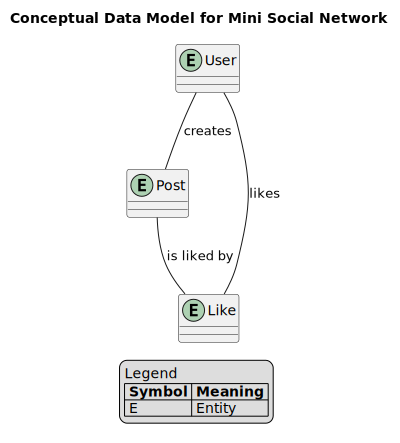
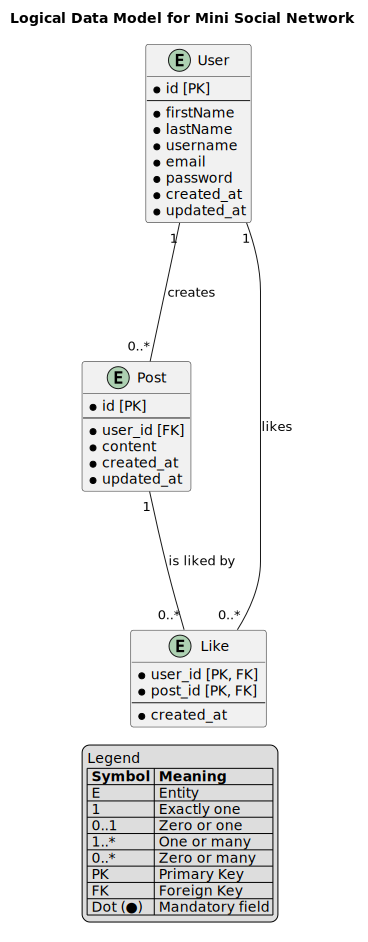
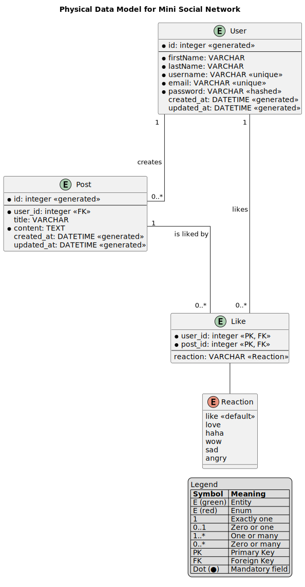

# Bases de données, Eloquent et modèles - Mini-projet

L. Delafontaine, avec l'aide de
[GitHub Copilot](https://github.com/features/copilot).

Ce travail est sous licence [CC BY-SA 4.0][licence].

> [!TIP]
>
> Trouvez d'autres informations relatives à ce contenu dans le
> [contenu parent](../README.md).

## Table des matières

- [Table des matières](#table-des-matières)
- [Objectifs](#objectifs)
- [Réinitialiser le projet Laravel](#réinitialiser-le-projet-laravel)
  - [Créer une issue pour suivre cette tâche](#créer-une-issue-pour-suivre-cette-tâche)
  - [Restaurer la base de données à son état initial](#restaurer-la-base-de-données-à-son-état-initial)
  - [Supprimer les fichiers de migration de base créés par Laravel](#supprimer-les-fichiers-de-migration-de-base-créés-par-laravel)
  - [Créer la pull request pour cette tâche](#créer-la-pull-request-pour-cette-tâche)
  - [Supprimer les modèles et les fichiers associés créés par Laravel](#supprimer-les-modèles-et-les-fichiers-associés-créés-par-laravel)
  - [Ajouter les migrations nécessaires à Laravel](#ajouter-les-migrations-nécessaires-à-laravel)
  - [Valider et fusionner la pull request](#valider-et-fusionner-la-pull-request)
  - [Récupérer les modifications localement](#récupérer-les-modifications-localement)
- [Réaliser la structure de la base de données](#réaliser-la-structure-de-la-base-de-données)
  - [Réaliser le modèle conceptuel des données (MCD)](#réaliser-le-modèle-conceptuel-des-données-mcd)
  - [Réaliser le modèle logique des données (MLD)](#réaliser-le-modèle-logique-des-données-mld)
  - [Réaliser le modèle physique des données (MPD)](#réaliser-le-modèle-physique-des-données-mpd)
- [Créer les modèles Eloquent et les migrations associées](#créer-les-modèles-eloquent-et-les-migrations-associées)
  - [Créer le modèle User](#créer-le-modèle-user)
  - [Créer le modèle Post](#créer-le-modèle-post)
  - [Créer le modèle Like](#créer-le-modèle-like)
- [Populer la base de données avec des données factices](#populer-la-base-de-données-avec-des-données-factices)
- [Tester les modèles Eloquent](#tester-les-modèles-eloquent)
  - [Récupérer les utilisateur.trices](#récupérer-les-utilisateurtrices)
  - [Récupérer les posts](#récupérer-les-posts)
  - [Récupérer les likes](#récupérer-les-likes)
  - [Récupérer les posts d'un.e utilisateur.trice](#récupérer-les-posts-dune-utilisateurtrice)
  - [Récupérer les posts likés par un.e utilisateur.trice](#récupérer-les-posts-likés-par-une-utilisateurtrice)
  - [Récupérer les utilisateur.trices ayant liké un post](#récupérer-les-utilisateurtrices-ayant-liké-un-post)
  - [Créer un nouveau post](#créer-un-nouveau-post)
  - [Liker un post](#liker-un-post)
- [Conclusion](#conclusion)
- [Solution](#solution)
- [Aller plus loin](#aller-plus-loin)

## Objectifs

Mettre en place la structure de base de données et les modèles Eloquent pour le
petit réseau social.

## Réinitialiser le projet Laravel

Lors de l'initialisation d'un projet Laravel, certains fichiers de base sont
créés automatiquement.

Ces fichiers peuvent être utilisés tels quels, mais pour ce mini-projet, nous
allons les supprimer afin de créer nos propres modèles et migrations à partir de
zéro.

### Créer une issue pour suivre cette tâche

Comme il s'agit d'une nouvelle tâche à effectuer sur le projet Laravel, nous
allons créer une nouvelle issue dans le dépôt GitHub du projet pour suivre cette
tâche.

Créez une nouvelle issue intitulée _"Réinitialiser le projet Laravel"_, comme
étudié dans la séance précédente.

De cette issue, créez une nouvelle branche Git et basculez dessus localement
pour effectuer les modifications nécessaires.

La commande utilisée pour créer et basculer sur une nouvelle branche Git donnée
par GitHub devrait ressembler à ceci :

```bash
git fetch origin
git checkout 3-réinitialiser-le-projet-laravel
```

### Restaurer la base de données à son état initial

Lors de l'initialisation du projet Laravel, une base de données SQLite a été
créée et les migrations initiales ont été appliquées.

Comme nous utilisons une base de données SQLite, il suffirait de supprimer le
fichier `database/database.sqlite` pour réinitialiser la base de données.

Mais pour des raisons de complétude, nous allons utiliser la commande Artisan
pour réinitialiser la base de données en annulant toutes les migrations
appliquées. Cette manière est plus générale et fonctionnerait également avec
d'autres types de bases de données.

Pour restaurer la base de données à son état initial, exécuter la commande
suivante dans le terminal à la racine du projet Laravel :

```bash
php artisan migrate:rollback
```

Cette commande annulera la dernière "batch" de migrations appliquées. Un batch
correspond à un groupe de migrations appliquées ensemble lors d'une exécution de
la commande `php artisan migrate`.

Comme lors de l'initialisation du projet Laravel, plusieurs migrations ont été
appliquées en une seule fois, lors de l'exécution de la commande
`php artisan migrate`, le résultat devrait être similaire à ceci :

```txt
   INFO  Rolling back migrations.

  0001_01_01_000002_create_jobs_table ............... 13.52ms DONE
  0001_01_01_000001_create_cache_table ............... 5.81ms DONE
  0001_01_01_000000_create_users_table ............... 8.33ms DONE
```

Ce batch correspond aux trois migrations créant les tables `users`, `cache` et
`jobs` initiales de Laravel.

Si plusieurs "batches" ont été appliquées, il faudra exécuter cette commande
plusieurs fois jusqu'à ce que toutes les migrations soient annulées. Une autre
commande permet de tout annuler en une seule fois :

```bash
php artisan migrate:reset
```

Cette commande annulera toutes les migrations appliquées et réinitialisera la
base de données à son état initial.

Les commandes `php artisan migrate:rollback` et `php artisan migrate:reset` ont
appelé les méthodes `down` des migrations pour annuler les modifications
apportées à la base de données.

Si vous ouvrez le fichier `database/database.sqlite`, vous verrez qu'il est
maintenant vide, sans aucune table.

### Supprimer les fichiers de migration de base créés par Laravel

Les commandes `php artisan migrate:rollback` et `php artisan migrate:reset`
n'effacent pas les fichiers de migration eux-mêmes.

Cela permet de les conserver pour référence future, les modifier et les
réappliquer, mais dans ce mini-projet, nous allons les supprimer pour repartir
de zéro.

Supprimez tous les fichiers du dossier `database/migrations/`.

A l'aide de la commande Git, vérifiez que les fichiers ont bien été supprimés :

```bash
git status
```

Le résultat devrait ressembler à ceci :

```txt
On branch 3-réinitialiser-le-projet-laravel
Your branch is up to date with 'origin/3-réinitialiser-le-projet-laravel'.

Changes not staged for commit:
  (use "git add/rm <file>..." to update what will be committed)
  (use "git restore <file>..." to discard changes in working directory)
        deleted:    database/migrations/0001_01_01_000000_create_users_table.php
        deleted:    database/migrations/0001_01_01_000001_create_cache_table.php
        deleted:    database/migrations/0001_01_01_000002_create_jobs_table.php

no changes added to commit (use "git add" and/or "git commit -a")
```

Ceci indique que les fichiers de migration ont bien été supprimés, mais que les
modifications n'ont pas encore été validées (_"commit"_) dans Git.

Ajoutez ces suppressions à l'index Git avec la commande suivante :

```bash
git add database/migrations/
```

Puis, validez ces modifications avec un message de commit approprié :

```bash
git commit -m "Supprimer les fichiers de migration de base"
```

Puis, poussez les modifications vers le dépôt distant sur GitHub :

```bash
git push
```

### Créer la pull request pour cette tâche

Une fois les modifications poussées vers le dépôt distant, créez une pull
request depuis la branche `3-réinitialiser-le-projet-laravel` vers la branche
principale `main`, comme étudié dans la séance précédente.

Revoyez les modifications, spécifiez son titre _"Réinitialiser le projet
Laravel"_, ajoutez une description si nécessaire, puis créez la pull request,
**mais ne la fusionnez pas encore**. D'autres modifications seront apportées à
cette branche dans les étapes suivantes.

### Supprimer les modèles et les fichiers associés créés par Laravel

Lors de l'initialisation du projet Laravel, un modèle `User` a été créé
automatiquement dans le dossier `app/Models/` ainsi que plusieurs fichiers
associés, tels que des factories et des seeders.

Pour repartir de zéro, nous allons supprimer le modèle `User` et les fichiers
associés.

Supprimez les fichiers suivants dans le dossier `app/Models/`,
`database/factories/` et `database/seeders/` :

- `app/Models/User.php`.
- `database/factories/UserFactory.php`.
- `database/seeders/DatabaseSeeder.php`.

À l'aide de la commande Git, vérifiez que les fichiers ont bien été supprimés :

```bash
git status
```

Le résultat devrait ressembler à ceci :

```txt
On branch 3-réinitialiser-le-projet-laravel
Your branch is up to date with 'origin/3-réinitialiser-le-projet-laravel'.

Changes not staged for commit:
  (use "git add/rm <file>..." to update what will be committed)
  (use "git restore <file>..." to discard changes in working directory)
        deleted:    app/Models/User.php
        deleted:    database/factories/UserFactory.php
        deleted:    database/seeders/DatabaseSeeder.php

no changes added to commit (use "git add" and/or "git commit -a")
```

Ceci indique que les fichiers ont bien été supprimés, mais que les modifications
n'ont pas encore été validées (_"commit"_) dans Git.

Ajoutez ces suppressions à l'index Git avec la commande suivante :

```bash
git add app/Models/ database/factories/ database/seeders/
```

ou simplement pour rajouter tous les fichiers :

```bash
git add .
```

Puis, validez ces modifications avec un message de commit approprié :

```bash
git commit -m "Supprimer les modèles et fichiers associés de base"
```

Puis, poussez les modifications vers le dépôt distant sur GitHub :

```bash
git push
```

La pull request créée précédemment sera automatiquement mise à jour avec ces
nouvelles modifications.

### Ajouter les migrations nécessaires à Laravel

Lorsque nous avons supprimé les fichiers de migration de base créés par Laravel,
nous avons également supprimé certaines migrations nécessaires au bon
fonctionnement de Laravel.

Pourquoi avoir supprimé ces migrations si elles sont nécessaires au bon
fonctionnement de Laravel ?

Parce que certaines de ces migrations couplaient plusieurs fonctionnalités
avancées en une seule migration, mélangeant des fonctionnalités que nous
souhaitons modifier et d'autres que nous n'allons pas utiliser dans ce
mini-projet.

De ce fait, il était donc plus simple de tout supprimer et de ne rétablir que
les migrations nécessaires. Cela permet aussi de mieux séparer les migrations
nécessaires à Laravel et les migrations spécifiques au mini-projet.

Pour rétablir les migrations nécessaires au bon fonctionnement de Laravel, nous
allons utiliser les commandes Artisan suivantes :

```bash
php artisan make:session-table
```

```bash
php artisan make:cache-table
```

```bash
php artisan make:queue-table
```

Ces trois commandes vont créer les fichiers de migration nécessaires dans le
dossier `database/migrations/`.

Appliquez ensuite ces migrations à la base de données en exécutant la commande
suivante dans le terminal à la racine du projet Laravel :

```bash
php artisan migrate
```

Le résultat devrait ressembler à ceci :

```txt
   INFO  Running migrations.

  2026_01_29_142851_create_sessions_table ........... 12.98ms DONE
  2026_01_29_142857_create_cache_table .............. 13.05ms DONE
  2026_01_29_142954_create_jobs_table ................ 6.29ms DONE
```

Les migrations ont été appliquées avec succès et les tables nécessaires ont été
créées dans la base de données.

Pour le moment, ces migrations ne sont pas importantes pour la réalisation du
mini-projet, mais elles sont nécessaires au bon fonctionnement de Laravel.

La documentation nécessaire pour comprendre ces fonctionnalités avancées de
Laravel est disponible aux adresses suivantes :

- <https://laravel.com/docs/12.x/session#driver-prerequisites>.
- <https://laravel.com/docs/12.x/cache#driver-prerequisites>.
- <https://laravel.com/docs/12.x/queues#driver-prerequisites>.

Si le temps le permet, nous pourrons explorer leur utilité/fonctionnement dans
une future séance.

Validez que l'application fonctionne toujours correctement en exécutant la
commande suivante dans le terminal à la racine du projet Laravel :

```bash
composer run dev
```

Puis accédez à l'URL <http://localhost:8000> dans votre navigateur web pour
vérifier que la page d'accueil s'affiche correctement.

### Valider et fusionner la pull request

Une fois les modifications poussées vers le dépôt distant, revenez à la pull
request créée précédemment sur GitHub.

Revoyez les modifications puis validez la pull request.

Si une quelconque modification est nécessaire, effectuez-la localement,
poussez-la vers le dépôt distant.

Une fois satisfait.e des modifications, fusionnez la pull request dans la
branche principale `main`.

### Récupérer les modifications localement

Une fois la pull request fusionnée, n'oubliez pas de récupérer les modifications
dans votre dépôt local en basculant sur la branche principale `main` et en
exécutant la commande suivante :

```bash
git pull
```

Cela permet de s'assurer que votre dépôt local est à jour avec les dernières
modifications apportées dans la branche principale `main`.

Ce flux de travail avec les issues, les branches Git et les pull requests peut
paraître long et fastidieux au début, mais il permet de séquencer et d'organiser
le travail de manière efficace, surtout dans un contexte de développement
collaboratif.

## Réaliser la structure de la base de données

Maintenant que le projet Laravel a été réinitialisé, nous allons concevoir la
structure de la base de données pour le petit réseau social.

### Réaliser le modèle conceptuel des données (MCD)

Avec un simple papier et un crayon, ou un outil de modélisation de votre choix,
réalisez le modèle conceptuel des données (MCD) pour le petit réseau social.

Cela vous permettra de mettre à plat les idées que vous avez eues dans l'étape
précédente.

Pour rappel, un MCD est une représentation graphique des entités et de leurs
relations.

Il ne s'agit pas forcément de modéliser les attributs des entités mais
simplement de leur existence et de leurs relations.

Il s'agit surtout d'un diagramme orienté "business" illustrant les entités et
leurs relations sans se soucier des détails techniques de la base de données.

Un bon article pour rafraîchir vos notions sur les différences entre le MCD, le
MLD et le MPD ainsi que leurs utilisations est disponible à l'adresse suivante :
<https://www.thoughtspot.com/data-trends/data-modeling/conceptual-vs-logical-vs-physical-data-models>.

De façon simple et non-formelle, prenez un moment pour identifier les entités
principales du petit réseau social.

Pour cela, vous pouvez utiliser un bloc-notes avec papier/crayon, un tableau
noir/blanc ou tout autre outil de votre choix.

De quelles entités avons-nous besoin pour réaliser un petit réseau social où les
utilisateur.trices peuvent créer des posts et liker les posts des autres
utilisateur.trices ?

Prenez quelques minutes pour réfléchir à ces questions avant de passer à l'étape
suivante. Entraidez-vous si nécessaire et n'hésitez pas à poser des questions si
vous avez des doutes.

> [!NOTE]
>
> Je (Ludovic) ne me considère pas comme un expert en modélisation de données à
> l'aide d'un MCD. D'autres personnes pourraient proposer des modèles différents
> et plus complets. L'objectif est de réfléchir à la structure de la base de
> données et de s'assurer qu'elle répond aux besoins du petit réseau social.

<details>
<summary>Exemple de réponse</summary>

> [!NOTE]
>
> Ceci est un exemple de réponse possible. D'autres réponses sont possibles et
> valides. L'objectif est de réfléchir à la structure de la base de données.
>
> N'hésitez pas à proposer d'autres entités ou attributs si vous le souhaitez.



Si vous avez proposé une entité `Profile` en plus de l'entité `User`, c'est tout
à fait acceptable mais cela ne sera pas forcément nécessaire. Un profil peut
être intégré directement dans l'entité `User` pour simplifier la structure de la
base de données. Au final, un profil est simplement la mise à jour de son/sa
propre utilisateur.trice (`User`).

</details>

### Réaliser le modèle logique des données (MLD)

Réalisez maintenant le modèle logique des données (MLD) pour le petit réseau
social.

Cela vous permettra de mettre à plat les idées que vous avez eues dans l'étape
précédente.

Pour rappel, un MLD est une représentation graphique des tables, de leurs
colonnes (attributs), et de leurs relations.

Il s'agit d'un diagramme plus technique illustrant la structure de la base de
données mais qui n'est pas encore spécifique à un SGBD particulier.

Un bon article pour rafraîchir vos notions sur les différences entre le MCD, le
MLD et le MPD ainsi que leurs utilisations est disponible à l'adresse suivante :
<https://www.thoughtspot.com/data-trends/data-modeling/conceptual-vs-logical-vs-physical-data-models>.

De quelles entités et attributs avons-nous besoin pour réaliser un petit réseau
social où les utilisateur.trices peuvent créer des posts et liker les posts des
autres utilisateur.trices ?

Prenez quelques minutes pour réfléchir à ces questions avant de passer à l'étape
suivante. Entraidez-vous si nécessaire et n'hésitez pas à poser des questions si
vous avez des doutes.

> [!NOTE]
>
> Je (Ludovic) ne me considère pas comme un expert en modélisation de données à
> l'aide d'un MLD. D'autres personnes pourraient proposer des modèles différents
> et plus complets. L'objectif est de réfléchir à la structure de la base de
> données et de s'assurer qu'elle répond aux besoins du petit réseau social.

<details>
<summary>Exemple de réponse</summary>

> [!NOTE]
>
> Ceci est un exemple de réponse possible. D'autres réponses sont possibles et
> valides. L'objectif est de réfléchir à la structure de la base de données.
>
> N'hésitez pas à proposer d'autres entités ou attributs si vous le souhaitez.



Vous remarquerez dans la solution proposée qu'une nouvelle entité `Like` a été
ajoutée pour représenter les likes des posts par les utilisateur.trices.

Cette entité permet de modéliser la relation de "like" entre les
utilisateur.trices et les posts de manière explicite au travers une table de
jointure, plutôt que d'utiliser une relation "Many to Many" implicite entre les
entités `User` et `Post`.

Cette entité `Like` est appelée une table pivot ou table intermédiaire, et elle
contient des colonnes pour les clés étrangères vers les entités `User` et
`Post`, ainsi qu'une colonne pour la réaction associée au like (par exemple,
"like" (👍),"love" (❤️), "haha" (😂), "wow" (😮), "sad" (😢) ou "angry" (😡)).

Cela permet aussi de faciliter les requêtes liées aux likes.

De plus, la colonne `title` est optionnelle dans la table `posts`, car un post
peut être créé sans titre, mais il doit toujours avoir du contenu.

</details>

### Réaliser le modèle physique des données (MPD)

Réalisez maintenant le modèle physique des données (MPD) pour le petit réseau
social.

Cela vous permettra de mettre à plat les idées que vous avez eues dans l'étape
précédente.

Pour rappel, un MPD est une représentation graphique des tables, de leurs
colonnes, de leurs types de données, de leurs contraintes, et de leurs
relations.

Il s'agit d'un diagramme très technique illustrant la structure de la base de
données spécifique à un SGBD particulier (ici, SQLite).

Un bon article pour rafraîchir vos notions sur les différences entre le MCD, le
MLD et le MPD ainsi que leurs utilisations est disponible à l'adresse suivante :
<https://www.thoughtspot.com/data-trends/data-modeling/conceptual-vs-logical-vs-physical-data-models>.

Reprenez les entités, les attributs et les relations que vous avez définis dans
le MLD et ajoutez les types de données, les contraintes (unicité, nullabilité (=
si une colonne peut être nulle/optionnelle ou non), etc.) et les clés
primaires/étrangères nécessaires pour réaliser le MPD.

Pour rappel, vous pouvez retrouver les types de données disponibles dans SQLite
à l'adresse suivante : <https://www.sqlite.org/datatype3.html>.

> [!NOTE]
>
> Je (Ludovic) ne me considère pas comme un expert en modélisation de données à
> l'aide d'un MPD. D'autres personnes pourraient proposer des modèles différents
> et plus complets. L'objectif est de réfléchir à la structure de la base de
> données et de s'assurer qu'elle répond aux besoins du petit réseau social.

<details>
<summary>Exemple de réponse</summary>

> [!NOTE]
>
> Ceci est un exemple de réponse possible. D'autres réponses sont possibles et
> valides. L'objectif est de réfléchir à la structure de la base de données.
>
> N'hésitez pas à proposer d'autres entités ou attributs si vous le souhaitez.



Vous remarquerez l'utilisation des types de données spécifiques à SQLite, tels
que `INTEGER`, `VARCHAR`, `TEXT` et `DATETIME`. Ces types de données sont
utilisés pour définir les colonnes de la base de données et leurs contraintes.

La différence entre les types `VARCHAR` et `TEXT` est que `VARCHAR` est utilisé
pour les chaînes de caractères de maximum 255 caractères, tandis que `TEXT` est
utilisé pour les chaînes de caractères plus longues.

Il est possible de spécifier une longueur maximale pour les colonnes de type
`VARCHAR`, mais dans ce mini-projet, nous allons utiliser la longueur par défaut
de 255 caractères.

Comme SQLite ne supporte pas les énumérations, la colonne `reaction` de la table
`likes` est définie comme un type `VARCHAR`. La logique de validation pour
s'assurer que les valeurs de cette colonne sont limitées à "like", "love",
"haha", "wow", "sad" ou "angry" sera implémentée au niveau de l'application
Laravel, plutôt que dans la base de données.

</details>

## Créer les modèles Eloquent et les migrations associées

Maintenant que la structure de la base de données a été réalisée, nous allons
créer les modèles Eloquent et les migrations associées pour le petit réseau
social.

### Créer le modèle User

Dans cette section, nous allons créer le modèle Eloquent `User` ainsi que la
migration associée pour la table `users`.

#### Créer l'issue et la branche pour suivre cette tâche

Comme il s'agit d'une nouvelle tâche à effectuer sur le projet Laravel, nous
allons créer une nouvelle issue dans le dépôt GitHub du projet pour suivre cette
tâche.

Créez une nouvelle issue et sa branche associée intitulée _"Créer le modèle User
et la migration associée"_, comme étudié dans la séance précédente.

Basculez localement sur cette nouvelle branche pour effectuer les modifications
nécessaires.

#### Créer le modèle et la migration

A l'aide de la commande Artisan, créez le modèle Eloquent `User` avec la
migration associée :

```bash
php artisan make:model User --migration
```

Cela créera le fichier `app/Models/User.php` pour le modèle Eloquent `User`
ainsi que le fichier de migration dans le dossier `database/migrations/`.

Le résultat devrait ressembler à ceci :

```txt
   INFO  Model [app/Models/User.php] created successfully.

   INFO  Migration [database/migrations/2026_01_29_143919_create_users_table.php] created successfully.
```

Cela signifie que le modèle `User` et la migration associée ont été créés avec
succès dans leur fichier respectif, à savoir `app/Models/User.php` et
`database/migrations/2026_01_29_143919_create_users_table.php`.

#### Définir la migration

Ouvrez le fichier de migration créé dans le dossier `database/migrations/` et
définissez la structure de la table `users` en ajoutant les colonnes
correspondantes aux attributs du modèle `User`.

```php
Schema::create('users', function (Blueprint $table) {
    $table->id();
    $table->string('first_name');
    $table->string('last_name');
    $table->string('username')->unique();
    $table->string('email')->unique();
    $table->timestamps();
});
```

Il est de convention dans les bases de données relationnelles d'utiliser le
format [Snake case](https://en.wikipedia.org/wiki/Snake_case) (`snake_case`)
pour les noms de colonnes. Ainsi, les colonnes sont nommées `first_name` et
`last_name` dans la table `users`.

Les colonnes `username` et `email` sont définies comme uniques pour éviter la
création de plusieurs utilisateur.trices avec le même nom d'utilisateur ou la
même adresse e-mail.

Le type de données par colonne est défini en fonction des besoins de chaque
attribut, tous décrits dans la documentation de Laravel pour les migrations :
<https://laravel.com/docs/12.x/migrations#available-column-types>. Une colonne
`string` est convertie en `VARCHAR` dans la base de données, tandis qu'une
colonne `text` est convertie en `TEXT`. Les types de données sont spécifiques au
SGBD utilisé, dans ce cas SQLite.

De plus, les colonnes `created_at` et `updated_at` sont automatiquement ajoutées
par la méthode `timestamps()` de Laravel pour suivre la date de création et de
mise à jour des enregistrements dans la table `users`.

Vous remarquerez que la colonne `password` n'est pas définie dans la migration,
car pour le moment, nous ne gérons pas l'authentification des
utilisateur.trices. Nous ajouterons cette fonctionnalité plus tard dans le
mini-projet.

#### Appliquer la migration

Une fois les modifications apportées au fichier de migration, appliquez la
migration à la base de données en exécutant la commande suivante dans le
terminal à la racine du projet Laravel :

```bash
php artisan migrate
```

Le résultat devrait ressembler à ceci :

```txt
   INFO  Running migrations.

  2026_01_29_143919_create_users_table ................................. 11.13ms DONE
```

La migration a été appliquée avec succès et la table `users` a été créée dans la
base de données.

**Pour rappel, une fois une migration appliquée, il est fortement déconseillé de
modifier le fichier de migration.** Si des modifications sont nécessaires, il
faut créer une nouvelle migration pour apporter ces modifications ou annuler la
migration existante avec la commande `php artisan migrate:rollback` puis la
modifier avant de la réappliquer. Cela peut entraîner la perte de données si la
table contient déjà des données.

Ouvrez le fichier `database/database.sqlite` pour vérifier que la table `users`
a bien été créée avec les colonnes définies dans la migration.

Vous remarquerez que la base de données contient aussi une table `migrations`
qui est utilisée par Laravel pour suivre les migrations appliquées. C'est grâce
à cette table que les commandes `php artisan migrate`,
`php artisan migrate:rollback` et `php artisan migrate:reset` fonctionnent
correctement.

#### Tester le modèle Eloquent

Ouvrez le fichier `routes/web.php` et ajoutez le code suivant pour tester le
modèle Eloquent `User` :

```php
use App\Models\User;

// ... autres routes ...

Route::get('/test-user', function () {
    $user = new User();

    $user->first_name = 'John';
    $user->last_name = 'Doe';
    $user->username = 'johndoe';
    $user->email = 'johndoe@example.com';

    $user->save();

    return $user;
});
```

Nous reviendrons plus tard sur les routes et les contrôleurs dans Laravel, mais
pour le moment, nous allons simplement ajouter ce code pour tester le modèle
Eloquent `User` et la migration associée.

Vous remarquerez que le modèle Eloquent `User` est utilisé pour créer un nouvel
utilisateur avec les noms des colonnes définis dans la migration.

Ceci est possible grâce à l'ORM Eloquent de Laravel qui permet de faire le lien
entre les modèles et les tables de la base de données.

Nous commençons par créer une nouvelle instance du modèle `User`, puis nous
définissons les attributs de l'utilisateur en utilisant les noms des colonnes de
la table `users` définis dans la migration.

Si les conventions de nommage sont respectées, Eloquent peut automatiquement
faire le lien entre les modèles et les tables de la base de données sans avoir
besoin de configurer manuellement les relations.

Sauvez le fichier et accédez à l'URL <http://localhost:8000/test-user> dans
votre navigateur web.

Vous devriez voir les informations de l'utilisateur `John Doe` qui vient d'être
créé dans la base de données suite à l'accès à la page
<http://localhost:8000/test-user>. Cela signifie que le modèle Eloquent `User`
fonctionne correctement et que les données ont été enregistrées dans la table
`users` de la base de données.

Vous pouvez aussi vérifier que les données ont été enregistrées dans la base de
données en ouvrant le fichier `database/database.sqlite`, vous devriez voir une
entrée dans la table `users` avec les informations de l'utilisateur `John Doe`.

Si vous rafraîchissez la page, une erreur devrait se produire car le nom
d'utilisateur `johndoe` est défini comme unique dans la migration, ce qui
signifie que vous ne pouvez pas créer deux utilisateurs avec le même nom
d'utilisateur.

Pour le moment, nous allons laisser cette erreur se produire pour tester la
contrainte d'unicité définie dans la migration. Nous pourrons gérer cette erreur
plus tard dans le développement du mini-réseau social.

Nous reviendrons dans une prochaine section sur un exemple plus complet des
modèles Eloquent pour valider leur fonctionnement et leur utilisation dans
Laravel.

#### Valider et pousser les modifications

Maintenant que le modèle Eloquent `User` et la migration associée ont été créés
et testés, il est temps de valider ces modifications dans Git et de les pousser
vers le dépôt distant sur GitHub.

À l'aide de la commande Git, ajoutez les nouveaux fichiers à l'index Git :

```bash
git add .
```

Puis, validez ces modifications avec un message de commit approprié :

```bash
git commit -m "Créer le modèle User et la migration associée"
```

Puis, poussez les modifications vers le dépôt distant sur GitHub :

```bash
git push
```

#### Créer, valider et fusionner la pull request

Une fois les modifications poussées vers le dépôt distant, créez une pull
request depuis la branche créée pour cette tâche vers la branche principale
`main`, comme étudié dans la séance précédente :

- Spécifiez son titre _"Créer le modèle User et la migration associée"_.
- Ajoutez une description si nécessaire.
- Créez la pull request.
- Validez la pull request.
- Fusionnez-la dans la branche principale `main`.

### Créer le modèle Post

Dans cette section, nous allons créer le modèle Eloquent `Post` ainsi que la
migration associée pour la table `posts`.

Il s'agit d'une tâche similaire à celle de la création du modèle `User`, mais
cette fois, nous allons créer une relation entre le modèle `Post` et le modèle
`User` pour indiquer que chaque post appartient à un.e utilisateur.trice.

#### Créer l'issue et la branche pour suivre cette tâche

En vous inspirant de la tâche précédente, créez une nouvelle issue et sa branche
associée intitulée _"Créer le modèle Post et la migration associée"_, comme
étudié dans la séance précédente.

#### Créer le modèle et la migration

En vous inspirant de la tâche précédente, utilisez la commande Artisan pour
créer le modèle Eloquent `Post` avec la migration associée.

Essayez de déduire la commande Artisan à utiliser pour créer le modèle `Post` et
la migration associée, en vous inspirant de la commande utilisée pour créer le
modèle `User` et la migration associée.

<details>
<summary>Afficher la solution</summary>

```bash
php artisan make:model Post --migration
```

Cela créera le fichier `app/Models/Post.php` pour le modèle Eloquent `Post`
ainsi que le fichier de migration dans le dossier `database/migrations/`.

Le résultat devrait ressembler à ceci :

```txt
   INFO  Model [app/Models/Post.php] created successfully.

   INFO  Migration [database/migrations/2026_02_07_123042_create_posts_table.php] created successfully.
```

</details>

#### Définir la migration

Comme la table `posts` doit avoir une relation avec la table `users`, il est
nécessaire de définir une clé étrangère dans la migration pour la colonne
`user_id` qui fera référence à la colonne `id` de la table `users`.

Cela permettra de définir la relation "One to Many / Many to One" entre les
posts et les utilisateur.trices, indiquant que chaque post appartient à un.e
utilisateur.trice et qu'un.e utilisateur.trice peut avoir plusieurs posts.

Ouvrez le fichier de migration créé dans le dossier `database/migrations/` et
définissez la structure de la table `posts` en ajoutant les colonnes
correspondantes aux attributs du modèle `Post`, ainsi que la clé étrangère pour
la relation avec la table `users` :

```php
Schema::create('posts', function (Blueprint $table) {
    $table->id();
    $table->foreignId('user_id')->constrained('users')->onDelete('cascade');
    $table->string('title')->nullable();
    $table->text('content');
    $table->timestamps();
});
```

La ligne
`$table->foreignId('user_id')->constrained('users')->onDelete('cascade');`
définit une contrainte de clé étrangère pour la colonne `user_id` qui fait
référence à la colonne`id` de la table `users`. La méthode `onDelete('cascade')`
indique que si un.e utilisateur.trice est supprimé.e, tous les posts associés à
cet.te utilisateur.trice seront également supprimés de manière automatique pour
éviter les données orphelines dans la table `posts`.

L'attribut `title` est défini comme _"nullable"_ (= peut être nul/optionnel)
pour permettre la création de posts sans titre. Par défaut, les colonnes sont
définies comme obligatoires, donc si nous voulons permettre la création de posts
sans titre, nous devons spécifier que la colonne `title` peut être nulle.

#### Appliquer la migration

En vous inspirant de la tâche précédente, appliquez la migration à la base de
données en exécutant la commande Artisan appropriée.

Essayez de déduire la commande Artisan à utiliser pour appliquer la migration,
en vous inspirant de la commande utilisée pour appliquer la migration du modèle
`User`.

<details>
<summary>Afficher la solution</summary>

```bash
php artisan migrate
```

Le résultat devrait ressembler à ceci :

```txt
   INFO  Running migrations.

  2026_02_07_123042_create_posts_table .................................. 6.33ms DONE
```

</details>

#### Mettre à jour les modèles Eloquent pour définir la relation entre les modèles User et Post

Notre base de données définit une relation "One to Many / Many to One" entre les
tables `users` et `posts`, indiquant qu'un.e utilisateur.trice peut avoir
plusieurs posts (One to Many) et que chaque post appartient à un.e
utilisateur.trice (Many to One).

Afin de refléter cette relation dans les modèles Eloquent, il est nécessaire de
définir les méthodes correspondantes dans les modèles `User` et `Post`.

D'un côté, dans le modèle `User`, nous allons définir une méthode `posts` qui
indiquera que chaque utilisateur.trice peut avoir plusieurs posts (One to Many).
De l'autre côté, dans le modèle `Post`, nous allons définir une méthode `user`
qui indiquera que chaque post appartient à un.e utilisateur.trice (Many to One).

Cette configuration permettra d'utiliser les fonctionnalités d'Eloquent pour
accéder facilement aux posts d'un.e utilisateur.trice et à l'utilisateur.trice
d'un post, en utilisant les relations définies dans les modèles.

Ouvrez le fichier `app/Models/User.php` et ajoutez la méthode `posts` pour
définir la relation "One to Many" avec le modèle `Post` :

```php
/**
 * Get the posts for the user.
 */
public function posts(): HasMany
{
    return $this->hasMany(Post::class);
}
```

Il sera sans doute nécessaire d'ajouter l'import de la classe `HasMany` en haut
du fichier :

```php
use Illuminate\Database\Eloquent\Relations\HasMany;
```

Cette fonction indique que chaque utilisateur.trice peut avoir plusieurs posts,
et elle permet d'accéder aux posts d'un.e utilisateur.trice en utilisant la
syntaxe `$user->posts`.

Passons maintenant au modèle `Post` pour définir la relation "Many to One" avec
le modèle `User`.

Ouvrez le fichier `app/Models/Post.php` et ajoutez la méthode `user` pour la
relation "Many to One" avec le modèle `User` :

```php
    /**
     * Get the user that owns the post.
     */
public function user(): BelongsTo
{
    return $this->belongsTo(User::class);
}
```

Il sera sans doute nécessaire d'ajouter l'import de la classe `BelongsTo` en
haut du fichier :

```php
use Illuminate\Database\Eloquent\Relations\BelongsTo;
```

Cette fonction indique que chaque post appartient à un.e utilisateur.trice, et
elle permet d'accéder à l'utilisateur.trice d'un post en utilisant la syntaxe
`$post->user`.

Les relations entre les modèles `User` et `Post` sont maintenant définies, ce
qui permettra d'utiliser les fonctionnalités d'Eloquent pour accéder facilement
aux posts d'un.e utilisateur.trice et à l'utilisateur.trice d'un post.

#### Tester le modèle Eloquent

Ouvrez le fichier `routes/web.php` et ajoutez le code suivant pour tester les
modèles Eloquent `User` et `Post` ainsi que la relation entre eux :

```php
use App\Models\User;
use App\Models\Post;

// ... autres routes ...

Route::get('/test-post-1', function () {
    // Récupère la première personne dans la table `users`, peu importe son ID
    $user = User::first();

    $post = new Post();
    $post->title = 'Mon premier post';
    $post->content = 'Ceci est le contenu de mon premier post.';

    $user->posts()->save($post);

    return $post;
});

Route::get('/test-post-2', function () {
    // Récupère la personne avec l'ID 1 dans la table `users`
    $user = User::find(1);

    $post = new Post();
    $post->content = 'Ceci est le contenu de mon deuxième post.';

    $post->user()->associate($user);

    $post->save();

    return $post;
});
```

Ces deux routes permettent de tester la création de posts en utilisant les
relations définies entre les modèles `User` et `Post`. Le résultat devrait être
similaire pour les deux routes, avec la création de posts associés à
l'utilisateur `John Doe` dans la base de données.

Néanmoins, les deux routes utilisent des méthodes différentes pour associer le
post à l'utilisateur :

- La première route passe par l'utilisateur.trice pour sauver son nouveau post.

  Pour cela, nous utilisons la relation `posts` définie dans le modèle `User`
  pour accéder à la relation "One to Many" et ensuite nous appelons la méthode
  `save` pour sauvegarder le nouveau post.

  Cela signifie que nous passons par la relation définie dans le modèle `User`
  pour sauvegarder le post, ce qui permet de s'assurer que le post est
  automatiquement associé à l'utilisateur.trice lors de la sauvegarde.

- La deuxième route passe associe le post à l'utilisateur.trice afin de créer le
  lien entre les deux.

  Pour cela, nous utilisons la relation `user` définie dans le modèle `Post`
  pour accéder à la relation "Many to One" et ensuite nous appelons la méthode
  `associate` pour associer l'utilisateur.trice au post avant de sauvegarder le
  nouveau post.

  Cela signifie que nous créons d'abord le post, puis nous associons le post à
  un.e utilisateur.trice avant de le sauvegarder, ce qui permet de s'assurer que
  le post est correctement associé à l'utilisateur.trice lors de la sauvegarde.

Les deux méthodes sont valides pour créer un post associé à un.e
utilisateur.trice. Leur seule différence réside dans la manière dont le lien
entre le post et l'utilisateur.trice est établi avant la sauvegarde du post et
depuis quel côté de la relation nous décidons de passer pour sauvegarder le
nouveau post.

Vous remarquerez que dans la première route, le titre du post est défini, tandis
que dans la deuxième route, le titre du post n'est pas défini.

Accédez à l'URL <http://localhost:8000/test-post-1> dans votre navigateur web
pour tester la première route, puis à l'URL <http://localhost:8000/test-post-2>
pour tester la deuxième route.

Les deux routes devraient créer des posts associés à l'utilisateur `John Doe`
dans la base de données, et vous devriez voir les informations des posts qui
viennent d'être créés dans votre navigateur web.

Si vous rafraîchissez les pages, aucune erreur ne devrait se produire, car les
contraintes d'unicité ne sont pas définies pour les titres des posts, et les
contenus des posts peuvent être dupliqués.

La base de données devrait maintenant contenir deux posts associés à
l'utilisateur `John Doe`. Vous pouvez vérifier cela en ouvrant le fichier
`database/database.sqlite` et en consultant les tables `users` et `posts` pour
voir les données qui ont été enregistrées.

Les utilisateur.trices peuvent maintenant créer des posts, bravo !

#### Valider et pousser les modifications

Maintenant que les modèles Eloquent `User` et `Post` et la migration associée
ont été mis en place et testés, il est temps de valider ces modifications dans
Git et de les pousser vers le dépôt distant sur GitHub.

En vous inspirant de la tâche précédente, utilisez les commandes Git pour
ajouter les nouveaux fichiers à l'index Git, valider les modifications avec un
message de commit approprié, et pousser les modifications vers le dépôt distant
sur GitHub.

<details>
<summary>Afficher la solution</summary>

À l'aide de la commande Git, ajoutez les nouveaux fichiers à l'index Git :

```bash
git add .
```

Puis, validez ces modifications avec un message de commit approprié :

```bash
git commit -m "Créer le modèle Post et la migration associée"
```

Puis, poussez les modifications vers le dépôt distant sur GitHub :

```bash
git push
```

</details>

#### Créer, valider et fusionner la pull request

En vous inspirant de la tâche précédente, créez une pull request depuis la
branche créée pour cette tâche vers la branche principale `main` puis validez et
fusionnez-la dans la branche principale `main`.

<details>
<summary>Afficher la solution</summary>

- Spécifiez son titre _"Créer le modèle Post et la migration associée"_.
- Ajoutez une description si nécessaire.
- Créez la pull request.
- Validez la pull request.
- Fusionnez-la dans la branche principale `main`.

</details>

### Créer le modèle Like

Dans cette section, nous allons créer le modèle Eloquent `Like` ainsi que la
migration associée pour la table `likes`.

Il s'agit d'une tâche similaire à celle de la création des modèles `User` et
`Post`, mais cette fois, nous allons créer une relation entre le modèle `Like`
et les modèles `User` et `Post` pour indiquer que chaque like appartient à un.e
utilisateur.trice et à un post.

#### Créer l'issue et la branche pour suivre cette tâche

En vous inspirant de la tâche précédente, créez une nouvelle issue et sa branche
associée intitulée _"Créer le modèle Like et la migration associée"_, comme
étudié dans la séance précédente.

#### Créer le modèle et la migration

Comme nous avons une table pivot `likes` pour représenter la relation de "like"
entre les utilisateur.trices et les posts, nous allons créer un modèle Eloquent
`Like` pour représenter cette table pivot.

Pour cela, nous allons utiliser la commande Artisan en deux temps :

1. Création de la migration pour la table `likes` (source :
   <https://laravel.com/docs/12.x/migrations#generating-migrations>) :

   ```bash
   php artisan make:migration create_likes_table
   ```

   Cela créera un fichier de migration dans le dossier `database/migrations/`
   pour la table `likes`.

2. Création du modèle Eloquent `Like` en tant que modèle de table pivot (source
   : <https://laravel.com/docs/12.x/eloquent#generating-model-classes>) :

   ```bash
   php artisan make:model Like --pivot
   ```

   Cela créera le fichier `app/Models/Like.php` pour le modèle Eloquent `Like`.
   Nous reviendrons plus tard sur les détails de la création d'un modèle de
   table pivot avec l'option `--pivot` dans Laravel.

Le résultat devrait ressembler à ceci :

```txt
   INFO  Migration [database/migrations/2026_02_07_151302_create_likes_table.php] created successfully.

   INFO  Model [app/Models/Like.php] created successfully.
```

</details>

#### Définir la migration

Comme la table `likes` doit avoir une relation avec les tables `users` et
`posts`, il est nécessaire de définir des clés étrangères dans la migration pour
les colonnes `user_id` et `post_id` qui feront référence aux colonnes `id` des
tables `users` et `posts`.

Cela permettra de définir la relation "Many to Many" entre les posts et les
utilisateur.trices, indiquant que chaque post peut être aimé par plusieurs
utilisateur.trices et qu'un.e utilisateur.trice peut aimer plusieurs posts.

Ouvrez le fichier de migration créé dans le dossier `database/migrations/` et
définissez la structure de la table `likes` en ajoutant les colonnes
correspondantes aux attributs du modèle `Like`, ainsi que les clés étrangères
pour la relation avec les tables `users` et `posts` :

```php
Schema::create('likes', function (Blueprint $table) {
    $table->id();
    $table->foreignId('user_id')->constrained('users')->onDelete('cascade');
    $table->foreignId('post_id')->constrained('posts')->onDelete('cascade');
    $table->enum('reaction', ['like', 'love', 'haha', 'wow', 'sad', 'angry'])->default('like');

    $table->index(['user_id', 'post_id']);
    $table->unique(['user_id', 'post_id']);
});
```

Nous avons défini deux clés étrangères pour les colonnes `user_id` et `post_id`
qui font référence aux colonnes `id` des tables `users` et `posts`.

La ligne `$table->id();` est toujours présente pour définir une clé primaire
auto-incrémentée pour la table `likes`. Vous pourriez être tenté de supprimer
cette ligne pour utiliser une clé primaire composite avec les colonnes `user_id`
et `post_id`. Malheureusement, Laravel ne supporte pas les clés primaires
composites, c'est pourquoi nous devons la laisser (source :
<https://laravel.com/docs/12.x/eloquent#composite-primary-keys>).

Pour palier à cette limitation, les colonnes `user_id` et `post_id` sont donc
définies comme indexes et uniques en utilisant les méthodes
`index(['user_id', 'post_id'])` et `unique(['user_id', 'post_id'])` pour imiter
une clé primaire composite.

Cela signifie qu'un.e utilisateur.trice ne peut aimer un même post qu'une seule
fois, ce qui est logique dans le contexte d'un réseau social.

Cette manière de faire garantit que chaque like est unique pour une combinaison
de `user_id` et `post_id`, tout en respectant les limitations de Laravel
concernant les clés primaires composites.

La méthode `onDelete('cascade')` indique que si un.e utilisateur.trice ou un
post est supprimé.e, tous les likes associés à cet.te utilisateur.trice ou à ce
post seront également supprimés de manière automatique pour éviter les données
orphelines dans la table `likes`.

Une colonne `reaction` de type énumération est également définie pour permettre
aux utilisateur.trices de réagir à un post avec différentes émotions, telles que
"like" (👍),"love" (❤️), "haha" (😂), "wow" (😮), "sad" (😢) ou "angry" (😡). La
valeur par défaut est définie sur "like" pour indiquer que si aucune réaction
n'est spécifiée lors de la création d'un like, la réaction sera automatiquement
définie sur "like".

#### Appliquer la migration

En vous inspirant de la tâche précédente, appliquez la migration à la base de
données en exécutant la commande Artisan appropriée.

Essayez de déduire la commande Artisan à utiliser pour appliquer la migration,
en vous inspirant de la commande utilisée pour appliquer la migration du modèle
`User`.

<details>
<summary>Afficher la solution</summary>

```bash
php artisan migrate
```

Le résultat devrait ressembler à ceci :

```txt
   INFO  Running migrations.

  2026_02_07_151302_create_likes_table .................................. 7.47ms DONE
```

</details>

#### Mettre à jour les modèles Eloquent pour définir la relation entre les modèles User, Post et Like

Notre base de données définit une relation "Many to Many" entre les tables
`users` et `posts`, indiquant qu'un.e utilisateur.trice peut aimer plusieurs
posts et qu'un post peut être aimé par plusieurs utilisateur.trices.

Afin de refléter cette relation dans les modèles Eloquent, il est nécessaire de
définir les méthodes correspondantes dans les modèles `User`, `Post` et `Like`.

D'un côté, dans le modèle `User`, nous allons définir une méthode `likes` qui
indiquera quels posts chaque utilisateur.trice a aimé (Many to Many).

De l'autre côté, dans le modèle `Post`, nous allons définir une méthode `likes`
qui indiquera quels utilisateur.trices ont aimé chaque post (Many to Many).
Cette configuration permettra d'utiliser les fonctionnalités d'Eloquent pour
accéder facilement aux likes des utilisateur.trices et des posts, en utilisant
les relations définies dans les modèles.

Ouvrez le fichier `app/Models/User.php` et ajoutez la méthode `likes` pour
définir la relation "Many to Many" avec le modèle `Post` (en passant par le
modèle `Like`) :

```php
/**
 * Get the posts liked by the user.
 */
public function likes(): BelongsToMany
{
    return $this->belongsToMany(Post::class, 'likes')->using(Like::class);
}
```

Il sera sans doute nécessaire d'ajouter l'import de la classe `BelongsToMany` en
haut du fichier :

```php
use Illuminate\Database\Eloquent\Relations\BelongsToMany;
```

Cette fonction indique que chaque utilisateur.trice peut avoir aimé zéro, un ou
plusieurs posts, et elle permet d'accéder aux likes d'un.e utilisateur.trice en
utilisant la syntaxe `$user->likes`.

Comme il s'agit d'une relation "Many to Many", Eloquent s'attend à trouver une
table pivot (= table intermédiaire) pour gérer cette relation. Par défaut,
Eloquent cherche une table pivot nommée `post_user` pour gérer la relation entre
les modèles `User` et `Post` (dans l'ordre alphabétique des noms des modèles).

Cependant, dans notre cas, nous avons défini la table pivot comme étant `likes`
dans la migration du modèle `Like`. C'est la raison pour laquelle nous devons
spécifier le nom de la table pivot dans la méthode `belongsToMany` en utilisant
le deuxième argument de la méthode, qui est le nom de la table pivot. De plus,
nous utilisons la méthode `using` pour spécifier que nous voulons utiliser le
modèle `Like` pour gérer cette relation "Many to Many". Cela permet d'utiliser
les fonctionnalités d'Eloquent pour accéder facilement aux likes d'un.e
utilisateur.trice et des posts, en utilisant les relations définies dans les
modèles.

Passons maintenant au modèle `Post` pour définir la relation "Many to Many" avec
le modèle `User` (en passant par le modèle `Like`).

Ouvrez le fichier `app/Models/Post.php` et ajoutez la méthode `likes` pour
définir la relation "Many to Many" avec le modèle `User` (en passant par le
modèle `Like`) :

```php
/**
 * Get the users who liked the post.
 */
public function likes(): BelongsToMany
{
    return $this->belongsToMany(User::class, 'likes')->using(Like::class)->withPivot('reaction');
}
```

Il sera sans doute nécessaire d'ajouter l'import de la classe `BelongsToMany` en
haut du fichier :

```php
use Illuminate\Database\Eloquent\Relations\BelongsToMany;
```

Cette fonction indique que chaque post peut avoir été aimé par zéro, un ou
plusieurs utilisateur.trices, et elle permet d'accéder aux likes d'un post en
utilisant la syntaxe `$post->likes`.

Finalement, le modèle `Like` est utilisé pour gérer la table pivot `likes` qui
représente la relation "Many to Many" entre les modèles `User` et `Post`.

Grâce à la commande `php artisan make:model Like --pivot`, le modèle `Like` est
automatiquement configuré pour être utilisé comme table pivot pour la relation
"Many to Many" entre les modèles `User` et `Post`. Cela signifie que nous
pouvons utiliser le modèle `Like` pour gérer les interactions entre les
utilisateur.trices et les posts, en utilisant les fonctionnalités d'Eloquent
pour accéder facilement aux likes d'un.e utilisateur.trice et des posts, en
utilisant les relations définies dans les modèles.

#### Tester le modèle Eloquent

Ouvrez le fichier `routes/web.php` et ajoutez le code suivant pour tester les
modèles Eloquent `User` et `Post` ainsi que la relation entre eux :

```php
use App\Models\User;
use App\Models\Post;

// ... autres routes ...

Route::get('/test-like', function () {
    $user = User::find(1);
    $post = Post::find(2);

    $user->likes()->attach($post->id, ['reaction' => 'love']);


    return $post->likes;
});
```

Cette route permet de tester la création d'un like en utilisant les relations
définies entre les modèles `User`, `Post` et `Like`.

Nous commençons par récupérer un.e utilisateur.trice et un post dans la base de
données en utilisant les méthodes `find` des modèles `User` et `Post`.

Puis, nous utilisons la relation `likes` définie dans le modèle `User` pour
accéder à la relation "Many to Many" et ensuite nous appelons la méthode
`attach` pour attacher le post à l'utilisateur.trice avec une réaction
spécifique (dans cet exemple, nous utilisons une réaction "Love" définie dans
une énumération `Reaction`).

Accédez à l'URL <http://localhost:8000/test-like> dans votre navigateur web.

Vous devriez voir les informations des likes associés au post qui vient d'être
aimé par l'utilisateur `John Doe` dans votre navigateur web.

Si vous rafraîchissez les pages, une erreur devrait se produire, car un.e
utilisateur.trice ne peut aimer un même post qu'une seule fois en raison de la
contrainte d'unicité définie dans la migration du modèle `Like`.

La base de données devrait maintenant contenir un like associé à l'utilisateur
`John Doe` et au post avec l'ID 2. Vous pouvez vérifier cela en ouvrant le
fichier `database/database.sqlite` et en consultant la table `likes` pour voir
les données qui ont été enregistrées.

Les utilisateur.trices peuvent maintenant aimer des posts, bravo !

#### Valider et pousser les modifications

Maintenant que les modèles Eloquent `User`, `Post` et `Like` ainsi que la
migration associée ont été mis en place et testés, il est temps de valider ces
modifications dans Git et de les pousser vers le dépôt distant sur GitHub.

En vous inspirant de la tâche précédente, utilisez les commandes Git pour
ajouter les nouveaux fichiers à l'index Git, valider les modifications avec un
message de commit approprié, et pousser les modifications vers le dépôt distant
sur GitHub.

<details>
<summary>Afficher la solution</summary>

À l'aide de la commande Git, ajoutez les nouveaux fichiers à l'index Git :

```bash
git add .
```

Puis, validez ces modifications avec un message de commit approprié :

```bash
git commit -m "Créer le modèle Like et la migration associée"
```

Puis, poussez les modifications vers le dépôt distant sur GitHub :

```bash
git push
```

</details>

#### Créer, valider et fusionner la pull request

En vous inspirant de la tâche précédente, créez une pull request depuis la
branche créée pour cette tâche vers la branche principale `main` puis validez et
fusionnez-la dans la branche principale `main`.

<details>
<summary>Afficher la solution</summary>

- Spécifiez son titre _"Créer le modèle Like et la migration associée"_.
- Ajoutez une description si nécessaire.
- Créez la pull request.
- Validez la pull request.
- Fusionnez-la dans la branche principale `main`.

</details>

## Populer la base de données avec des données factices

TODO

## Tester les modèles Eloquent

TODO

### Récupérer les utilisateur.trices

TODO

### Récupérer les posts

TODO

### Récupérer les likes

TODO

### Récupérer les posts d'un.e utilisateur.trice

TODO

### Récupérer les posts likés par un.e utilisateur.trice

TODO

### Récupérer les utilisateur.trices ayant liké un post

TODO

### Créer un nouveau post

TODO

### Liker un post

TODO

## Conclusion

Ce mini-projet met en place les fondations de la base de données pour le petit
réseau social. Les migrations et les modèles Eloquent permettront de gérer les
posts et les likes de manière simple et sécurisée.

Dans les futures étapes, nous pourrions ajouter des fonctionnalités qui
demanderont des modifications à la structure de la base de données.

Dans ce cas, nous pourrions créer de nouvelles migrations pour modifier la
structure existante sans perdre les données déjà présentes.

Grâce à la mise en place de cette source de vérité (_"source of truth"_), nous
pourrons désormais développer les fonctionnalités du petit réseau social en
s'appuyant sur une base de données solide et bien conçue.

## Solution

La solution du mini-projet est accessible dans un dépôt GitHub dédié à l'adresse
suivante :
<https://github.com/heig-vd-devprodmed-course/heig-vd-devprodmed-mini-projet/tree/mini-projet-2>.

> [!NOTE]
>
> La solution est fournie à titre indicatif uniquement. Il est fortement
> recommandé de développer votre propre version du mini-projet avant de
> consulter la solution.
>
> De plus, cette solution référence un commit spécifique. Des modifications
> peuvent avoir été apportées au dépôt depuis ce commit.
>
> Pour accéder à la version exacte de la solution correspondant à ce commit/tag,
> vous pouvez cloner le dépôt et utiliser la commande Git suivante pour basculer
> sur le commit/tag spécifique :
>
> ```bash
> git checkout <commit-hash> # ou git checkout <tag>
> ```
>
> Remplacez `<commit-hash>` ou `<tag>` par l'identifiant du commit ou du tag
> correspondant à la solution.

## Aller plus loin

- Seriez-vous capable d'utiliser une énumération PHP pour définir les
  différentes réactions possibles lors de la création d'un like ? Référez-vous à
  la documentation de Laravel pour les énumérations :
  <https://laravel.com/docs/12.x/routing#implicit-enum-binding>.
- Seriez-vous capable de mettre en place une _"Factory"_ pour générer des
  données factices de manière plus efficace et réaliste ? Référez-vous à la
  documentation de Laravel pour les factories :
  <https://laravel.com/docs/12.x/eloquent-factories>.

<!-- URLs -->

[licence]:
	https://github.com/heig-vd-devprodmed-course/heig-vd-devprodmed-course/blob/main/LICENSE.md
