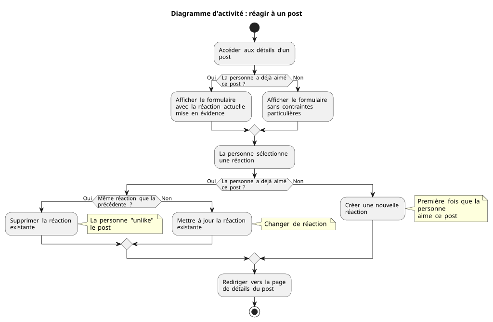

# Formulaires et validation - Mini-projet

L. Delafontaine, avec l'aide de
[GitHub Copilot](https://github.com/features/copilot).

Ce travail est sous licence [CC BY-SA 4.0][licence].

> [!TIP]
>
> Toutes les informations relatives à ce contenu sont décrites dans le
> [contenu principal](../README.md).

## Table des matières

- [Table des matières](#table-des-matières)
- [Objectifs](#objectifs)
- [Identifier les tâches à réaliser](#identifier-les-tâches-à-réaliser)
- [Mettre en place les formulaires pour gérer les posts](#mettre-en-place-les-formulaires-pour-gérer-les-posts)
  - [Créer l'issue et la branche pour suivre cette tâche](#créer-lissue-et-la-branche-pour-suivre-cette-tâche)
  - [Formulaire de création](#formulaire-de-création)
  - [Formulaire d'édition](#formulaire-dédition)
  - [Formulaire de suppression](#formulaire-de-suppression)
  - [Pousser les modifications et fusionner la pull request](#pousser-les-modifications-et-fusionner-la-pull-request)
- [Mettre en place le formulaire pour liker un post](#mettre-en-place-le-formulaire-pour-liker-un-post)
  - [Créer l'issue et la branche pour suivre cette tâche](#créer-lissue-et-la-branche-pour-suivre-cette-tâche-1)
  - [Mettre à jour le contrôleur](#mettre-à-jour-le-contrôleur)
  - [Mettre à jour la vue](#mettre-à-jour-la-vue-3)
  - [Créer le contrôleur](#créer-le-contrôleur)
  - [Définir les actions de chaque méthode](#définir-les-actions-de-chaque-méthode)
  - [Lier le contrôleur aux routes](#lier-le-contrôleur-aux-routes)
  - [Tester le formulaire](#tester-le-formulaire-3)
  - [Pousser les modifications et fusionner la pull request](#pousser-les-modifications-et-fusionner-la-pull-request-1)
- [Mettre en place les formulaires pour gérer le profil utilisateur.trice](#mettre-en-place-les-formulaires-pour-gérer-le-profil-utilisateurtrice)
  - [Créer l'issue et la branche pour suivre cette tâche](#créer-lissue-et-la-branche-pour-suivre-cette-tâche-2)
  - [Créer et appliquer la migration pour ajouter l'image de profil](#créer-et-appliquer-la-migration-pour-ajouter-limage-de-profil)
  - [Créer les vues](#créer-les-vues)
  - [Créer les traductions](#créer-les-traductions)
  - [Créer le contrôleur](#créer-le-contrôleur-1)
  - [Définir les actions de chaque méthode](#définir-les-actions-de-chaque-méthode-1)
  - [Créer le lien symbolique pour accéder aux fichiers publiques](#créer-le-lien-symbolique-pour-accéder-aux-fichiers-publiques)
  - [Lier le contrôleur aux routes](#lier-le-contrôleur-aux-routes-1)
  - [Mettre à jour le lien pour accéder à son profil](#mettre-à-jour-le-lien-pour-accéder-à-son-profil)
  - [Tester la mise à jour du profil](#tester-la-mise-à-jour-du-profil)
  - [Améliorer la page de profil utilisateur.trice](#améliorer-la-page-de-profil-utilisateurtrice)
  - [Tester la suppression du profil](#tester-la-suppression-du-profil)
  - [Améliorer la documentation](#améliorer-la-documentation)
  - [Pousser les modifications et fusionner la pull request](#pousser-les-modifications-et-fusionner-la-pull-request-2)
- [Conclusion](#conclusion)
- [Solution](#solution)
- [Idées pour le mini-projet personnel](#idées-pour-le-mini-projet-personnel)
- [Aller plus loin](#aller-plus-loin)

## Objectifs

Mettre en place tous les formulaires nécessaires pour permettre aux
utilisateur.trice.s de créer, éditer et supprimer des posts, ainsi que de gérer
leur profil utilisateur.trice.

Dans cette séance, nous souhaitons également permettre aux personnes d'avoir une
image de profil pour leur compte utilisateur.trice. Nous allons donc devoir
toucher à tous les aspects que nous avons étudié jusqu'ici : base de données,
modèles, vues, contrôleurs, etc.

## Identifier les tâches à réaliser

Maintenant que nous avons une bonne compréhension du patron de conception MVC
(modèles, vues et contrôleurs), nous allons pouvoir mettre en place les
formulaires nécessaires pour permettre aux utilisateur.trice.s de créer, éditer
et supprimer des posts, ainsi que de gérer leur profil utilisateur.trice.

Ces différentes tâchent requièrent de toucher à tous les aspects de
l'application : base de données, vue, composants, etc. Prenez quelques minutes
pour lister les tâches que vous allez devoir réaliser pour cette partie avec
leurs implications.

<details>
<summary>Exemple de réponse</summary>

> [!NOTE]
>
> Ceci est un exemple de réponse possible. D'autres réponses sont possibles et
> valides. L'objectif est de réfléchir aux tâches que vous allez devoir faire.
>
> N'hésitez pas à proposer d'autres tâches que celles mentionnées dans cet
> exemple.

- Créer les formulaires de création, d'édition et de suppression de posts.
- Mettre à jour les routes et les méthodes de contrôleur pour gérer la création,
  la mise à jour et la suppressions des posts associés.
- Mettre à jour les vues pour gérer les posts.
- Mettre à jour les traductions pour la gestion des posts.
- Créer une migration pour rajouter un champ pour l'image de profil de la
  personne.
- Créer les formulaires de mise à jour et de suppression du profil.
- Mettre à jour les routes et les méthodes de contrôleur pour gérer la création,
  la mise à jour et la suppressions du profil.
- Mettre à jour les vues pour gérer le profil.
- Mettre à jour les traductions pour la gestion du profil.

</details>

## Mettre en place les formulaires pour gérer les posts

Dans cette section, nous allons mettre en place les formulaires nécessaires pour
permettre aux utilisateur.trice.s de créer, éditer et supprimer des posts.

### Créer l'issue et la branche pour suivre cette tâche

Commencez par créer l'issue sur GitHub pour suivre cette tâche, puis créez la
branche correspondante à partir de la branche principale `main`.

Basculez sur la branche que vous venez de créer, puis suivez les étapes
suivantes pour mettre en place la tâche à effectuer.

### Formulaire de création

#### Mettre à jour la vue

Dans le fichier `resources/views/posts/create.blade.php`, rajoutez le formulaire
suivant pour créer un nouveau post :

```php
        <form method="POST" action="{{ url('/posts') }}">
            @csrf

            <div class="mb-4">
                <label for="title" class="block text-sm font-medium text-gray-700 dark:text-gray-300 mb-2">
                    {{ __('ui.posts.form.fields.title.label') }}
                </label>
                <input id="title" type="text" name="title" value="{{ old('title') }}"
                    placeholder="{{ __('ui.posts.form.fields.title.placeholder') }}"
                    class="w-full px-3 py-2 border rounded-md bg-white dark:bg-slate-700 text-gray-900 dark:text-white focus:ring-2 focus:border-transparent @error('title') border-red-500 focus:ring-red-500 @else border-gray-300 dark:border-gray-600 focus:ring-teal-500 dark:focus:ring-purple-500 @enderror">
                @error('title')
                    <p class="mt-1 text-sm text-red-600 dark:text-red-400">{{ $message }}</p>
                @enderror
            </div>

            <div class="mb-6">
                <label for="content" class="block text-sm font-medium text-gray-700 dark:text-gray-300 mb-2">
                    {{ __('ui.posts.form.fields.content.label') }}
                </label>
                <textarea id="content" name="content" rows="5"
                    placeholder="{{ __('ui.posts.form.fields.content.placeholder') }}"
                    class="w-full px-3 py-2 border rounded-md bg-white dark:bg-slate-700 text-gray-900 dark:text-white focus:ring-2 focus:border-transparent @error('content') border-red-500 focus:ring-red-500 @else border-gray-300 dark:border-gray-600 focus:ring-teal-500 dark:focus:ring-purple-500 @enderror">{{ old('content') }}</textarea>
                @error('content')
                    <p class="mt-1 text-sm text-red-600 dark:text-red-400">{{ $message }}</p>
                @enderror
            </div>

            <footer class="pt-4 border-t border-gray-200 dark:border-gray-700">
                <div class="flex items-center justify-between">
                    <a href="{{ url('/posts') }}"
                        class="px-4 py-2 bg-gray-200 dark:bg-gray-700 text-gray-800 dark:text-gray-200 rounded-md hover:bg-gray-300 dark:hover:bg-gray-600">
                        {{ __('ui.posts.form.actions.cancel') }}
                    </a>
                    <button type="submit"
                        class="px-4 py-2 bg-teal-600 dark:bg-purple-900 text-white rounded-md hover:bg-teal-700 dark:hover:bg-purple-800 cursor-pointer">
                        {{ __('ui.posts.form.actions.submit') }}
                    </button>
                </div>
            </footer>
        </form>
```

Prenez quelques minutes pour comprendre ce bout de code et essayez de répondre
aux questions suivantes :

- Comment est structuré le formulaire ? Quels éléments le composent ?
- Vers quelle URL les données sont envoyées ? Avec quelle méthode HTTP ?
- Est-ce que le formulaire est protégé contre les attaques CSRF ? Si oui,
  comment ?
- Quels sont les mécanismes mis en place pour afficher les erreurs de
  validations ?
- Est-ce que les données sont préservées en cas d'erreur de validation ? Comment
  cela s'articule ?
- Comment sont utilisées les traductions dans ce formulaire ? Comment sont-elles
  structurées ?

Vous pouvez vous aider de la [théorie](../README.md) pour répondre à chacune de
ces questions.

#### Mettre à jour les traductions

Ouvrez le fichier `lang/fr/ui.php` et rajoutez les lignes suivantes au fichier :

```php
<?php

declare(strict_types=1);

return [
    // Autres traductions liées aux autres pages...
    'posts' => [
        // Autres traductions liées aux posts...
        'form' => [
            'fields' => [
                'title' => [
                    'label' => 'Titre (optionnel)',
                    'placeholder' => 'Entrez un titre pour votre post (optionnel)',
                ],
                'content' => [
                    'label' => 'Contenu',
                    'placeholder' => 'Exprimez-vous librement dans votre post...',
                ],
            ],
            'actions' => [
                'submit' => 'Sauvegarder',
                'cancel' => 'Annuler',
            ],
        ],
        // Autres traductions liées aux posts...
    ],
    // Autres traductions liées aux autres pages...
];
```

Comme les données du formulaire seront utilisées autant pour la création d'un
post que sa mise à jour, tous les champs communs sont mis au même niveau que les
autres pages/vues propres aux posts (`posts.create`, `posts.index`,
`posts.edit`, `posts.show`).

Ouvrez maintenant le fichier `lang/fr/validation.php` que la libraire
[`laravel-lang/lang`](https://laravel-lang.com/packages-lang.html) a créé dans
une précédente séance.

Vous noterez que ce fichier contient déjà plusieurs traductions liées à la
validation utilisée par Laravel.

Rajoutez les lignes suivantes au fichier :

```php
<?php

declare(strict_types=1);

return [
    // Autres traductions liées à la validation...
    'attributes' => [
        'content'         => 'contenu',
        'title'           => 'titre',
    ],
    // Autres traductions liées à la validation...
];
```

Ces quelques lignes permettront de traduire correctement les attributs dans les
erreurs de validation.

Par exemple, plutôt que d'afficher _"Le texte de title doit contenir au moins 3
caractères."_ (notez le terme _"title"_, issue de l'attribut `name` donné au
champ `input` du formulaire), l'attribut sera correctement traduit avec le texte
_"Le texte de titre doit contenir au moins 3 caractères."_

#### Mettre à jour les routes et le contrôleur

Ouvrez maintenant le fichier `app/Http/Controllers/PostController.php`. Mettez à
jour la fonction `store` du contrôleur avec le code suivant :

```php
    /**
     * Store a newly created resource in storage.
     */
    public function store(Request $request)
    {
        $validated = $request->validate([
            'title' => 'nullable|string|max:255',
            'content' => 'required|string|max:5000',
        ]);

        $user = User::where('id', 2)->first();
        $post = new Post();

        $post->title = $validated['title'];
        $post->content = $validated['content'];
        $post->user()->associate($user);

        $post->save();

        return redirect("/posts/$post->id");
    }
```

En effet, selon les conventions de Laravel, cette méthode est appelée lors de la
soumission d'un formulaire avec la méthode HTTP POST pour la création d'une
nouvelle ressource (un nouveau post).

Lors de la création du post, pour le moment, nous associons ce nouveau post à
l'utilisatrice Jane Doe (ID `2`). Dans une future séance, nous gérerons les
utilisateur.trices authentifiées et nous pourrons mettre à jour le code pour
associer le post à la personne actuellement connectée.

Prenez quelques minutes pour comprendre ce bout de code et essayez de répondre
aux questions suivantes :

- Y-a-t-il des règles de validation appliquées sur la requête ? Si oui,
  lesquelles ?
- Si des erreurs de validation se produisent, que se passe-t-il ?
- Comment ce nouveau post est-il lié à l'utilisatrice Jane Doe ?
- Comment ce nouveau post est-il sauvegardé en base de données ?
- Vers quelle page la personne est redirigée une fois le post sauvegardé ? Pour
  quelle raison ?

#### Tester le formulaire

Sauvegardez tous les fichiers mis à jour et accédez à la page de création d'un
nouveau post.

Un formulaire devrait maintenant être présent, vous permettant de créer un
nouveau post avec un titre et un contenu !

Essayez de créer de nouveaux posts ainsi que des posts qui ne respectent pas les
règles de validation (vous pouvez utiliser la ressource
<https://www.lipsum.com/> pour générer une grande quantité de texte si besoin).

Lorsqu'un nouveau post a été créé avec succès, vous devriez avoir accès à la
page de détail du post fraîchement créé !

Essayez maintenant de rajouter une règle de validation pour que le contenu soit
de minimum trois (3) caractères. Que devriez-vous faire pour proposer cette
nouvelle règle de validation ? Testez votre solution. Le message d'erreur de
validation devrait s'afficher correctement.

<details>
<summary>Afficher la réponse</summary>

Afin de rajouter cette règle de validation, il suffit d'ajouter la règle `min:3`
au contenu du post :

```php
$validated = $request->validate([
    'title' => 'nullable|string|max:255',
    'content' => 'required|string|min:3|max:5000',
]);
```

</details>

### Formulaire d'édition

#### Mettre à jour la vue

Dans le fichier `resources/views/posts/edit.blade.php`, rajoutez le formulaire
suivant pour mettre à jour un post :

```php

        <form method="POST" action="{{ url('/posts/' . $post->id) }}">
            @csrf
            @method('PATCH')

            <div class="mb-4">
                <label for="title" class="block text-sm font-medium text-gray-700 dark:text-gray-300 mb-2">
                    {{ __('ui.posts.form.fields.title.label') }}
                </label>
                <input type="text" id="title" name="title" value="{{ old('title', $post->title) }}"
                    placeholder="{{ __('ui.posts.form.fields.title.placeholder') }}"
                    class="w-full px-3 py-2 border border-gray-300 dark:border-gray-600 rounded-md bg-white dark:bg-slate-700 text-gray-900 dark:text-white focus:ring-2 focus:ring-teal-500 dark:focus:ring-purple-500 focus:border-transparent @error('title') border-red-500 focus:ring-red-500 @else border-gray-300 dark:border-gray-600 focus:ring-teal-500 dark:focus:ring-purple-500 @enderror">
                @error('title')
                    <p class="mt-1 text-sm text-red-600 dark:text-red-400">{{ $message }}</p>
                @enderror
            </div>

            <div class="mb-6">
                <label for="content" class="block text-sm font-medium text-gray-700 dark:text-gray-300 mb-2">
                    {{ __('ui.posts.form.fields.content.label') }}
                </label>
                <textarea id="content" name="content" rows="5"
                    placeholder="{{ __('ui.posts.form.fields.content.placeholder') }}"
                    class="w-full px-3 py-2 border border-gray-300 dark:border-gray-600 rounded-md bg-white dark:bg-slate-700 text-gray-900 dark:text-white focus:ring-2 focus:ring-teal-500 dark:focus:ring-purple-500 focus:border-transparent @error('content') border-red-500 focus:ring-red-500 @else border-gray-300 dark:border-gray-600 focus:ring-teal-500 dark:focus:ring-purple-500 @enderror">{{ old('content', $post->content) }}</textarea>
                @error('content')
                    <p class="mt-1 text-sm text-red-600 dark:text-red-400">{{ $message }}</p>
                @enderror
            </div>

            <footer class="pt-4 border-t border-gray-200 dark:border-gray-700">
                <div class="flex items-center justify-between">
                    <div class="flex gap-2">
                        <a href="{{ url('/posts/' . $post->id) }}"
                            class="px-4 py-2 bg-gray-200 dark:bg-gray-700 text-gray-800 dark:text-gray-200 rounded-md hover:bg-gray-300 dark:hover:bg-gray-600">
                            {{ __('ui.posts.form.actions.cancel') }}
                        </a>
                    </div>
                    <button type="submit"
                        class="px-4 py-2 bg-teal-600 dark:bg-purple-900 text-white rounded-md hover:bg-teal-700 dark:hover:bg-purple-800 cursor-pointer">
                        {{ __('ui.posts.form.actions.submit') }}
                    </button>
                </div>
            </footer>
        </form>
```

Prenez quelques minutes pour comprendre ce bout de code et essayez de répondre
aux questions suivantes :

> [!NOTE]
>
> Prenez le temps de comparer avec le précédent formulaire et d'identifier les
> différences.

- Comment est structuré le formulaire ? Quels éléments le composent ?
- Vers quelle URL les données sont envoyées ? Avec quelle méthode HTTP ?
- Comment le post spécifique est utilisé dans le formulaire ?
- Est-ce que le formulaire est protégé contre les attaques CSRF ? Si oui,
  comment ?
- Quels sont les mécanismes mis en place pour afficher les erreurs de
  validations ?
- Est-ce que les données sont préservées en cas d'erreur de validation ? Comment
  cela s'articule ? Est-ce qu'il y a une différence avec le précédent formulaire
  ? Si oui, laquelle ?
- Comment sont utilisées les traductions dans ce formulaire ? Comment sont-elles
  structurées ?

Vous pouvez vous aider de la [théorie](../README.md) pour répondre à chacune de
ces questions.

#### Mettre à jour les traductions

Comme toutes les traduction du formulaire ont déjà été créées dans la section
précédente, il n'y a rien à faire ici pour le moment.

#### Mettre à jour les routes et le contrôleur

Ouvrez maintenant le fichier `app/Http/Controllers/PostController.php`. Mettez à
jour la fonction `store` du contrôleur avec le code suivant :

```php
    /**
     * Update the specified resource in storage.
     */
    public function update(Request $request, string $id)
    {
        $validated = $request->validate([
            'title' => 'nullable|string|max:255',
            'content' => 'required|string|max:5000',
        ]);

        $post = Post::findOrFail($id);

        $post->title = $validated['title'];
        $post->content = $validated['content'];

        $post->save();

        return redirect("/posts/$post->id");
    }
```

En effet, selon les conventions de Laravel, cette méthode est appelée lors de la
soumission d'un formulaire avec la méthode HTTP PATCH ou PUT pour la mise à jour
d'une ressource (un post existant).

Prenez quelques minutes pour comprendre ce bout de code et essayez de répondre
aux questions suivantes :

- Comment le post spécifique est utilisé dans le contrôleur ?
- Y-a-t-il des règles de validation appliquées sur la requête ? Si oui,
  lesquelles ?
- Si des erreurs de validation se produisent, que se passe-t-il ?
- Comment ce post est-il lié à l'utilisatrice Jane Doe ?
- Comment ce post est-il sauvegardé en base de données ?
- Vers quelle page la personne est redirigée une fois le post mis à jour ? Pour
  quelle raison ?

#### Tester le formulaire

Sauvegardez tous les fichiers mis à jour et accédez à la page de mise à jour
d'un post. Pour rappel, vous pouvez y accéder depuis la page de visualisation
d'un post, dans l'entête.

Un formulaire devrait maintenant être présent, vous permettant de modifier un
post avec un titre et un contenu !

Essayez de créer de mettre à jour des posts ainsi que des posts qui ne
respectent pas les règles de validation (vous pouvez utiliser la ressource
<https://www.lipsum.com/> pour générer une grande quantité de texte si besoin).

Lorsqu'un post a été mis à jour avec succès, vous devriez avoir accès à la page
de détail du post mis à jour !

### Formulaire de suppression

#### Mettre à jour la vue

Afin de supprimer le post, nous allons rajouter un bouton de suppression dans la
page d'édition du post.

Dans le fichier `resources/views/posts/edit.blade.php`, rajoutez le formulaire
suivant pour supprimer un post :

> [!NOTE]
>
> Comme présenté dans le cours précédent, l'affiche ci-dessous est un "diff"
> généré avec la commande `git diff`.
>
> Cela permet de mettre en avant les différences entre deux versions de
> fichiers.
>
> Prenez le temps d'identifier où dans le fichier le nouveau code doit se
> placer.

```diff
diff --git a/resources/views/posts/edit.blade.php b/resources/views/posts/edit.blade.php
index a7bac65..b2854be 100644
--- a/resources/views/posts/edit.blade.php
+++ b/resources/views/posts/edit.blade.php
@@ -69,6 +69,11 @@ class="w-full px-3 py-2 border border-gray-300 dark:border-gray-600 rounded-md b
                             class="px-4 py-2 bg-gray-200 dark:bg-gray-700 text-gray-800 dark:text-gray-200 rounded-md hover:bg-gray-300 dark:hover:bg-gray-600">
                             {{ __('ui.posts.form.actions.cancel') }}
                         </a>
+                        <button type="submit" form="delete-post-form"
+                            onclick="return confirm('{{ __('ui.posts.form.actions.delete_confirm') }}')"
+                            class="px-4 py-2 bg-red-600 dark:bg-red-900 text-white rounded-md hover:bg-red-700 dark:hover:bg-red-800 cursor-pointer">
+                            {{ __('ui.posts.form.actions.delete') }}
+                        </button>
                     </div>
                     <button type="submit"
                         class="px-4 py-2 bg-teal-600 dark:bg-purple-900 text-white rounded-md hover:bg-teal-700 dark:hover:bg-purple-800 cursor-pointer">
@@ -77,5 +82,10 @@ class="px-4 py-2 bg-teal-600 dark:bg-purple-900 text-white rounded-md hover:bg-t
                 </div>
             </footer>
         </form>
+
+        <form id="delete-post-form" method="POST" action="{{ url('/posts/' . $post->id) }}" class="hidden">
+            @csrf
+            @method('DELETE')
+        </form>
     </article>
 </x-default-layout>
```

Le formulaire de suppression est un cas un peu différent des formulaires que
nous avons créé jusqu'ici. En effet, selon la spécification HTML, il n'est pas
possible d'avoir des formulaires imbriqués les uns dans les autres.

Or, dans notre cas, nous souhaitons avoir un bouton de suppression à côté du
bouton d'annulation, lui-même situé dans le premier formulaire de la page
d'édition du post.

Heureusement pour nous, il est possible de créer des formulaires séparés et
d'indiquer à un bouton de soumission de formulaire (`type="submit"`) pour quel
formulaire la soumission doit avoir lieu (`form="delete-post-form"`) !

Nous utilisons également une alerte JavaScript pour demander la confirmation de
suppression à l'utilisateur.trice à l'aide de l'attribut `onclick`
(`onclick="return confirm('{{ __('ui.posts.form.actions.delete_confirm') }}')"`).

Ce bout de code fonctionne de la manière suivante :

- La fonction JavaScript `confirm` ouvre une boîte de dialogue avec un message
  de confirmation.
- La personne a le choix entre accepter ou refuser l'action.
- Si la personne accepte, la fonction `confirm` retourne `true` et la soumission
  du formulaire a lieu.
- Si la personne refuse, la fonction `confirm` retourne `false` et la soumission
  du formulaire n'a simplement pas lieu.

De plus, le formulaire est caché (grâce à la classe CSS `hidden`), ce qui permet
de ne pas montrer ce formulaire à l'utilisateur.trice final.e mais pourquoi
bénéficier de son utilisation.

Prenez quelques minutes pour comprendre ce bout de code et essayez de répondre
aux questions suivantes :

- Où est situé le formulaire de suppression dans la page ? Pourquoi selon vous ?
- Vers quelle URL les données sont envoyées ? Avec quelle méthode HTTP ?
- Est-ce que le formulaire est protégé contre les attaques CSRF ? Si oui,
  comment ?
- Quels sont les mécanismes mis en place pour afficher les erreurs de
  validations ?
- Est-ce que les données sont préservées en cas d'erreur de validation ? Comment
  cela s'articule ?
- Comment sont utilisées les traductions dans ce formulaire ? Comment sont-elles
  structurées ?

Vous pouvez vous aider de la [théorie](../README.md) pour répondre à chacune de
ces questions.

#### Mettre à jour les traductions

Ouvrez le fichier `lang/fr/ui.php` et rajoutez les lignes suivantes au fichier :

```php
<?php

declare(strict_types=1);

return [
    // Autres traductions liées aux autres pages...
    'posts' => [
        // Autres traductions liées aux posts...
        'form' => [
            // Autres traductions liées au(x) formulaire(s) des posts...
            'actions' => [
                // Autres traductions liées aux actions des formulaires des posts...
                'delete' => 'Supprimer',
                'delete_confirm' => 'Souhaitez-vous vraiment supprimer ce post ? Cette action est irréversible.',
                // Autres traductions liées aux actions des formulaires des posts...
            ],
            // Autres traductions liées au(x) formulaire(s) des posts...
        ],
        // Autres traductions liées aux posts...
    ],
    // Autres traductions liées aux autres pages...
];
```

Ici, nous ajoutons simplement les actions propres à la suppression d'un post
avec le nom donné au bouton de suppression et le message de confirmation.

#### Mettre à jour les routes et le contrôleur

Ouvrez maintenant le fichier `app/Http/Controllers/PostController.php`. Mettez à
jour la fonction `destroy` du contrôleur avec le code suivant :

```php
    /**
     * Remove the specified resource from storage.
     */
    public function destroy(string $id)
    {
        Post::destroy($id);

        return redirect("/posts");
    }
```

En effet, selon les conventions de Laravel, cette méthode est appelée lors de la
soumission d'un formulaire avec la méthode HTTP DELETE pour la suppression d'une
ressource (un post).

Prenez quelques minutes pour comprendre ce bout de code et essayez de répondre
aux questions suivantes :

- Y-a-t-il des règles de validation appliquées sur la requête ? Si oui,
  lesquelles ?
- Si des erreurs de validation se produisent, que se passe-t-il ?
- Comment ce nouveau post est-il modifié en base de données ?
- Vers quelle page la personne est redirigée une fois le post supprimé ? Pour
  quelle raison ?

#### Tester le formulaire

Sauvegardez tous les fichiers mis à jour et accédez à la page d'édition d'un
post.

Un nouveau bouton de suppression devrait maintenant être présent, vous
permettant de supprimer un post ! Le formulaire associé devrait être invisible.

Essayez de supprimer certains posts. Un message de confirmation devrait vous
permettre de confirmer l'action !

Lorsqu'un nouveau post a été supprimé avec succès, vous devriez avoir accès à la
page contenant tous les posts restants !

### Pousser les modifications et fusionner la pull request

Une fois les modifications terminées, validez les modifications dans Git, puis
vous pouvez créer la pull request.

Validez la pull request et fusionnez-la une fois que les modifications sont
terminées. Vous pouvez ensuite supprimer la branche que vous avez créée pour
cette tâche.

N'oubliez pas de récupérer les modifications localement après la fusion de la
pull request.

## Mettre en place le formulaire pour liker un post

Dans cette section, nous allons mettre en place le formulaire pour aimer/réagir
à un post.

Afin d'être capable de réagir à un post, nous devons imaginer deux cas de figure
:

1. La personne n'a pas encore liké un post.
2. La personne a déjà liké le post qu'elle visite.

Afin de gérer ces deux, il est nécessaire d'implémenter un peu de logique
supplémentaire :

1. Il est nécessaire de vérifier, lors de l'accès aux détails d'un post, si la
   personne connectée a déjà aimé le post.
2. Si ce n'est pas le cas, le formulaire peut s'afficher sans contraintes
   particulières.
3. Si, par contre, la personne a déjà aimé le post, il faut afficher la réaction
   que la personne a sélectionné pour notifier qu'elle a déjà aimé le post.

Puis, finalement, la personne va pouvoir aimer le post. Ici, trois cas de figure
se présentent à nous :

1. La personne aime le post pour la première fois -> le post est aimé sans
   contraintes particulières.
2. La personne change de réaction par rapport à sa première fois -> la réaction
   est mise à jour sans contraintes particulières.
3. La personne sélectionne la même réaction que sa première fois -> la réaction
   est supprimée.

Pour le troisième cas, nous partons du principe que si la personne a sélectionné
la même réaction que la première, cela signifie qu'elle souhaite "enlever" la
réaction, et donc la supprimer.

Le diagramme d'activité suivant résume ces cas d'utilisation :



### Créer l'issue et la branche pour suivre cette tâche

Commencez par créer l'issue sur GitHub pour suivre cette tâche, puis créez la
branche correspondante à partir de la branche principale `main`.

Basculez sur la branche que vous venez de créer, puis suivez les étapes
suivantes pour mettre en place la tâche à effectuer.

### Mettre à jour le contrôleur

Afin de savoir si la personne a déjà aimé le post, il est nécessaire
d'interroger la base de données pour récupérer la potentielle réaction de la
personne.

Pour cela, ouvrez le fichier `app/Http/Controllers/PostController.php` et mettez
à jour la méthode `show()` avec le contenu suivant :

```php
    /**
     * Display the specified resource.
     */
    public function show(string $id)
    {
        $post = Post::with('user')->with('likes')->findOrFail($id);

        $user = User::find(2);
        $reaction = $post->likes()->where('user_id', $user->id)->first();

        // Vérifie si la personne a déjà liké ce post
        if ($reaction) {
            // Récupère la réaction au post
            $reaction = $reaction->pivot->reaction;
        }

        return view('posts.show', ['post' => $post, 'reaction' => $reaction]);
    }
```

Prenez quelques minutes pour comprendre ce bout de code et essayez de répondre
aux questions suivantes :

> [!NOTE]
>
> Il est normal que toutes les actions soient liées au profil de Jane Doe (ID
> `2`). Comme nous n'avons pas encore mis en place l'authentification, il est
> nécessaire de stocker l'information en dur dans le code avec le compte
> correspondant à l'ID 2 (Jane Doe).

- Comment est-ce que la réaction est récupérée de la base de données ?
- Que signifie le mot-clé `pivot` ?

### Mettre à jour la vue

Maintenant que la réaction a été récupérée de la base de données, nous pouvons
l'utiliser pour déterminer le formulaire à générer.

Dans le fichier `resources/views/posts/show.blade.php`, remplacez le footer par
le contenu suivant :

```php
        <footer class="pt-4 border-t border-gray-200 dark:border-gray-700">
            <form method="POST" action="{{ url('/likes/' . $post->id) }}" class="mb-4">
                @csrf
                @method('PUT')
                <div class="flex flex-wrap justify-between gap-2">
                    <button type="submit" name="reaction" value="like"
                        class="w-12 h-12 rounded-full hover:bg-gray-200 dark:hover:bg-gray-600 cursor-pointer {{ $reaction === 'like' ? 'ring-2 ring-teal-600 dark:ring-purple-900' : '' }}">
                        👍
                    </button>
                    <button type="submit" name="reaction" value="love"
                        class="w-12 h-12 rounded-full cursor-pointer hover:bg-gray-200 dark:hover:bg-gray-600 {{ $reaction === 'love' ? 'ring-2 ring-teal-600 dark:ring-purple-900' : '' }}">
                        ❤️
                    </button>
                    <button type="submit" name="reaction" value="haha"
                        class="w-12 h-12 rounded-full hover:bg-gray-200 dark:hover:bg-gray-600 cursor-pointer {{ $reaction === 'haha' ? 'ring-2 ring-teal-600 dark:ring-purple-900' : '' }}">
                        😂
                    </button>
                    <button type="submit" name="reaction" value="wow"
                        class="w-12 h-12 rounded-full hover:bg-gray-200 dark:hover:bg-gray-600 cursor-pointer {{ $reaction === 'wow' ? 'ring-2 ring-teal-600 dark:ring-purple-900' : '' }}">
                        😮
                    </button>
                    <button type="submit" name="reaction" value="sad"
                        class="w-12 h-12 rounded-full hover:bg-gray-200 dark:hover:bg-gray-600 cursor-pointer {{ $reaction === 'sad' ? 'ring-2 ring-teal-600 dark:ring-purple-900' : '' }}">
                        😢
                    </button>
                    <button type="submit" name="reaction" value="angry"
                        class="w-12 h-12 rounded-full hover:bg-gray-200 dark:hover:bg-gray-600 cursor-pointer {{ $reaction === 'angry' ? 'ring-2 ring-teal-600 dark:ring-purple-900' : '' }}">
                        😡
                    </button>
                </div>
            </form>
            <ul class="flex flex-wrap gap-2">
                @forelse ($post->likes as $user)
                    <li class="flex items-center gap-1 text-sm text-gray-600 dark:text-gray-400">
                        <a href="{{ url('@' . $user->username) }}" class="font-semibold hover:underline">
                            {{ '@' . $user->username }}
                        </a>
                        <span>
                            @if ($user->pivot->reaction === 'like')
                                👍
                            @elseif($user->pivot->reaction === 'love')
                                ❤️
                            @elseif($user->pivot->reaction === 'haha')
                                😂
                            @elseif($user->pivot->reaction === 'wow')
                                😮
                            @elseif($user->pivot->reaction === 'sad')
                                😢
                            @elseif($user->pivot->reaction === 'angry')
                                😡
                            @endif
                        </span>
                    </li>
                @empty
                    <span class="text-sm text-gray-600 dark:text-gray-400">
                        {{ trans_choice('ui.posts.likes_count', 0) }}
                    </span>
                @endforelse
            </ul>
        </footer>
```

Prenez quelques minutes pour comprendre ce bout de code et essayez de répondre
aux questions suivantes :

- Comment est structuré le formulaire ? Quels éléments le composent ?
- Vers quelle URL les données sont envoyées ? Avec quelle méthode HTTP ? Est-ce
  que la route associée existe-t-elle dans notre projet ?
- Est-ce que le formulaire est protégé contre les attaques CSRF ? Si oui,
  comment ?
- Comment la réaction sélectionnée par la personne est-elle envoyée lors de la
  soumission du formulaire ?
- Si une réaction est déjà liée au post, comment est-elle utilisée pour
  déterminer la réaction à afficher ?
- Existe-t-il des mécanismes mis en place pour afficher les erreurs de
  validations ? Pourquoi ?

Vous pouvez vous aider de la [théorie](../README.md) pour répondre à chacune de
ces questions.

### Créer le contrôleur

Au travers des questions précédentes, vous avez sans doute identifié que la
route pour gérer les likes n'était pas présente dans notre projet.

Nous allons donc créer un contrôleur `LikeController` dédié pour gérer les likes
sur les posts.

Vous souvenez-vous de la commande pour créer un nouveau contrôleur ? Comment
nommeriez-vous ce nouveau contrôleur ?

Si besoin, utilisez la documentation officielle pour retrouver la commande.

<details>
<summary>Afficher la réponse</summary>

```text
php artisan make:controller LikeController
```

Le résultat devrait ressembler à ceci :

```text
   INFO  Controller [app/Http/Controllers/LikeController.php] created successfully.
```

</details>

Un contrôleur vierge devrait avoir été créé.

### Définir les actions de chaque méthode

Dans le contexte des likes, nous souhaitons être capable de réaliser les
opérations suivantes :

- Aimer un post.
- Changer de réaction sur un post.
- Supprimer la réaction du post.

Pour cela, nous allons implémenter une méthode `update()` dans notre nouveau
contrôleur.

Ouvrez le fichier `app/Http/Controllers/LikeController.php` et modifiez-le avec
le contenu suivant :

```php
<?php

namespace App\Http\Controllers;

use App\Models\Post;
use App\Models\User;
use Illuminate\Http\Request;

class LikeController extends Controller
{
    public function update(Request $request, string $id)
    {
        $validated = $request->validate([
            'reaction' => ['required', 'in:like,love,haha,wow,sad,angry'],
        ]);

        $post = Post::findOrFail($id);
        $user = User::where('id', 2)->first();
        $reaction = $validated['reaction'];

        // Vérifie si la personne avait déjà liké ce post
        $existingLike = $post->likes()->where('user_id', $user->id)->first();

        if ($existingLike) {
            // Vérifie si la personne a sélectionné la même réaction que celle qu'elle avait déjà sélectionnée
            if ($existingLike->pivot->reaction === $reaction) {
                // Retire la réaction
                $post->likes()->detach($user->id);
            } else {
                // Met à jour la réaction avec la nouvelle réaction
                $post->likes()->updateExistingPivot($user->id, ['reaction' => $reaction]);
            }
        } else {
            // Like le post avec la réaction sélectionnée
            $post->likes()->attach($user->id, ['reaction' => $reaction]);
        }

        return redirect("/posts/$id");
    }
}
```

Prenez quelques minutes pour comprendre ce bout de code et essayez de répondre
aux questions suivantes :

> [!NOTE]
>
> Il est normal que toutes les actions soient liées au profil de Jane Doe (ID
> `2`). Comme nous n'avons pas encore mis en place l'authentification, il est
> nécessaire de stocker l'information en dur dans le code avec le compte
> correspondant à l'ID 2 (Jane Doe).

- Quelles sont les règles de validation appliquées sur le profil ? Que fait la
  règle de validation `in` ? Que permet-elle comme type de réactions ?
- A quelle méthode HTTP répond la méthode `update()` ?
- Que fait la méthode `update()` ? Comment est-ce que la réaction est gérée ?
  Quels sont les cas de figure possibles dans cette méthode ?
- Une fois la réaction mise à jour (nouvelle réaction, changement de réaction ou
  suppression de réaction), où est-ce que l'utilisateur.trice est redirigé.e ?

### Lier le contrôleur aux routes

Pour lier notre contrôleur au monde extérieur, il est nécessaire de le lier aux
routes.

Ouvrez le fichier `routes/web.php` et mettez-le à jour avec le contenu suivant :

```php
<?php

// Autres imports...

use App\Http\Controllers\LikeController;

// Autres routes...

Route::match(['put', 'patch'], '/likes/{post}', [LikeController::class, 'update']);
```

La méthode `match` permet de regrouper plusieurs méthodes HTTP afin que toutes
les méthodes HTTP mentionnées appelle la même fonction du côté de Laravel
(source : <https://laravel.com/docs/12.x/routing#available-router-methods>).

De cette manière, la même fonction sera appelé pour répondre autant aux
formulaires qui utiliseraient la méthode la méthode `PATCH` (avec la directive
`@method('PATCH')`) que `PUT` (avec la directive `@method('PUT')`), deux
méthodes HTTP utilisées pour mettre à jour des ressources.

Il existe une nuance entre `PATCH` et `PUT`, mais nous n'allons pas les
différencier dans ce cours. Si cela vous intéresse, la différence est décrite
sur MDN aux adresses suivantes :

- <https://developer.mozilla.org/en-US/docs/Web/HTTP/Reference/Methods/PUT>.
- <https://developer.mozilla.org/en-US/docs/Web/HTTP/Reference/Methods/PATCH>.

L'intégralité de la nouvelle fonctionnalité a été implémentée ! Nous pouvons
maintenant la tester.

### Tester le formulaire

Sauvegardez tous les fichiers modifiés et tentez de liker un post.

Lors du choix d'un like, la page devrait se rafraîchir et la réaction
sélectionnée devrait être mise en évidence.

Si la réaction est à nouveau sélectionnée, la réaction est retirée du post.

La liste complète des personnes ayant réagi au post devrait également s'afficher
sous le formulaire.

Les personnes peuvent maintenant aimer/réagir à des posts, bravo !

### Pousser les modifications et fusionner la pull request

Une fois les modifications terminées, validez les modifications dans Git, puis
vous pouvez créer la pull request.

Validez la pull request et fusionnez-la une fois que les modifications sont
terminées. Vous pouvez ensuite supprimer la branche que vous avez créée pour
cette tâche.

N'oubliez pas de récupérer les modifications localement après la fusion de la
pull request.

## Mettre en place les formulaires pour gérer le profil utilisateur.trice

Dans cette section, nous allons mettre en place les formulaires nécessaires pour
permettre aux utilisateur.trice.s de gérer leur profil utilisateur.trice.

Cette partie demande à toucher à la plupart des aspects que nous avons étudié
jusqu'ici.

Pour réaliser cette tâche, nous allons devoir réaliser les points suivants :

- Modifier la base de données pour permettre aux personnes d'avoir une image de
  profil.
- Créer les vues avec les formulaires nécessaires pour permettre la mise à jour
  du profil.
- Créer les contrôleurs pour gérer les requêtes.

Lorsque nous développons ce genre de nouvelles fonctionnalités, il n'y a pas
d'ordre défini. Je (Ludovic) recommande de toujours partir des données puis de
"monter dans les couches" jusqu'au client final (le navigateur de la personne
qui utilisera le service) car les données sont la source absolue de vérité.

Si vous préférez commencer dans l'ordre inverse en commençant depuis le client
(le navigateur de la personne qui utilisera le service), c'est tout à fait
valide aussi. Si c'est votre souhait, vous pourriez suivre l'ordre suivant :

1. [Créer l'issue et la branche pour suivre cette tâche](#créer-lissue-et-la-branche-pour-suivre-cette-tâche-2)
2. [Mettre à jour le lien pour accéder à son profil](#mettre-à-jour-le-lien-pour-accéder-à-son-profil)
3. [Créer le contrôleur](#créer-le-contrôleur)
4. [Définir les actions de chaque méthode](#définir-les-actions-de-chaque-méthode)
5. [Créer le lien symbolique pour accéder aux fichiers publiques](#créer-le-lien-symbolique-pour-accéder-aux-fichiers-publiques)
6. [Lier le contrôleur aux routes](#lier-le-contrôleur-aux-routes)
7. [Créer les vues](#créer-les-vues)
8. [Créer les traductions](#créer-les-traductions)
9. [Créer et appliquer la migration pour ajouter l'image de profil](#créer-et-appliquer-la-migration-pour-ajouter-limage-de-profil)

Puis reprendre à la section
[Tester la mise à jour du profil](#tester-la-mise-à-jour-du-profil).

### Créer l'issue et la branche pour suivre cette tâche

Commencez par créer l'issue sur GitHub pour suivre cette tâche, puis créez la
branche correspondante à partir de la branche principale `main`.

Basculez sur la branche que vous venez de créer, puis suivez les étapes
suivantes pour mettre en place la tâche à effectuer.

### Créer et appliquer la migration pour ajouter l'image de profil

Nous allons créer une migration nommée `add_profile_picture_to_users_table` pour
rajouter un champ `profile_picture` à la table `users` de notre base de données.

Vous souvenez-vous de la commande pour créer une nouvelle migration ?

Si besoin, utilisez la documentation officielle pour retrouver la commande.

<details>
<summary>Afficher la réponse</summary>

```bash
php artisan make:migration add_profile_picture_to_users_table
```

Le résultat devrait ressembler à ceci :

```text
   INFO  Migration [database/migrations/2026_03_04_143945_add_profile_picture_to_users_table.php] created successfully.
```

</details>

Essayez maintenant de modifier le fichier de migration récemment créé en mettant
à jour les méthodes `up()` et `down()` pour ajouter/supprimer une colonne
`profile_picture` optionnelle.

Vous remarquerez que Laravel a su déduire automatiquement que vous souhaitez
modifier la table `users` grâce au nom donné à la migration.

Pour ajouter/supprimer des colonnes, utilisez la documentation officielle
disponible ici si besoin :
<https://laravel.com/docs/12.x/migrations#column-modifiers>.

<details>
<summary>Afficher la réponse</summary>

```php
<?php

use Illuminate\Database\Migrations\Migration;
use Illuminate\Database\Schema\Blueprint;
use Illuminate\Support\Facades\Schema;

return new class extends Migration
{
    /**
     * Run the migrations.
     */
    public function up(): void
    {
        Schema::table('users', function (Blueprint $table) {
            $table->string('profile_picture')->nullable()->after('username');
        });
    }

    /**
     * Reverse the migrations.
     */
    public function down(): void
    {
        Schema::table('users', function (Blueprint $table) {
            $table->dropColumn('profile_picture');
        });
    }
};
```

Prenez quelques minutes pour comprendre cette migration.

La migration ajoute une nouvelle colonne `profile_picture` à la table `users`.
De cette manière, nous allons pouvoir stocker le chemin d'accès à l'image de
profile pour chaque utilisateur.trice. Ce champ est optionnel (_"nullable"_).

</details>

Maintenant que la migration est définie, nous pouvons l'appliquer.

Vous souvenez-vous de la commande pour appliquer une migration ?

Si besoin, utilisez la documentation officielle pour retrouver la commande.

<details>
<summary>Afficher la réponse</summary>

```bash
php artisan migrate
```

Le résultat devrait ressembler à ceci :

```text
   INFO  Running migrations.

  2026_03_04_143945_add_profile_picture_to_users_table ........................... 8.14ms DONE
```

</details>

La base de données ayant été mise à jour, les modèles peuvent automatiquement
utiliser la nouvelle colonne. Nous pouvons passer aux vues pour présenter
l'information à l'utilisateur.trice.

### Créer les vues

Pour permettre aux utilisateur.trices de pouvoir gérer leur profil, il est
nécessaire de créer deux nouvelles vues :

1. `my-profile.show` : la vue pour visualiser son propre profil.
2. `my-profile.edit` : la vue pour mettre à jour son profil.

Le nom `my-profile` permet de séparer les éléments propres à la gestion de son
propre profil par rapport aux profiles publiques des autres utilisateur.trice.

Il n'est pas nécessaire de fournir une vue de création de profil (comme ça a pu
être le cas avec les posts par exemple) car l'utilisateur.trice sera créé lors
de la création de son compte au travers de l'inscription au service. Cet aspect
sera étudié dans la prochaine séance.

Vous souvenez-vous de la commande pour créer une nouvelle vue ?

Si besoin, utilisez la documentation officielle pour retrouver la commande.

<details>
<summary>Afficher la réponse</summary>

```bash
php artisan make:view my-profile.show

php artisan make:view my-profile.edit
```

Le résultat devrait ressembler à ceci :

```text
   INFO  View [resources/views/my-profile/show.blade.php] created successfully.

   INFO  View [resources/views/my-profile/edit.blade.php] created successfully.
```

</details>

Remplacez le contenu du fichier `resources/views/my-profile/show.blade.php` avec
le contenu suivant :

```php
<x-default-layout>
    <x-slot:title>
        {{ __('ui.my_profile.show.title') }}
    </x-slot>

    <x-slot:description>
        {{ __('ui.my_profile.show.description') }}
    </x-slot>

    <article class="bg-white dark:bg-slate-800 rounded-lg shadow-md p-6 text-center">
        <div class="flex justify-center mb-6">
            <div
                class="w-32 h-32 rounded-full overflow-hidden bg-gray-200 dark:bg-gray-700 flex items-center justify-center">
                @if ($user->profile_picture)
                    profile_picture) }}" alt="{{ $user->username }}"
                        class="w-full h-full object-cover">
                @else
                    username }}" class="h-32 w-32 text-gray-400">
                @endif
            </div>
        </div>

        <h1 class="text-2xl font-bold dark:text-white">
            {{ $user->first_name }} {{ $user->last_name }}
        </h1>

        <p class="text-lg text-gray-600 dark:text-gray-400 mt-1">
            {{ '@' . $user->username }}
        </p>

        <p class="text-gray-600 dark:text-gray-400 mt-1">
            {{ $user->email }}
        </p>

        <p class="mt-4 dark:text-gray-300">
            {{ __('ui.my_profile.show.member_since', ['date' => $user->created_at->isoFormat('LL')]) }}
        </p>

        <div class="flex justify-center gap-3 mt-6">
            <a href="{{ url('/my-profile/edit') }}"
                class="px-4 py-2 bg-teal-600 dark:bg-purple-900 text-white rounded-md hover:bg-teal-700 dark:hover:bg-purple-800">
                {{ __('ui.my_profile.show.actions.edit') }}
            </a>
            <a href="{{ url('/@' . $user->username) }}"
                class="px-4 py-2 bg-gray-200 dark:bg-gray-700 text-gray-800 dark:text-gray-200 rounded-md hover:bg-gray-300 dark:hover:bg-gray-600">
                {{ __('ui.my_profile.show.actions.view_public') }}
            </a>
        </div>
    </article>
</x-default-layout>
```

Prenez quelques minutes pour comprendre ce bout de code et essayez de répondre
aux questions suivantes :

- Comment sont utilisées les traductions dans cette vue ? Comment sont-elles
  structurées ?
- Comment est utilisé l'image de profil de l'utilisateur.trice dans cette vue ?
  Comment est-elle récupérée depuis le disque ?
- Quelles sont les actions possibles sur le profil depuis cette vue ?

Remplacez le contenu du fichier `resources/views/my-profile/edit.blade.php` avec
le contenu suivant :

```php
<x-default-layout>
    <x-slot:title>
        {{ __('ui.my_profile.edit.title') }}
    </x-slot>

    <x-slot:description>
        {{ __('ui.my_profile.edit.description') }}
    </x-slot>

    <article class="bg-white dark:bg-slate-800 rounded-lg shadow-md p-6">
        <header class="mb-6">
            <h1 class="text-2xl font-bold dark:text-white">
                {{ __('ui.my_profile.edit.title') }}
            </h1>

            <p class="mt-4 dark:text-gray-300">
                {{ __('ui.my_profile.edit.description') }}
            </p>
        </header>

        <form method="POST" enctype="multipart/form-data" action="{{ url('/my-profile') }}">
            @csrf
            @method('PUT')

            <div class="mb-4">
                <label for="profile-picture" class="block text-sm font-medium text-gray-700 dark:text-gray-300 mb-2">
                    {{ __('ui.my_profile.form.fields.profile_picture.label') }}
                </label>
                <input type="file" id="profile-picture" name="profile_picture"
                    accept="image/jpeg,image/png,image/bmp,image/gif,image/webp"
                    class="w-full px-3 py-2 border border-gray-300 dark:border-gray-600 rounded-md bg-white dark:bg-slate-700 text-gray-900 dark:text-white focus:ring-2 focus:ring-teal-500 dark:focus:ring-purple-500 focus:border-transparent file:mr-4 file:py-2 file:px-4 file:rounded-md file:border-0 file:text-sm file:font-semibold file:bg-teal-50 file:text-teal-700 hover:file:bg-teal-100 dark:file:bg-purple-900 dark:file:text-purple-200 dark:hover:file:bg-purple-800">
                <p class="mt-1 text-sm text-gray-500 dark:text-gray-400">
                    {{ __('ui.my_profile.form.fields.profile_picture.help') }}
                </p>
                @error('profile_picture')
                    <p class="mt-1 text-sm text-red-600 dark:text-red-400">{{ $message }}</p>
                @enderror
            </div>

            <div class="mb-4">
                <label for="username" class="block text-sm font-medium text-gray-700 dark:text-gray-300 mb-2">
                    {{ __('ui.my_profile.form.fields.username.label') }}
                </label>
                <input type="text" id="username" name="username" value="{{ old('username', $user->username) }}"
                    placeholder="{{ __('ui.my_profile.form.fields.username.placeholder') }}"
                    class="w-full px-3 py-2 border border-gray-300 dark:border-gray-600 rounded-md bg-white dark:bg-slate-700 text-gray-900 dark:text-white focus:ring-2 focus:ring-teal-500 dark:focus:ring-purple-500 focus:border-transparent @error('username') border-red-500 focus:ring-red-500 @else border-gray-300 dark:border-gray-600 focus:ring-teal-500 dark:focus:ring-purple-500 @enderror">
                @error('username')
                    <p class="mt-1 text-sm text-red-600 dark:text-red-400">{{ $message }}</p>
                @enderror
            </div>

            <div class="mb-4">
                <label for="email" class="block text-sm font-medium text-gray-700 dark:text-gray-300 mb-2">
                    {{ __('ui.my_profile.form.fields.email.label') }}
                </label>
                <input type="email" id="email" name="email" value="{{ old('email', $user->email) }}"
                    placeholder="{{ __('ui.my_profile.form.fields.email.placeholder') }}"
                    class="w-full px-3 py-2 border border-gray-300 dark:border-gray-600 rounded-md bg-white dark:bg-slate-700 text-gray-900 dark:text-white focus:ring-2 focus:ring-teal-500 dark:focus:ring-purple-500 focus:border-transparent @error('email') border-red-500 focus:ring-red-500 @else border-gray-300 dark:border-gray-600 focus:ring-teal-500 dark:focus:ring-purple-500 @enderror">
                @error('email')
                    <p class="mt-1 text-sm text-red-600 dark:text-red-400">{{ $message }}</p>
                @enderror
            </div>

            <div class="mb-4">
                <label for="first-name" class="block text-sm font-medium text-gray-700 dark:text-gray-300 mb-2">
                    {{ __('ui.my_profile.form.fields.first_name.label') }}
                </label>
                <input type="text" id="first-name" name="first_name"
                    value="{{ old('first_name', $user->first_name) }}"
                    placeholder="{{ __('ui.my_profile.form.fields.first_name.placeholder') }}"
                    class="w-full px-3 py-2 border border-gray-300 dark:border-gray-600 rounded-md bg-white dark:bg-slate-700 text-gray-900 dark:text-white focus:ring-2 focus:ring-teal-500 dark:focus:ring-purple-500 focus:border-transparent @error('first_name') border-red-500 focus:ring-red-500 @else border-gray-300 dark:border-gray-600 focus:ring-teal-500 dark:focus:ring-purple-500 @enderror">
                @error('first_name')
                    <p class="mt-1 text-sm text-red-600 dark:text-red-400">{{ $message }}</p>
                @enderror
            </div>

            <div class="mb-4">
                <label for="last-name" class="block text-sm font-medium text-gray-700 dark:text-gray-300 mb-2">
                    {{ __('ui.my_profile.form.fields.last_name.label') }}
                </label>
                <input type="text" id="last-name" name="last_name" value="{{ old('last_name', $user->last_name) }}"
                    placeholder="{{ __('ui.my_profile.form.fields.last_name.placeholder') }}"
                    class="w-full px-3 py-2 border border-gray-300 dark:border-gray-600 rounded-md bg-white dark:bg-slate-700 text-gray-900 dark:text-white focus:ring-2 focus:ring-teal-500 dark:focus:ring-purple-500 focus:border-transparent @error('last_name') border-red-500 focus:ring-red-500 @else border-gray-300 dark:border-gray-600 focus:ring-teal-500 dark:focus:ring-purple-500 @enderror">
                @error('last_name')
                    <p class="mt-1 text-sm text-red-600 dark:text-red-400">{{ $message }}</p>
                @enderror
            </div>

            <footer class="pt-4 border-t border-gray-200 dark:border-gray-700">
                <div class="flex items-center justify-between">
                    <div class="flex gap-2">
                        <a href="{{ url('/my-profile') }}"
                            class="px-4 py-2 bg-gray-200 dark:bg-gray-700 text-gray-800 dark:text-gray-200 rounded-md hover:bg-gray-300 dark:hover:bg-gray-600">
                            {{ __('ui.my_profile.form.actions.cancel') }}
                        </a>
                        <button type="submit" form="delete-profile-form"
                            onclick="return confirm('{{ __('ui.my_profile.form.actions.delete_confirm') }}')"
                            class="px-4 py-2 bg-red-600 dark:bg-red-900 text-white rounded-md hover:bg-red-700 dark:hover:bg-red-800 cursor-pointer">
                            {{ __('ui.my_profile.form.actions.delete') }}
                        </button>
                    </div>
                    <button type="submit"
                        class="px-4 py-2 bg-teal-600 dark:bg-purple-900 text-white rounded-md hover:bg-teal-700 dark:hover:bg-purple-800 cursor-pointer">
                        {{ __('ui.my_profile.form.actions.submit') }}
                    </button>
                </div>
            </footer>
        </form>

        <form id="delete-profile-form" method="POST" action="{{ url('/my-profile') }}" class="hidden">
            @csrf
            @method('DELETE')
        </form>
    </article>
</x-default-layout>
```

Prenez quelques minutes pour comprendre ce bout de code et essayez de répondre
aux questions suivantes :

- Comment sont utilisées les traductions dans cette vue ? Comment sont-elles
  structurées ?
- Quelles sont les actions possibles sur le profil depuis cette vue ?
- Comment sont structurés les formulaires ? Quels éléments les composent ?
- Quels sont les noms (selon l'attribut `name`) donnés à chaque champ du
  formulaire ?
- Pour chaque formulaire, vers quelle URL les données sont envoyées ? Avec
  quelle méthode HTTP ?
- Est-ce que les formulaires sont protégés contre les attaques CSRF ? Si oui,
  comment ?
- Quels sont les mécanismes mis en place pour afficher les erreurs de
  validations ?
- Est-ce que les données sont préservées en cas d'erreur de validation ? Comment
  cela s'articule ?
- Comment sont utilisées les traductions dans cette vue ? Comment sont-elles
  structurées ?

Les vues sont maintenant créées, nous pouvons définir les traductions utilisées
dans celles-ci.

### Créer les traductions

En utilisant les réflexions que vous avez eues sur les traductions dans la
section précédente, mettez à jour le fichier `lang/fr/ui.php` avec des
traductions adaptées pour représenter chaque élément.

<details>
<summary>Afficher la réponse</summary>

```php
<?php

declare(strict_types=1);

return [
    // Autres traductions...
    'my_profile' => [
        'edit' => [
            'title' => 'Modifier son profil',
            'description' => 'Page pour modifier son propre profil utilisateur',
        ],
        'show' => [
            'title' => 'Visualiser mon profil',
            'description' => 'Page de visualisation de son propre profil utilisateur.',
            'member_since' => 'Membre depuis le :date.',
            'actions' => [
                'edit' => 'Modifier le profil',
                'view_public' => 'Voir le profil public',
            ],
        ],
        'form' => [
            'fields' => [
                'profile_picture' => [
                    'label' => 'Photo de profil',
                    'help' => 'Formats acceptés: JPG, JPEG, PNG, BMP, GIF, WEBP. Taille maximale: 2 Mo.',
                ],
                'username' => [
                    'label' => "Nom d'utilisateur",
                    'placeholder' => "Entrez votre nom d'utilisateur",
                ],
                'email' => [
                    'label' => 'Adresse e-mail',
                    'placeholder' => 'Entrez votre adresse e-mail',
                ],
                'first_name' => [
                    'label' => 'Prénom',
                    'placeholder' => 'Entrez votre prénom',
                ],
                'last_name' => [
                    'label' => 'Nom',
                    'placeholder' => 'Entrez votre nom',
                ],
            ],
            'actions' => [
                'submit' => 'Sauvegarder',
                'cancel' => 'Annuler',
                'delete' => 'Supprimer le compte',
                'delete_confirm' => 'Souhaitez-vous vraiment supprimer votre compte ? Cette action est irréversible.',
            ],
        ],
    ],
    // Autres traductions...
];
```

</details>

En utilisant les réflexions que vous avez eues sur les traductions dans la
section précédente, mettez à jour le fichier `lang/fr/validation.php` avec des
traductions adaptées pour représenter chaque élément.

Pour rappel, le fichier `lang/fr/validation.php` convient les traductions pour
les erreurs de validation ainsi que les attributs utilisés dans les règles de
validation.

Il s'agit ici de mettre à jour la clé `attributs` mis à jour précédemment pour
les posts avec les attributs propres au profil.

<details>
<summary>Afficher la réponse</summary>

```php
<?php

declare(strict_types=1);

return [
    // Autres traductions...
    'attributes' => [
        // Autres traductions des attributs...
        'email'           => 'adresse e-mail',
        'first_name'      => 'prénom',
        'last_name'       => 'nom',
        'profile_picture' => 'photo de profil',
        'username'        => "nom d'utilisateur",
        // Autres traductions des attributs...
    ],
    // Autres traductions...
];
```

</details>

Les vues devraient maintenant utiliser toutes les traductions mises à
disposition.

### Créer le contrôleur

Les modèles et les vues ont été mis à jour/créés, il ne nous reste qu'à créer
les routes pour gérer les requêtes venant de nos client.es (leur navigateur).

Pour cela, nous allons créer un contrôleur de type _"singleton"_ (source :
<https://laravel.com/docs/12.x/controllers#singleton-resource-controllers>).

Un contrôleur standard a pour but de gérer une collection de ressources (des
pots, des likes, des commentaires, etc.).

Un contrôleur de type _"singleton"_ ne gère qu'une seule ressource, par exemple
un profile (accessible à la route `/profile`). C'est un cas d'usage parfait ici.

Pour créer un contrôleur de type _"singleton"_, utilisez la commande habituelle
pour créer un contrôleur avec l'argument `--singleton`.

Vous souvenez-vous de la commande pour créer un nouveau contrôleur ? Comment
nommeriez-vous ce nouveau contrôleur ?

Si besoin, utilisez la documentation officielle pour retrouver la commande.

<details>
<summary>Afficher la réponse</summary>

```text
php artisan make:controller --singleton MyProfileController
```

Le résultat devrait ressembler à ceci :

```text
   INFO  Controller [app/Http/Controllers/MyProfileController.php] created successfully.
```

</details>

Un contrôleur devrait avoir été créé avec la plupart des méthodes contenant la
fonction `abort(404);`. Si par mégarde ces méthodes seraient appelées par nos
routes, une erreur 404 sera retournée.

### Définir les actions de chaque méthode

Dans le contexte du profil utilisateur, nous souhaitons être capable de réaliser
les opérations suivantes :

- Visualiser son profil.
- Mettre à jour son profil.
- Supprimer son profil.

Pour cela, nous allons donc implémenter les méthodes `show()`, `edit()`,
`update()` et `destroy()`.

Ouvrez le fichier `app/Http/Controllers/MyProfileController.php` et modifiez-le
avec le contenu suivant :

```php
<?php

namespace App\Http\Controllers;

use App\Models\User;
use Illuminate\Http\RedirectResponse;
use Illuminate\Http\Request;
use Illuminate\Support\Facades\Storage;
use Illuminate\Validation\Rule;

class MyProfileController extends Controller
{
    /**
     * Show the form for creating the resource.
     */
    public function create(): never
    {
        abort(404);
    }

    /**
     * Store the newly created resource in storage.
     */
    public function store(Request $request): never
    {
        abort(404);
    }

    /**
     * Display the resource.
     */
    public function show()
    {
        $user = User::where('id', 2)->first();

        return view('my-profile.show', ['user' => $user]);
    }

    /**
     * Show the form for editing the resource.
     */
    public function edit()
    {
        $user = User::where('id', 2)->first();

        return view('my-profile.edit', ['user' => $user]);
    }

    /**
     * Update the resource in storage.
     */
    public function update(Request $request)
    {
        $user = User::where('id', 2)->first();

        $validated = $request->validate([
            'username' => ['required', 'alpha_dash:ascii', 'min:2', 'max:255', Rule::unique('users')->ignore($user->id)],
            'email' => ['required', 'email', 'max:255', Rule::unique('users')->ignore($user->id)],
            'first_name' => ['required', 'string', 'max:255'],
            'last_name' => ['required', 'string', 'max:255'],
            'profile_picture' => ['nullable', 'image', 'max:2048'], // 2MB max
        ]);

        $file = $request->file('profile_picture');

        // Vérifie si une image de profil a été téléversée
        if ($file) {
            // Vérifie si l'utilisateur.trice a une image de profil
            if ($user->profile_picture && Storage::disk('public')->exists($user->profile_picture)) {
                Storage::disk('public')->delete($user->profile_picture);
            }

            // Stocke la nouvelle image de profil et récupère son chemin
            $path = Storage::disk('public')->put('profile-pictures', $file);

            // Remplace le champ profile_picture dans les données validées par le chemin de l'image stockée
            $validated['profile_picture'] = $path;
        }

        // Met à jour les informations de l'utilisateur.trice
        $user->username = $validated['username'];
        $user->email = $validated['email'];
        $user->first_name = $validated['first_name'];
        $user->last_name = $validated['last_name'];

        // Si une image de profil a été téléversée, renseigne le chemin pour y accéder
        if (isset($validated['profile_picture'])) {
            $user->profile_picture = $validated['profile_picture'];
        }

        $user->save();

        return redirect('/my-profile');
    }

    /**
     * Remove the resource from storage.
     */
    public function destroy()
    {
        $user = User::where('id', 2)->first();

        if ($user->profile_picture && Storage::disk('public')->exists($user->profile_picture)) {
            Storage::disk('public')->delete($user->profile_picture);
        }

        $user->delete();

        return redirect('/');
    }
}
```

Prenez quelques minutes pour comprendre ce bout de code et essayez de répondre
aux questions suivantes :

> [!NOTE]
>
> Il est normal que toutes les actions soient liées au profil de Jane Doe (ID
> `2`). Comme nous n'avons pas encore mis en place l'authentification, il est
> nécessaire de stocker l'information en dur dans le code avec le compte
> correspondant à l'ID 2 (Jane Doe).

- Quelles sont les règles de validation appliquées sur le profil ? Que fait la
  règle de validation `alpha_dash:ascii` ? Que permet-elle comme type de nom
  d'utilisateur.trice ?
- A quelle méthode HTTP répond chaque méthode de la classe `MyProfileController`
  ?
- Que font les méthodes `show()` et `edit()` ?
- Que fait la méthode `update()` ? Comment est-ce que l'image de profil est
  validée ? Comment est-ce que l'image de profil est sauvegardée sur le disque ?
- Une fois le profil mis à jour, où est-ce que l'utilisateur.trice est
  redirigé.e ?
- Que fait la méthode `delete()` ? Que se passe-t-il si l'utilisateur.trice a
  une image de profil ?
- Une fois le profil supprimé, où est-ce que l'utilisateur.trice est redirigé.e
  ?

Comme nous allons devoir stocker les images de profil des utilisateur.trices, il
est nécessaire de configurer le stockage.

### Créer le lien symbolique pour accéder aux fichiers publiques

Le contrôleur est créé, le stockage configuré, il faut maintenant pouvoir
l'utiliser depuis les routes.

Afin que les images de profils soient publiquement accessibles, il est
nécessaire de configurer le stockage pour créer un lien symbolique (source :
<https://laravel.com/docs/12.x/filesystem#the-public-disk>).

Pour créer automatiquement le lien symbolique, exécutez la commande suivante :

```bash
php artisan storage:link
```

Le résultat devrait ressembler à ceci :

```text
   INFO  The [public/storage] link has been connected to [storage/app/public].
```

Une fois la commande exécutée, un nouveau dossier `storage` dans le dossier
`public` devrait avoir été créé. Ce dossier `storage` est un lien symbolique (un
raccourci) vers le dossier `storage/app/public`, permettant à notre application
Laravel d'utiliser et d'accéder aux photos de profil depuis le monde extérieur
(Internet).

### Lier le contrôleur aux routes

Pour lier notre contrôleur au monde extérieur, il est nécessaire de le lier aux
routes.

Lorsque nous utilisons un contrôleur de type _"singleton"_, il est possible
d'utiliser le code suivant pour lier les routes au contrôleur :

```php
Route::singleton('my-profile', MyProfileController::class)
```

Par défaut, un contrôleur de type _"singleton"_ n'expose que les méthodes
`show()`, `edit()` et `update()`. La méthode `destroy()` n'est pas prise en
compte.

Pour que la méthode `destroy()` puisse être utilisée, il est nécessaire
d'ajouter la méthode `destroyable()` à la route (source :
<https://laravel.com/docs/12.x/controllers#creatable-singleton-resources>).

Ouvrez le fichier `routes/web.php` et mettez-le à jour avec le contenu suivant :

```php
<?php

// Autres imports...

use App\Http\Controllers\MyProfileController;

// Autres routes...

Route::singleton('my-profile', MyProfileController::class)->destroyable();
```

L'intégralité de la nouvelle fonctionnalité a été implémentée ! Nous pouvons
maintenant la tester.

### Mettre à jour le lien pour accéder à son profil

L'image de profil dans l'entête de notre application redirige encore vers la
page `/profile`, qui n'existe plus dans nos routes.

Nous allons pouvoir mettre à jour ce lien pour rediriger vers `/my-profile`.

Ouvrez le fichier `resources/views/components/default-layout.blade.php` et
mettez-le à jour avec le contenu suivant :

```diff
diff --git a/resources/views/components/default-layout.blade.php b/resources/views/components/default-layout.blade.php
index bce1a48..5fba57e 100644
--- a/resources/views/components/default-layout.blade.php
+++ b/resources/views/components/default-layout.blade.php
@@ -31,7 +31,7 @@ class="block bg-teal-700 dark:bg-purple-900 px-3 py-1 rounded-md hover:bg-teal-8
                         {{ __('ui.posts.index.title') }}
                     </a>
                 </div>
-                <a href="{{ url('/profile') }}" class="block hover:opacity-80 transition">
+                <a href="{{ url('/my-profile') }}" class="block hover:opacity-80 transition">
                     
                 </a>
             </div>
```

### Tester la mise à jour du profil

Sauvegardez tous les fichiers modifiés jusqu'ici et accédez à la page de son
profil personnel.

Une page de profil devrait s'afficher.

Tentez de mettre à jour son profil avec :

- Une image de profil plus petite que 2 megabytes.
- Une image de profil plus grande que 2 megabytes.
- Un nom d'utilisateur.trice qui contient des accents ou des caractères
  spéciaux.
- Le username `johndoe`, déjà utilisé.
- L'adresse mail `john.doe@example.com`, déjà utilisée.

Lors de l'utilisation d'image, vous devriez remarquer qu'elle s'affiche lorsque
le profil est sauvegardé !

- Où sont stockées ces images ?
- Que se passe-t-il lorsque vous mettez à jour l'image de profil plusieurs fois
  ? Est-ce que les anciennes images restent ?
- Que se passe-t-il si vous accédez au profil publique de la personne ?

Vous devriez remarquer que la page publique du profil n'utilise pas encore
l'image de profil. Profitons-en pour la mettre à jour et l'utiliser.

### Améliorer la page de profil utilisateur.trice

La première version de la page de profil manque quelques informations utiles à
présenter. Mettons-la à jour.

Ouvrez le fichier `resources/views/profile.blade.php` et remplacez le contenu
avec le suivant :

```php
<x-default-layout>
    <x-slot:title>
        {{ __('ui.profile.title', ['username' => $user->username]) }}
    </x-slot>

    <x-slot:description>
        {{ __('ui.profile.description', ['username' => $user->username]) }}
    </x-slot>

    <article class="bg-white dark:bg-slate-800 rounded-lg shadow-md p-6 text-center mb-8">
        <div class="flex justify-center mb-6">
            <div
                class="w-32 h-32 rounded-full overflow-hidden bg-gray-200 dark:bg-gray-700 flex items-center justify-center">
                @if ($user->profile_picture)
                    profile_picture) }}" alt="{{ $user->username }}"
                        class="w-full h-full object-cover">
                @else
                    username }}" class="h-32 w-32 text-gray-400">
                @endif
            </div>
        </div>

        <h1 class="text-2xl font-bold dark:text-white">
            {{ $user->first_name }} {{ $user->last_name }}
        </h1>

        <p class="text-lg text-gray-600 dark:text-gray-400 mt-1">
            {{ '@' . $user->username }}
        </p>

        <p class="mt-4 dark:text-gray-300">
            {{ __('ui.profile.member_since', ['date' => $user->created_at->isoFormat('LL')]) }}
        </p>
    </article>

    <div class="mb-6">
        <h2 class="text-xl font-bold dark:text-white">
            {{ __('ui.profile.posts_heading', ['first_name' => $user->first_name, 'last_name' => $user->last_name]) }}
        </h2>
        <p class="mt-2 text-sm text-gray-500 dark:text-gray-400">
            {{ trans_choice('ui.profile.number_of_posts', count($posts)) }}
        </p>
    </div>

    <div class="space-y-6">
        @forelse ($posts as $post)
            <x-post-card :post="$post" />
        @empty
            <p class="text-center text-gray-500 dark:text-gray-400">
                {{ __('ui.posts.no_posts') }}
            </p>
        @endforelse
    </div>
</x-default-layout>
```

Ajoutez les traductions manquantes au fichier `lang/fr/ui.php` :

```php
<?php

declare(strict_types=1);

return [
    // Autres traductions...
    'profile' => [
        // Autres traductions liées au profile...
        'posts_heading' => 'Posts de :first_name :last_name',
        'member_since' => 'Membre depuis le :date.'
        // Autres traductions liées au profile...
    ],
    // Autres traductions...
];
```

Sauvegardez ces fichiers et rafraîchissez la page de profil publique. La photo
de profil devrait s'afficher (si présente) et la mise en page générale devrait
être améliorée.

### Tester la suppression du profil

Testez de supprimer le profil de Jane Doe. Un message de confirmation devrait
survenir.

Une fois le profil supprimé, non seulement le profil devrait avoir été supprimé,
mais tous les posts associés devraient également avoir été supprimés. Ceci est
possible grâce à la suppression en cascade que nous avions configuré pour la
base données.

Suivez la section suivante pour réinitialiser votre projet si nécessaire.

### Améliorer la documentation

Comme un certain nombres de choses doivent être réalisées pour gérer le stockage
correctement, nous pouvons profiter pour mettre à jour la documentation pour
lancer le projet Laravel dans le fichier `README.md`.

Modifiez le fichier `README.md` avec le contenu suivant :

````diff
diff --git a/README.md b/README.md
index 06c54be..4a0d0bd 100644
--- a/README.md
+++ b/README.md
@@ -53,13 +53,27 @@ ## Développement local
     php artisan key:generate
     ```

-5. Créer la base de données et exécuter les migrations :
+5. Créer le lien symbolique pour les fichiers téléversés :
+
+    ```bash
+    php artisan storage:link
+    ```
+
+6. Créer la base de données et exécuter les migrations :

     ```bash
     php artisan migrate
     ```

-6. Démarrer le serveur de développement Laravel :
+    S'il est nécessaire de réinitialiser la base de données, utiliser la commande `php artisan migrate:reset` puis `php artisan migrate` à nouveau.
+
+7. Optionnel : en mode développement, il est possible de peupler la base de données avec des données fictives :
+
+    ```bash
+    migrate db:seed
+    ```
+
+8. Démarrer le serveur de développement Laravel :

     ```bash
     composer run dev
````

Cela vous permettra (ou d'autres personnes) de pouvoir reprendre le projet dans
le futur.

Suivez maintenant les instructions du point 6 pour réinitialiser la base de
données, réappliquer les migrations et peupler la base de données avec les
données fictives.

### Pousser les modifications et fusionner la pull request

Une fois les modifications terminées, validez les modifications dans Git, puis
vous pouvez créer la pull request.

Validez la pull request et fusionnez-la une fois que les modifications sont
terminées. Vous pouvez ensuite supprimer la branche que vous avez créée pour
cette tâche.

N'oubliez pas de récupérer les modifications localement après la fusion de la
pull request.

## Conclusion

Dans cette séance, nous avons vu comment mettre en place des formulaires pour
permettre à l'utilisateur.trice de gérer des posts (création, mise à jour,
suppression) et comment gérer les erreurs de validation.

Nous avons également vu comment créer une page de profil pour
l'utilisateur.trice, comment lui permettre de mettre à jour son profil, comment
gérer le téléversement de fichiers (l'image de profil) et comment afficher ces
informations dans les différentes vues.

Au travers de cette séance, nous sommes revenus sur des concepts vus
précédemment, notamment lié au patron MVC mais nous les avons appliqués à de
nouveaux contextes pour vous permettre de mieux les assimiler et de les
maîtriser.

## Solution

La solution du mini-projet est accessible dans un dépôt GitHub dédié à l'adresse
suivante :
<https://github.com/heig-vd-devprodmed-course/heig-vd-devprodmed-mini-projet/tree/mini-projet-5>.

> [!NOTE]
>
> La solution est fournie à titre indicatif uniquement. Il est fortement
> recommandé de développer votre propre version du mini-projet avant de
> consulter la solution.
>
> De plus, cette solution référence un commit spécifique. Des modifications
> peuvent avoir été apportées au dépôt depuis ce commit.
>
> Pour accéder à la version exacte de la solution correspondant à ce commit/tag,
> vous pouvez cloner le dépôt et utiliser la commande Git suivante pour basculer
> sur le commit/tag spécifique :
>
> ```bash
> git checkout <commit-hash> # ou git checkout <tag>
> ```
>
> Remplacez `<commit-hash>` ou `<tag>` par l'identifiant du commit ou du tag
> correspondant à la solution.

## Idées pour le mini-projet personnel

> [!TIP]
>
> Plus tard dans le cours, vous aurez l'occasion de rajouter des fonctionnalités
> à votre mini-projet personnel. Voici quelques idées de fonctionnalités que
> vous pourriez implémenter.

- Permettre à l'utilisateur.trice de mettre à jour son mot de passe depuis la
  page de profil.
- Permettre à l'utilisateur.trice de voir la liste de ses posts depuis la page
  de profil.
- Ajouter des champs au profil ou aux posts pour représenter des points
  particuliers sur ces deux ressources.

## Aller plus loin

> [!TIP]
>
> Cette section est optionnelle.
>
> Vous pouvez y revenir si vous avez du temps ou si vous souhaitez approfondir
> vos connaissances après avoir terminé les exercices et le mini-projet.

- Seriez-vous capable de transformer l'entête du profil pour utiliser un
  composant `ProfileHeader` dédié, de manière similaire à ce que nous avons fait
  pour le composant `PostCard` ?
- Seriez-vous capable de transformer les formulaires en composants dédiés, de
  manière similaire à ce que nous avons fait pour le composant `PostCard` ?
- Seriez-vous capable d'utiliser les _"Form Request"_ pour valider les requêtes
  des différentes requêtes comme présenté dans la section
  [Réutiliser les règles de validation dans plusieurs contrôleurs](../README.md#réutiliser-les-règles-de-validation-dans-plusieurs-contrôleurs)
  de la théorie ?

<!-- URLs -->

[licence]:
	https://github.com/heig-vd-devprodmed-course/heig-vd-devprodmed-course/blob/main/LICENSE.md
