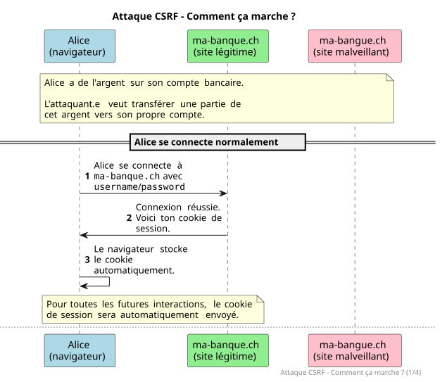
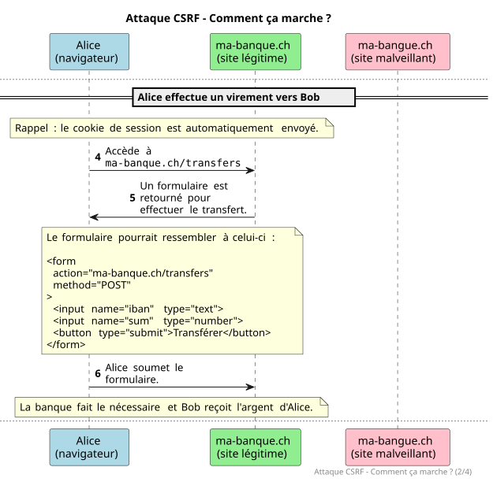
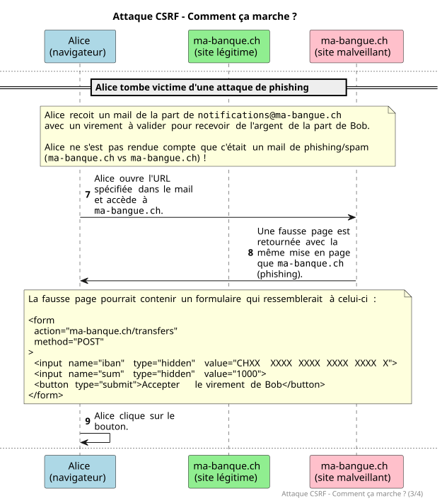
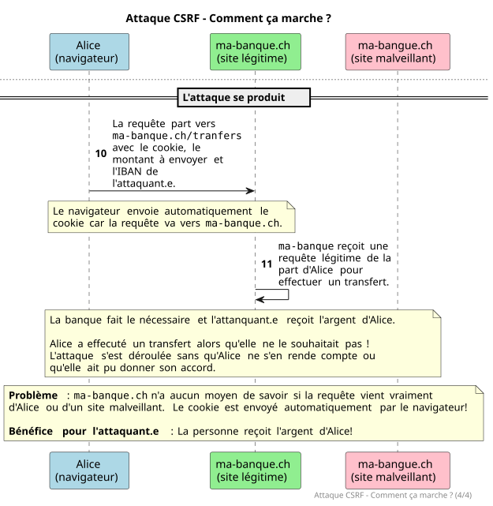
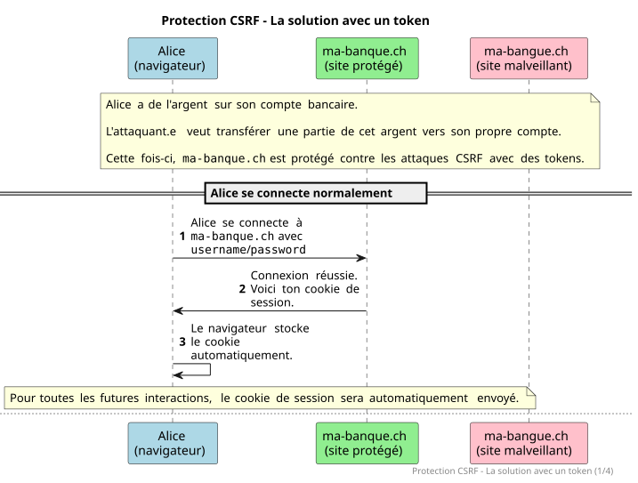
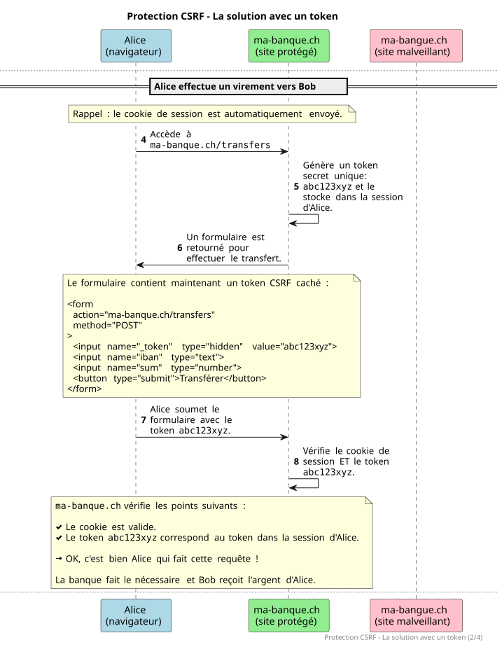
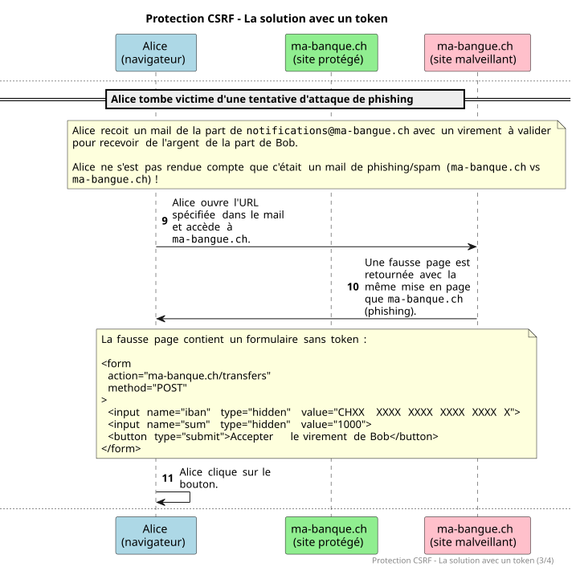
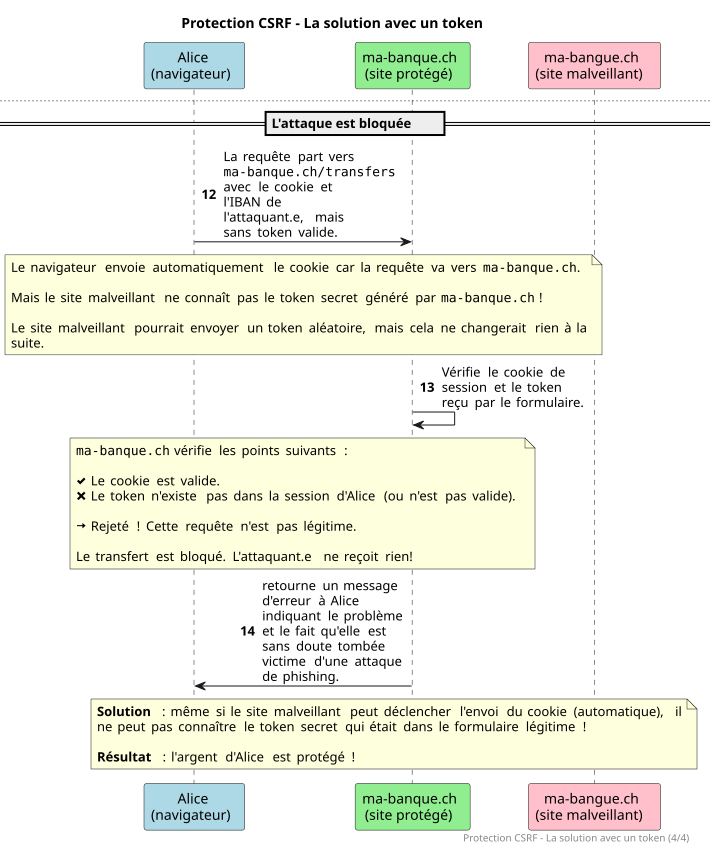

# Formulaires et validation

<!--
_class: lead
_paginate: false
-->

<https://github.com/heig-vd-devprodmed-course/heig-vd-devprodmed-course>

Visualiser le contenu complet sur GitHub [à cette
adresse][contenu-complet-sur-github].

<small>L. Delafontaine, avec l'aide de
[GitHub Copilot](https://github.com/features/copilot).</small>

<small>Ce travail est sous licence [CC BY-SA 4.0][licence].</small>

![bg opacity:0.1][illustration-principale]

## Plus de détails sur GitHub

<!-- _class: lead -->

_Cette présentation est un résumé du contenu complet disponible sur GitHub._

_Pour plus de détails, consulter le [contenu complet sur
GitHub][contenu-complet-sur-github] ou en cliquant sur l'en-tête de ce
document._

## Objectifs (1)

- Comprendre les concepts liés aux formulaires et à la validation dans le
  développement d'applications web.
- Comprendre comment les formulaires et les sessions interagissent dans une
  application web.

![bg right:40%][illustration-objectifs]

## Objectifs (2)

- Comprendre les implications de sécurité liées à la gestion des formulaires et
  des sessions, et comment s'en protéger.
- Comprendre comment gérer les fichiers téléversés via des formulaires.
- Implémenter ces concepts avec Laravel pour réaliser le petit réseau social du
  mini-projet.

![bg right:40%][illustration-objectifs]

## Les formulaires, un rappel

Un formulaire est un élément HTML qui permet de collecter des données auprès des
utilisateur.trice.s et de les envoyer au serveur pour traitement.

Les formulaires sont essentiels pour permettre aux utilisateur.trice.s
d'interagir avec une application web.

![bg right:40%][illustration-formulaires-html]

### Structure d'un formulaire

<div class="two-columns">
<div>

Un formulaire se compose de plusieurs éléments : champs de texte, boutons de
soumission, cases à cocher, listes déroulantes, etc.

Chaque champ est associé à un label pour améliorer l'accessibilité.

</div>
<div>

```php
<form action="/posts" method="POST">
    <label for="title">Titre</label>
    <input
      type="text"
      name="title"
      id="title"
      placeholder="Titre du post" />

    <label for="content">Contenu</label>
    <textarea
        name="content"
        id="content"
        placeholder="Contenu du post"
        required
        minlength="10"
    ></textarea>

    <button type="submit">Créer le post</button>
</form>
```

</div>

### Les attributs d'un formulaire

- `action` et `method` définissent l'URL de destination et la méthode HTTP.
- Attributs de validation HTML5 : `required`, `minlength`, etc.
- L'attribut `name` définit la clé pour accéder aux données côté serveur.

La validation HTML5 est une première ligne de défense, mais la validation côté
serveur est essentielle.

### Envoyer les données d'un formulaire

- L'attribut `action` définit l'URL vers laquelle les données seront envoyées.
- L'attribut `method` définit la méthode HTTP (`GET` ou `POST` par défaut).
- L'attribut `name` permet d'accéder aux données côté serveur.

![bg right:40%][illustration-envoyer-les-donnees-des-formulaires]

### Recevoir les données d'un formulaire

Les données sont accessibles via des objets ou tableaux associatifs.

En PHP : superglobales `$_GET` et `$_POST`.

Les données doivent être validées côté serveur pour assurer la sécurité.

![bg right:40%][illustration-envoyer-les-donnees-des-formulaires]

## Les sessions, un rappel

Une session permet de stocker des données spécifiques à un.e utilisateur.trice
sur le serveur, associées via un cookie de session.

Les sessions maintiennent l'état entre les requêtes HTTP. Elles permettent de
garder un annuaire des utilisateur.trices connecté.es avec leurs données

![bg right:40%][illustration-les-sessions]

### Créer une session

Le serveur démarre une session (ex : `session_start()` en PHP).

Génère un identifiant unique stocké dans un cookie envoyé au navigateur.

Le navigateur renvoie ce cookie avec chaque requête ultérieure.

![bg right:40%][illustration-les-sessions]

### Accéder aux données de session

Les données sont accessibles via des objets ou tableaux (ex : `$_SESSION` en
PHP).

Exemple : `$_SESSION['username'] = 'Alice';`

![bg right:40%][illustration-les-sessions]

### Supprimer une session

Utiliser une fonction dédiée (ex : `session_destroy()` en PHP).

Supprimer également le cookie de session côté client pour éviter toute
confusion.

![bg right:40%][illustration-les-sessions]

## Les formulaires et les sessions

Les formulaires et les sessions travaillent ensemble :

- Les sessions maintiennent l'état de l'utilisateur.trice entre les requêtes.
- Les données de formulaire peuvent être stockées en session pour les réutiliser
  (erreurs de validation, données saisies, etc.).

![bg right:40%][illustration-les-sessions]

## Les formulaires dans Laravel

Laravel fournit des fonctionnalités supplémentaires pour faciliter la gestion
des formulaires :

- Validation des données intégrée.
- Protection contre les attaques CSRF.
- Gestion des erreurs de validation.

![bg right:40%][illustration-formulaires-html]

### Actions et méthodes HTTP des formulaires

<div class="two-columns">
<div>

L'attribut `action` doit correspondre à une route définie dans Laravel.

L'attribut `method` spécifie la méthode HTTP (`POST`, `GET`).

Laravel permet de simuler d'autres méthodes HTTP (`PUT`, `PATCH` et `DELETE`)
avec `@method()`.

</div>
<div>

```php
<form action="/posts/1" method="POST">
    <input
        type="hidden"
        name="_method"
        value="DELETE"
    />

    <button type="submit">Supprimer</button>
</form>
```

```php
<form action="/posts/1" method="POST">
    @method('DELETE')

    <button type="submit">Supprimer</button>
</form>
```

</div>
</div>

### Se protéger contre les attaques CSRF

- Les formulaires présentent différentes vulnérabilités :
  - Injections SQL.
  - Attaques XSS.
  - Etc.
- Une attaque connue est l'attaque CSRF (Cross-Site Request Forgery).

![bg right:40%][illustration-se-proteger-contre-les-attaques-csrf]

#### Attaque CSRF - Comment ça marche ?

Un.e attaquant.e fait exécuter une action non désirée par un.e utilisateur.trice
authentifié.e.

Exemple : transfert d'argent depuis le compte bancaire d'Alice vers celui de
l'attaquant.e via un formulaire caché sur un site malveillant.

![bg right:40%][illustration-se-proteger-contre-les-attaques-csrf]

---



---



---



---



#### Protection CSRF - La solution avec un token

<div class="two-columns">
<div>

Laravel génère un token CSRF unique pour chaque session.

Le token est vérifié à chaque soumission de formulaire.

Si les tokens ne correspondent pas, la requête est rejetée.

</div>
<div>

```php
<form action="/posts" method="POST">
    @csrf

    <!-- Champs du formulaire -->

    <button type="submit">
      Soumettre le formulaire
    </button>
</form>
```

</div>
</div>

---



---



---



---



### Le rôle de l'APP_KEY dans les sessions et la protection CSRF

Lors d'une séance précédente, nous avons dû configurer la `APP_KEY` de notre
application avec `php artisan key:generate`.

Cette commande met à jour le fichier `.env` avec une clé unique.

Cette clé chiffre les données de session et génère les tokens CSRF de façon
sécurisée.

**Ne jamais partager cette clé ou la rendre publique.**

### Validation des données de formulaire (1)

Laravel fournit un système de validation intégré.

Les règles de validation peuvent être définies dans les contrôleurs ou dans des
classes dédiées (Form Requests).

**Exemples** :

- `'title' => 'nullable|string|max:255'`
- `'title' => ['nullable', 'string', 'max:255']`

Les deux manières sont valides.

### Validation des données de formulaire (2)

Si la validation échoue, Laravel redirige automatiquement vers le formulaire
précédent avec les erreurs.

De nombreuses règles de validation prédéfinies : `required`, `string`, `max`,
`email`, `unique`, etc.

La documentation officielle présente toutes les règles disponibles :
<https://laravel.com/docs/12.x/validation#available-validation-rules>.

Prenons un exemple de formulaire dans les slides suivantes.

---

```php
<form method="POST" action="{{ url('/posts') }}">
    @csrf

    <label for="title">Titre du post</label>
    <input
        id="title"
        type="text"
        name="title"
        placeholder="Saisissez le titre du post"
    />

    <label for="content">Contenu du post</label>
    <textarea
        id="content"
        name="content"
        rows="5"
        placeholder="Saisissez le contenu du post"
    ></textarea>

    <button type="submit">Soumettre le formulaire</button>
</form>
```

---

```php
public function store(Request $request)
{
    $validated = $request->validate([
      'title' => 'nullable|string|max:255',
      'content' => 'required|string|min:10|max:5000',
    ]);

    $post = new Post();

    $post->title = $validated['title'];
    $post->content = $validated['content'];

    $post->save();

    return redirect("/posts/$post->id");
}
```

#### Messages d'erreur de validation

<div class="two-columns">
<div>

Laravel génère automatiquement des messages d'erreur pour chaque champ qui
échoue.

Possibilité d'afficher tous les messages avec `$errors->all()`

Ou un champ spécifique avec la directive `@error('nom_du_champ')` et `$message`.

</div>
<div>

```php
@if ($errors->any())
    <ul>
        @foreach ($errors->all() as $error)
            <li>{{ $error }}</li>
        @endforeach
    </ul>
@endif
```

</div>
</div>

---

```php
<form method="POST" action="{{ url('/posts') }}">
    @csrf

    <label for="title">Titre du post</label>
    <input id="title" type="text" name="title" placeholder="Saisissez le titre du post"/>

    @error('title')
    <p>{{ $message }}</p>
    @enderror

    <label for="content">Contenu du post</label>
    <textarea id="content" name="content" rows="5" placeholder="Le contenu du post"
    ></textarea>

    @error('content')
    <p>{{ $message }}</p>
    @enderror

    <button type="submit">Soumettre le formulaire</button>
</form>
```

### Traduire les messages d'erreur de validation

Lors d'une précédente séance, nous avions mis en place l'internationalisation
(i18n) avec Laravel. Ceci a créé le fichier `lang/fr/validation.php`.

Ce fichier contient tous les messages d'erreur de validation possibles et
utilisés par Laravel.

**Exemple** : _"Le texte de :attribute doit contenir au moins :min caractères."_

### Conserver les données de formulaire en cas d'erreur de validation

Lorsqu'une erreur de validation survient, les données des formulaires sont
stockées en session accessibles avec la directive `@old`. Si aucune valeur n'est
trouvée, la directive retourne `null`.

- `value="{{ old('title') }}"` : récupère la valeur précédente du champ `title`
  en cas d'erreur de validation.
- `value="{{ old('title', $post->title) }}"` : récupère la valeur précédente du
  champ `title` ou la valeur actuelle de `$post->title`.

### Accéder aux données des formulaires

<div class="two-columns">
<div>

Les données validées sont accessibles via `$validated`.

Peuvent être ensuite utilisée pour créer ou mettre à jour des ressources en base
de données.

</div>
<div>

```php
public function store(Request $request)
{
    $validated = $request->validate([
      'title' => 'nullable|string|max:255',
      'content' => 'required|string|min:10|max:5000',
    ]);

    // Création d'un modèle
    $post = new Post();

    // Accéder aux données validées
    $post->title = $validated['title'];
    $post->content = $validated['content'];

    // Sauvegarder le modèle dans la base de données
    $post->save();

    // Redirection
    return redirect("/posts/$post->id");
}
```

</div>
</div>

### Rediriger après la soumission d'un formulaire

Une fois le formulaire soumis et traité, il est courant de rediriger
l'utilisateur.trice vers une autre page :

```php
return redirect("/posts/$post->id");
```

Il existe plusieurs méthodes de redirection. La documentation donne des exemples
pour chaque cas d'utilisation :
<https://laravel.com/docs/12.x/responses#redirects>.

### Réutiliser les règles de validation dans plusieurs contrôleurs (1)

Il est possible de réutiliser les règles de validation dans plusieurs
contrôleurs avec des classes dédiées appelées _"Form Requests"_ :

```bash
php artisan make:request
```

Le fichier de la classe est créé dans le dossier `app/Http/Requests`.

Les règles sont définies dans la méthode `rules()`.

---

<div class="two-columns">
<div>

```php
<?php

namespace App\Http\Requests;

use Illuminate\Foundation\Http\FormRequest;

class StorePostRequest extends FormRequest
{
    public function authorize(): bool
    {
        return true;
    }

    public function rules(): array
    {
        return [
            'title' => 'nullable|string|max:255',
            'content' => 'required|string|max:5000',
        ];
    }
}
```

</div>
<div>

```php
public function store(StorePostRequest $request)
{
    // La requête est valide...

    // Les données validées sont directement accessibles...
    $validated = $request->validated();

    // Stocke le post...
}
```

</div>
</div>

## Gérer les fichiers d'un formulaire

- Les fichiers sont des données particulières qui nécessitent une gestion
  spécifique.
- Laravel fournit des fonctionnalités pour gérer les fichiers.

![bg right:40%][illustration-formulaires-html]

### Le type de champ `file`

<div class="two-columns">
<div>

- Utiliser `<input type="file">` dans le formulaire.
- Ajouter `enctype="multipart/form-data"` à l'attribut du formulaire. Cela
  permet de transférer les fichiers correctement.
- La personne pourra alors sélectionner un fichier.

</div>
<div>

```php
<form
    method="POST"
    action="{{ url('/profile') }}"
    enctype="multipart/form-data"
>
  @csrf

  <label for="profile_picture">
      Photo de profil
  </label>
  <input
    id="profile_picture"
    type="file"
    name="profile_picture"
  />

  <button type="submit">Soumettre</button>
</form>
```

</div>
</div>

### Validation des fichiers

<div class="two-columns">
<div>

- Règles spécifiques : `file`, `image`, `mimes`, `max`, etc.
- La règle `image` accepte : JPG, JPEG, PNG, BMP, GIF ou WEBP.
- Possibilité de définir une taille maximale avec `max` (en kilobytes).

</div>
<div>

```php
public function update(Request $request)
{
    $validated = $request->validate([
        'profile_picture' => [
          'nullable',
          'image',
          'max:2048', // 2MB max
        ],
    ]);

    // ...
}
```

</div>
</div>

### Stocker les fichiers téléversés (1)

- Laravel fournit un système de stockage intégré avec différents _"disques"_
  (espaces de stockage).
- Laravel offre deux disques par défaut :
  - `local` (stockage local et privé) - Dossier `storage/app/private`.
  - `public` (stockage public) - Dossier `storage/app/public`.
- La classe `Storage` permet de gérer les fichiers (noms aléatoires) :

  ```php
  $path = Storage::disk('public')->put('profile-pictures', $file);
  ```

### Stocker les fichiers téléversés (2)

```php
public function update(Request $request): RedirectResponse
{
    $user = User::where('id', 2)->first();

    $validated = $request->validate([
        'username' => [
          'required', 'string', 'max:255', Rule::unique('users')->ignore($user->id)
        ],
        'email' => [
          'required', 'email', 'max:255', Rule::unique('users')->ignore($user->id)
        ],
        'first_name' => ['required', 'string', 'max:255'],
        'last_name' => ['required', 'string', 'max:255'],
        'profile_picture' => ['nullable', 'image', 'max:2048'], // 2MB max
    ]);
```

---

```php
    $file = $request->file('profile_picture');

    // Vérifie si une image de profil a été téléversée
    if ($file) {
        // Vérifie si l'utilisateur.trice a une image de profil
        if ($user->profile_picture && Storage::disk('public')->exists($user->profile_picture)) {
            Storage::disk('public')->delete($user->profile_picture);
        }

        // Stocke la nouvelle image de profil et récupère son chemin
        $path = Storage::disk('public')->put('profile-pictures', $file);

        // Remplace le champ profile_picture dans
        // les données validées par le chemin de l'image stockée
        $validated['profile_picture'] = $path;
    }
```

---

```php
    // Met à jour les informations de l'utilisateur.trice
    $user->username = $validated['username'];
    $user->email = $validated['email'];
    $user->first_name = $validated['first_name'];
    $user->last_name = $validated['last_name'];

    // Si une image de profil a été téléversée, renseigne le chemin pour y accéder
    if (isset($validated['profile_picture'])) {
        $user->profile_picture = $validated['profile_picture'];
    }

    $user->save();

    return redirect('/my-profile');
}
```

### Stocker les fichiers téléversés (3)

- **Nous ne stockons pas l'image elle-même dans la base de données, mais plutôt
  le chemin vers l'image stockée sur le disque**.
- Cela permet de garder la base de données légère et d'optimiser les
  performances.
- **Si l'application est déplacée vers un autre environnement** (ex : de
  développement à production), **les fichiers stockés sur le disque doivent eux
  aussi être transférés**.

### Gérer les disques de stockage (1)

- Par défaut, les fichiers sont stockés dans le disque `local` (dossiers
  `storage/app/private` et `storage/app/public`).
- Pour rendre les fichiers accessibles publiquement, il faut les stocker dans le
  disque `public` (dossier `storage/app/public`).
- Afin d'accéder à ce dossier public depuis l'extérieur, il est nécessaire de
  créer un lien symbolique entre `public/storage` et `storage/app/public` avec
  la commande suivante :

  ```bash
  php artisan storage:link
  ```

### Gérer les disques de stockage (2)

- L'exécution de la commande `php artisan storage:link` crée un lien symbolique
  `public/storage` pointant vers `storage/app/public`.
- Les fichiers stockés dans le disque `public` sont maintenant accessibles via
  `asset('storage/nom_du_fichier')`, et ce, depuis n'importe quelle partie de
  l'application.

## Conclusion

Les formulaires et la validation sont essentiels pour interagir avec les
utilisateur.trice.s.

Laravel fournit des outils puissants pour gérer les formulaires (validation,
fichiers, précédentes saisies, etc.).

La protection CSRF et la validation côté serveur sont indispensables pour la
sécurité de l'application.

![bg right:40%][illustration-principale]

## Questions

<!-- _class: lead -->

Est-ce que vous avez des questions ?

## À vous de jouer !

- (Re)lire le contenu de cours.
- Faire les exercices.
- Faire le mini-projet.
- Poser des questions si nécessaire.

➡️ [Visualiser le contenu complet sur GitHub.][contenu-complet-sur-github]

**N'hésitez pas à vous entraidez si vous avez des difficultés !**

![bg right:40%][illustration-a-vous-de-jouer]

## Sources

- [Illustration principale][illustration-principale] par
  [Richard Jacobs](https://unsplash.com/@rj2747) sur
  [Unsplash](https://unsplash.com/photos/grayscale-photo-of-elephants-drinking-water-8oenpCXktqQ)
- [Illustration][illustration-objectifs] par
  [Aline de Nadai](https://unsplash.com/@alinedenadai) sur
  [Unsplash](https://unsplash.com/photos/low-angle-view-of-ball-shoots-in-the-ring-j6brni7fpvs)
- [Illustration][illustration-formulaires-html] par
  [Kelly Sikkema](https://unsplash.com/@kellysikkema) sur
  [Unsplash](https://unsplash.com/photos/stack-of-papers-flat-lay-photography-tQQ4BwN_UFs)
- [Illustration][illustration-envoyer-les-donnees-des-formulaires] par
  [Anastasiia Nelen](https://unsplash.com/@mnelen) sur
  [Unsplash](https://unsplash.com/photos/a-blue-and-white-box-SAHWzVB3bcc)
- [Illustration][illustration-les-sessions] par
  [Markus Spiske](https://unsplash.com/@markusspiske) sur
  [Unsplash](https://unsplash.com/photos/text-nBwhHm69x4I)
- [Illustration][illustration-se-proteger-contre-les-attaques-csrf] par
  [John Salvino](https://unsplash.com/@jsalvino) sur
  [Unsplash](https://unsplash.com/photos/gray-steel-chain-locked-on-gate-bqGBbLq_yfc)
- [Illustration][illustration-a-vous-de-jouer] par
  [Nikita Kachanovsky](https://unsplash.com/@nkachanovskyyy) sur
  [Unsplash](https://unsplash.com/photos/white-sony-ps4-dualshock-controller-over-persons-palm-FJFPuE1MAOM)

<!-- URLs -->

[contenu-complet-sur-github]:
	https://github.com/heig-vd-devprodmed-course/heig-vd-devprodmed-course/tree/main/01-contenus-du-cours/06-formulaires-et-validation/README.md
[licence]:
	https://github.com/heig-vd-devprodmed-course/heig-vd-devprodmed-course/blob/main/LICENSE.md

<!-- Illustrations -->

[illustration-principale]:
	https://images.unsplash.com/photo-1517486430290-35657bdcef51?fit=crop&h=720
[illustration-objectifs]:
	https://images.unsplash.com/photo-1516389573391-5620a0263801?fit=crop&h=720
[illustration-formulaires-html]:
	https://images.unsplash.com/photo-1554224155-1696413565d3?fit=crop&h=720
[illustration-envoyer-les-donnees-des-formulaires]:
	https://images.unsplash.com/photo-1659896975336-3f3f989d3396?fit=crop&h=720
[illustration-les-sessions]:
	https://images.unsplash.com/photo-1601714582667-574b826b99a6?fit=crop&h=720
[illustration-se-proteger-contre-les-attaques-csrf]:
	https://images.unsplash.com/photo-1508345228704-935cc84bf5e2?fit=crop&h=720
[illustration-a-vous-de-jouer]:
	https://images.unsplash.com/photo-1509198397868-475647b2a1e5?fit=crop&h=720
