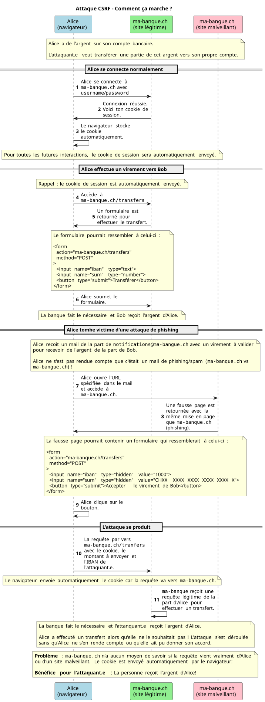
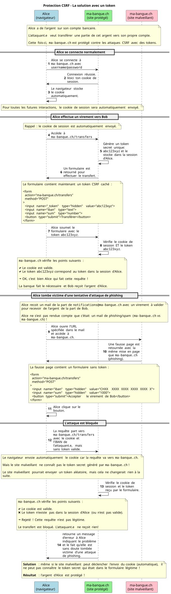

# Formulaires et validation

L. Delafontaine, avec l'aide de
[GitHub Copilot](https://github.com/features/copilot).

Ce travail est sous licence [CC BY-SA 4.0][licence].

> [!TIP]
>
> Voici quelques informations relatives à ce contenu.
>
> **Ressources annexes**
>
> - Autres formats du support de cours : [Présentation (web)][presentation-web]
>   · [Présentation (PDF)][presentation-pdf].
> - Exercices : [Accéder au contenu](./01-exercices/README.md).
> - Mini-projet : [Accéder au contenu](./02-mini-projet/README.md).
>
> **Objectifs**
>
> À l'issue de cette séance, les personnes qui étudient devraient être capables
> de :
>
> - Comprendre les concepts liés aux formulaires et à la validation dans le
>   développement d'applications web.
> - Comprendre comment les formulaires et les sessions interagissent dans une
>   application web.
> - Comprendre les implications de sécurité liées à la gestion des formulaires
>   et des sessions, et comment s'en protéger.
> - Comprendre comment gérer les fichiers téléversés via des formulaires.
> - Implémenter ces concepts avec Laravel pour réaliser le petit réseau social
>   du mini-projet.
>
> **Méthodes d'enseignement et d'apprentissage**
>
> Les méthodes d'enseignement et d'apprentissage utilisées pour animer la séance
> sont les suivantes :
>
> - Présentation magistrale.
> - Discussions collectives.
> - Travail en autonomie.
>
> **Méthodes d'évaluation**
>
> L'évaluation prend la forme d'exercices et d'un mini-projet à réaliser en
> autonomie en classe ou à la maison.
>
> L'évaluation se fait en utilisant les critères suivants :
>
> - Capacité à répondre avec justesse.
> - Capacité à argumenter.
> - Capacité à réaliser les tâches demandées.
> - Capacité à s'approprier les exemples de code.
> - Capacité à appliquer les exemples de code à des situations similaires.
>
> Les retours se font de la manière suivante :
>
> - Corrigé des exercices.
> - Corrigé du mini-projet.
>
> L'évaluation ne donne pas lieu à une note.

## Table des matières

- [Table des matières](#table-des-matières)
- [Objectifs](#objectifs)
- [Les formulaires, un rappel](#les-formulaires-un-rappel)
  - [Structure d'un formulaire](#structure-dun-formulaire)
  - [Les attributs d'un formulaire](#les-attributs-dun-formulaire)
  - [Envoyer les données d'un formulaire](#envoyer-les-données-dun-formulaire)
  - [Recevoir les données d'un formulaire](#recevoir-les-données-dun-formulaire)
- [Les sessions, un rappel](#les-sessions-un-rappel)
  - [Créer une session](#créer-une-session)
  - [Accéder aux données de session](#accéder-aux-données-de-session)
  - [Supprimer une session](#supprimer-une-session)
- [Les formulaires et les sessions](#les-formulaires-et-les-sessions)
- [Les formulaires dans Laravel](#les-formulaires-dans-laravel)
  - [Actions et méthodes HTTP des formulaires](#actions-et-méthodes-http-des-formulaires)
  - [Se protéger contre les attaques CSRF](#se-protéger-contre-les-attaques-csrf)
  - [Le rôle de l'APP_KEY dans les sessions et la protection CSRF](#le-rôle-de-lapp_key-dans-les-sessions-et-la-protection-csrf)
  - [Validation des données de formulaire](#validation-des-données-de-formulaire)
  - [Traduire les messages d'erreur de validation](#traduire-les-messages-derreur-de-validation)
  - [Conserver les données de formulaire en cas d'erreur de validation](#conserver-les-données-de-formulaire-en-cas-derreur-de-validation)
  - [Accéder aux données des formulaires](#accéder-aux-données-des-formulaires)
  - [Rediriger après la soumission d'un formulaire](#rediriger-après-la-soumission-dun-formulaire)
- [Gérer les fichiers d'un formulaire](#gérer-les-fichiers-dun-formulaire)
  - [Le type de champ `file`](#le-type-de-champ-file)
  - [Validation des fichiers](#validation-des-fichiers)
  - [Stocker les fichiers téléversés](#stocker-les-fichiers-téléversés)
  - [Gérer les disques de stockage](#gérer-les-disques-de-stockage)
- [Conclusion](#conclusion)
- [Exercices](#exercices)
- [Mini-projet](#mini-projet)
- [Questions d'évaluation](#questions-dévaluation)
- [À faire pour la prochaine séance](#à-faire-pour-la-prochaine-séance)
- [Contenu optionnel](#contenu-optionnel)
  - [Réutiliser les règles de validation dans plusieurs contrôleurs](#réutiliser-les-règles-de-validation-dans-plusieurs-contrôleurs)

## Objectifs

Ce contenu de cours a pour objectifs de permettre aux personnes qui étudient de
maîtriser les concepts liés aux formulaires et à la validation dans le
développement d'applications web avec Laravel.

Ce contenu repose sur la documentation officielle suivante :

- <https://laravel.com/docs/12.x/csrf> et ses sous-sections.
- <https://laravel.com/docs/12.x/validation> et ses sous-sections.
- <https://laravel.com/docs/12.x/responses> et ses sous-sections.
- <https://laravel.com/docs/12.x/session> et ses sous-sections.
- <https://laravel.com/docs/12.x/encryption> et ses sous-sections.
- <https://laravel.com/docs/12.x/filesystem> et ses sous-sections.

La liste complète des objectifs est disponible dans la section _"Objectifs"_ du
bloc d'information en haut de ce contenu.

## Les formulaires, un rappel

Un formulaire est un élément HTML qui permet de collecter des données auprès des
utilisateur.trice.s et de les envoyer au serveur pour traitement.

Les formulaires sont essentiels pour permettre aux utilisateur.trice.s
d'interagir avec une application web, que ce soit pour créer du contenu, mettre
à jour des informations, ou effectuer des actions spécifiques.

### Structure d'un formulaire

Un formulaire se compose généralement de plusieurs éléments, tels que des champs
de texte, des boutons de soumission, des cases à cocher, des listes déroulantes,
etc. :

```php
<form action="/posts" method="POST">
    <label for="title">Titre</label>
    <input
      type="text"
      name="title"
      id="title"
      placeholder="Titre du post" />

    <label for="content">Contenu</label>
    <textarea
        name="content"
        id="content"
        placeholder="Contenu du post"
        required
        minlength="10"
    ></textarea>

    <button type="submit">Créer le post</button>
</form>
```

Ici, le formulaire est composé des éléments suivants :

- Un champ de texte `<input type="text">` pour le titre du post.
- Un champ de texte multiligne `<textarea>` pour le contenu du post.
- Un bouton de soumission `<button type="submit">` pour envoyer les données au
  serveur.

La liste des différents types de champs de formulaire est disponible dans la
documentation officielle de MDN :
<https://developer.mozilla.org/en-US/docs/Web/HTML/Element/input>.

### Les attributs d'un formulaire

Les formulaires peuvent comporter différents attributs pour définir leur
comportement et leurs contraintes. Par exemple :

- Des attributs tels que `action` et `method` qui définissent respectivement
  l'URL de destination des données et la méthode HTTP utilisée pour l'envoi.
- Des attributs de validation HTML5 tels que `required` et `minlength` pour
  indiquer que le champ est obligatoire et a une longueur minimale.
- Chaque champ est associé à un label `<label>` pour améliorer l'accessibilité
  et la compréhension du formulaire. L'attribut `for` du label doit correspondre
  à l'attribut `id` du champ de formulaire pour établir une association claire
  entre eux.

Il est important de noter que les attributs de validation HTML5 sont une
première ligne de défense pour garantir que les données envoyées par les
utilisateur.trice.s sont conformes aux attentes. Cependant, ils ne sont pas
suffisants pour assurer la sécurité et la robustesse de l'application. C'est
pourquoi il est essentiel de mettre en place une validation côté serveur.

### Envoyer les données d'un formulaire

L'attribut `action` d'un formulaire définit l'URL vers laquelle les données du
formulaire seront envoyées lorsque l'utilisateur.trice soumet le formulaire.

L'attribut `method` définit la méthode HTTP utilisée pour envoyer les données,
généralement `POST`. Par défaut, les navigateurs n'envoient que les méthodes
`GET` et `POST` via les formulaires HTML.

L'attribut `name` de chaque champ de formulaire est crucial, car il définit la
clé sous laquelle les données seront accessibles côté serveur. Par exemple, si
un champ a `name="title"`, alors la valeur saisie dans ce champ sera accessible
côté serveur via la clé `title`.

### Recevoir les données d'un formulaire

Lorsque les données d'un formulaire sont envoyées au serveur, elles sont
généralement accessibles dans le code de l'application via des objets ou des
tableaux associatifs.

En Programmation serveur 1 et 2, nous avons vu comment accéder aux données d'un
formulaire en utilisant les superglobales PHP `$_GET` et `$_POST`.

Lorsque les données d'un formulaire sont envoyées au serveur, il faut également
les valider pour s'assurer qu'elles sont conformes aux attentes de l'application
et les protéger contre les attaques potentielles (ex : injection SQL, XSS,
etc.).

Nous étudierons dans cette séance comment accéder aux données d'un formulaire
dans le contexte d'une application Laravel, en utilisant les objets de requête
et les méthodes de validation intégrées.

## Les sessions, un rappel

Une session est un mécanisme qui permet de stocker des données spécifiques à
un.e utilisateur.trice sur le serveur, et de les associer à une session unique
via un cookie de session.

Les sessions sont utilisées pour maintenir l'état de l'utilisateur.trice entre
les différentes requêtes HTTP, qui sont par nature sans état (stateless). Elles
permettent de stocker des informations telles que les données
d'authentification, les préférences de l'utilisateur.trice.trice, ou les
messages flash.

### Créer une session

Afin de créer une session, le serveur doit démarrer une session pour
l'utilisateur.trice. Cela se fait généralement à l'aide d'une fonction ou d'une
méthode spécifique dans le code de l'application. Par exemple, en PHP, on
utilise la fonction `session_start()` pour démarrer une session.

Cette fonction génère un identifiant de session unique qui associe un espace
mémoire (ou dans une base de données) sur le serveur à l'utilisateur.trice. Cet
identifiant de session est ensuite envoyé au navigateur de l'utilisateur.trice
sous forme de cookie de session.

Le navigateur stocke ce cookie et l'envoie automatiquement avec chaque requête
ultérieure vers le même serveur, permettant ainsi au serveur de reconnaître
l'utilisateur.trice et d'accéder aux données de session associées.

Chaque fois que l'utilisateur.trice fait une requête, le navigateur envoie le
cookie de session au serveur, qui peut alors accéder aux données de session en
utilisant l'identifiant de session envoyé par le navigateur.

Imaginez un annuaire téléphonique où chaque utilisateur.trice a une fiche avec
ses informations. Le serveur crée une fiche pour chaque utilisateur.trice qui se
connecte, et le cookie de session agit comme une clé qui permet au serveur de
trouver la fiche correspondante à chaque requête.

### Accéder aux données de session

Les données de session sont généralement accessibles dans le code de
l'application via des objets ou des tableaux associatifs. Par exemple, en PHP,
on peut accéder aux données de session via la superglobale `$_SESSION`.

Par exemple, si nous avons stocké le nom de l'utilisateur.trice dans la session
avec `$_SESSION['username'] = 'Alice';`, alors nous pouvons accéder à cette
information dans une requête ultérieure avec `$_SESSION['username']`, qui nous
renverra la valeur `'Alice'`.

### Supprimer une session

Il est également possible de supprimer une session, ce qui efface toutes les
données associées à cette session à l'aide d'une fonction ou d'une méthode
spécifique. Par exemple, en PHP, on utilise la fonction `session_destroy()` pour
supprimer une session.

Cela supprime les données de session du serveur, mais il est important de noter
que le cookie de session dans le navigateur de l'utilisateur.trice n'est pas
automatiquement supprimé. Par conséquent, il est recommandé de supprimer
également le cookie de session côté client pour éviter toute confusion.

Sans le cookie de session, le serveur ne pourra pas associer les requêtes de
l'utilisateur.trice à une session spécifique, ce qui signifie que les données de
session ne seront plus accessibles pour cet utilisateur.trice.

## Les formulaires et les sessions

Les formulaires et les sessions sont souvent utilisés ensemble dans les
applications web :

- Grâce aux sessions, nous pouvons maintenir l'état de l'utilisateur.trice entre
  les différentes requêtes HTTP, ce qui est essentiel pour des fonctionnalités
  telles que l'authentification, les préférences utilisateur.trice.s ou les
  données temporaires, comme les données de formulaire.
- Lorsqu'un formulaire est soumis, les données du formulaire peuvent être
  stockées dans la session pour être utilisées dans des requêtes ultérieures,
  par exemple pour les erreurs de validation afin que la personne n'ait pas à
  ressaisir toutes les données du formulaire en cas d'erreur, ou pour afficher
  un message de succès après la soumission du formulaire.

C'est pourquoi les deux notions sont présentées ensemble dans ce contenu de
cours.

## Les formulaires dans Laravel

Les formulaires dans Laravel ressemblent à des formulaires HTML classiques, mais
Laravel fournit des fonctionnalités supplémentaires pour faciliter leur gestion,
notamment la validation des données et la protection contre les attaques CSRF.

Ils sont gérés à l'aide de plusieurs concepts clés, notamment les routes, les
contrôleurs, la validation des données, et la protection contre les attaques
CSRF. Nous allons explorer chacun de ces concepts en détail.

### Actions et méthodes HTTP des formulaires

Lors de la création d'un formulaire, l'action (attribut `action`) permet de
spécifier l'URL vers laquelle les données du formulaire seront envoyées. Cette
URL doit correspondre à une route définie dans Laravel. Par exemple, si nous
avons un formulaire pour créer un post, l'action pourrait être définie comme
suit :

```php
<form action="/posts" method="POST">
    <!-- Champs du formulaire -->
</form>
```

Dans cet exemple, les données du formulaire seront envoyées à l'URL `/posts`.

En plus de l'URL, il est également important de spécifier la méthode HTTP
utilisée pour envoyer les données du formulaire (attribut `method`). La méthode
la plus courante pour les formulaires de création est `POST`, qui indique que
les données doivent être envoyées au serveur pour créer une nouvelle ressource,
comme présenté dans l'exemple précédent.

Il est important de noter que les navigateurs n'envoient que les méthodes `GET`
et `POST` via les formulaires HTML. Cependant, Laravel permet de simuler
d'autres méthodes HTTP (comme `PUT`, `PATCH`, ou `DELETE`) en utilisant un champ
caché `_method` dans le formulaire. Par exemple, pour simuler une requête
`DELETE`, nous pourrions faire :

```php
<form action="/posts/1" method="POST">
    <input
        type="hidden"
        name="_method"
        value="DELETE"
    />

    <button type="submit">Supprimer</button>
</form>
```

Dans cet exemple, même si la méthode du formulaire est `POST`, Laravel traitera
la requête comme une requête `DELETE` grâce au champ caché `_method`.
L'utilisation du type de champ `hidden` permet de masquer ce champ aux
utilisateur.trice.s, tout en permettant à Laravel de détecter la méthode HTTP
souhaitée.

Afin de ne pas devoir ajouter manuellement ce champ caché à chaque formulaire,
Laravel propose une directive Blade `@method` qui génère automatiquement ce
champ pour simuler la méthode HTTP souhaitée. Par exemple, pour simuler une
requête `DELETE`, nous pourrions faire :

```php
<form action="/posts/1" method="POST">
    @method('DELETE')

    <button type="submit">Supprimer</button>
</form>
```

Dans cet exemple, la directive `@method('DELETE')` génère automatiquement le
champ caché nécessaire pour que Laravel traite la requête comme une requête
`DELETE`.

Il est donc nécessaire de faire correspondre l'action du formulaire à une route
définie dans Laravel, et de spécifier la méthode HTTP appropriée pour que les
données du formulaire soient traitées correctement par l'application.

En utilisant l'exemple précédent, si nous avons une route définie comme suit
dans Laravel :

```php
Route::delete('/posts/{id}', [PostController::class, 'destroy']);
```

Alors, lorsque le formulaire est soumis, Laravel traitera la requête comme une
requête `DELETE` vers l'URL `/posts/1`, et exécutera la méthode `destroy` du
`PostController` pour supprimer le post avec l'ID 1.

Le corps de la méthode `destroy` pourrait ressembler à ceci :

```php
public function destroy(string $id)
{
    Post::destroy($id);

    return redirect("/posts");
}
```

Dans cet exemple, la méthode `destroy` utilise la méthode statique `destroy` du
modèle `Post` pour supprimer le post avec l'ID spécifié, puis redirige
l'utilisateur.trice vers la liste des posts.

### Se protéger contre les attaques CSRF

Lorsque nous travaillons avec les formulaires, plusieurs types d'attaque peuvent
avoir lieu (attaques d'injection SQL, attaques XSS, etc.).

L'une des attaques les plus courantes est l'attaque CSRF (Cross-Site Request
Forgery).

Laravel met à disposition une protection intégrée contre les attaques CSRF
(Cross-Site Request Forgery) pour tous les formulaires qui envoient des données
au serveur.

Cette protection est assurée par un token CSRF unique généré pour chaque session
utilisateur.trice. Ce token doit être inclus dans chaque formulaire qui envoie
des données au serveur.

Avant de plonger dans les détails techniques, il est important de comprendre ce
qu'est une attaque CSRF et pourquoi elle est dangereuse et comment s'en
protéger.

#### Attaque CSRF - Comment ça marche ?

Les attaques CSRF (Cross-Site Request Forgery) sont des attaques où un.e
attaquant.e tente de faire exécuter une action non désirée sur une application
web par un utilisateur.trice authentifié.e.

Imaginons la situation suivante : un.e utilisateur.trice, Alice, est connecté.e
à son compte bancaire en ligne afin de gérer ses paiements et ses transferts
d'argent.

Pendant ce temps, Alice visite un site web malveillant créé par un.e
attaquant.e, qui contient un formulaire caché pour effectuer un transfert
d'argent depuis le compte d'Alice vers le compte de l'attaquant.e.

Lorsque Alice visite ce site malveillant, le formulaire caché est
automatiquement soumis, envoyant une requête de transfert d'argent à la banque
d'Alice avec les informations d'authentification d'Alice, ce qui permet à
l'attaquant.e de voler de l'argent du compte d'Alice sans que celle-ci ne s'en
rende compte.

Le diagramme suivant illustre ce scénario d'attaque CSRF :



#### Protection CSRF - La solution avec un token

Pour se protéger contre les attaques CSRF, Laravel utilise un token CSRF unique
pour chaque session utilisateur.trice. Ce token est généré automatiquement par
Laravel et doit être inclus dans chaque formulaire qui envoie des données au
serveur.

Lorsque le formulaire est soumis, Laravel vérifie que le token CSRF envoyé avec
la requête correspond au token stocké dans la session de l'utilisateur.trice. Si
les tokens ne correspondent pas, Laravel rejette la requête, empêchant ainsi
l'attaque CSRF de réussir.

Le diagramme suivant illustre comment la protection CSRF de Laravel empêche
l'attaque décrite précédemment :



Laravel implémente cette protection de manière transparente pour les
développeur.euse.s, grâce à la directive Blade `@csrf`, qui génère
automatiquement le champ caché nécessaire pour inclure le token CSRF dans chaque
formulaire.

Par exemple :

```php
<form action="/posts" method="POST">
    @csrf

    <!-- Champs du formulaire -->

    <button type="submit">
      Soumettre le formulaire
    </button>
</form>
```

De cette manière, les développeur.euse.s n'ont pas à se soucier de la gestion du
token CSRF, et peuvent être assurés que leurs formulaires sont protégés contre
les attaques CSRF.

### Le rôle de l'APP_KEY dans les sessions et la protection CSRF

Lorsque vous initialisez une nouvelle application Laravel, une clé d'application
doit être générée à l'aide la commande suivante :

```bash
php artisan key:generate
```

Cette commande génère une clé d'application unique et la stocke dans le fichier
`.env` de votre application, sous la variable `APP_KEY`.

Cette clé d'application est utilisée pour chiffrer les données de session et
pour générer les tokens CSRF. Elle joue un rôle crucial dans la sécurité de
votre application, car elle garantit que les données de session et les tokens
CSRF sont uniques à votre application et ne peuvent pas être devinés ou
reproduits par des attaquant.e.s.

Si votre clé d'application n'est pas correctement configurée, les sessions et la
protection CSRF de votre application ne fonctionneront pas correctement, ce qui
peut exposer votre application à des risques de sécurité.

C'est la raison pour laquelle il est essentiel de générer une clé d'application
unique pour chaque application Laravel que vous développez, et de ne jamais
partager cette clé avec d'autres applications ou la rendre publique.

Le README de votre application Laravel doit inclure une section qui explique
comment générer la clé d'application et pourquoi c'est important pour la
sécurité de l'application.

### Validation des données de formulaire

Lorsque Laravel reçoit les données d'un formulaire, il est essentiel de les
valider pour s'assurer qu'elles sont conformes aux attentes de l'application et
pour protéger contre les attaques potentielles (ex : injection SQL, XSS, etc.).

Laravel fournit un système de validation intégré qui permet de définir des
règles de validation pour les données de formulaire. Ces règles peuvent être
définies dans les contrôleurs ou dans des classes de validation dédiées.

Prenons l'exemple d'un formulaire de création de post avec le formulaire suivant
:

```php
<form method="POST" action="{{ url('/posts') }}">
    @csrf

    <label for="title">Titre du post</label>
    <input
        id="title"
        type="text"
        name="title"
        placeholder="Saisissez le titre du post"
    />

    <label for="content">Contenu du post</label>
    <textarea
        id="content"
        name="content"
        rows="5"
        placeholder="Saisissez le contenu du post"
    ></textarea>

    <button type="submit">Soumettre le formulaire</button>
</form>
```

Dans le contrôleur, nous pouvons définir des règles de validation pour les
données du formulaire comme suit :

```php
public function store(Request $request)
{
    $validated = $request->validate([
      'title' => 'nullable|string|max:255',
      'content' => 'required|string|min:10|max:5000',
    ]);

    $post = new Post();

    $post->title = $validated['title'];
    $post->content = $validated['content'];

    $post->save();

    return redirect("/posts/$post->id");
}
```

Dans cet exemple, la méthode `store` du `PostController` utilise la méthode
`validate` de l'objet `Request` pour valider les données du formulaire.

Les règles de validation spécifient que le champ `title` est optionnel
(`nullable`) et doit avoir une longueur maximale de 255 caractères, tandis que
le champ `content` est obligatoire (`required`) et doit avoir une longueur
minimale de 10 caractères et une longueur maximale de 5000 caractères.

Chaque règle est définie sous forme de chaîne de caractères, avec les
différentes règles séparées par des pipes (`|`). Laravel fournit de nombreuses
règles de validation prédéfinies, telles que `required`, `string`, `max`,
`email`, `unique`, etc., qui peuvent être utilisées pour valider les données de
formulaire de manière efficace.

Si les données du formulaire ne respectent pas les règles de validation, Laravel
génère automatiquement une réponse de redirection vers le formulaire précédent,
avec les erreurs de validation et les données saisies précédemment stockées dans
la session pour être affichées dans la vue du formulaire.

Les règles de validation permettent également de valider si les données sont
bien uniques dans la base de données, si elles correspondent à un format
spécifique (ex : email), ou si elles respectent des contraintes personnalisées.

L'exemple suivant illustre certaines des règles de validation disponibles dans
Laravel :

```php
public function update(Request $request): RedirectResponse
{
    $user = User::where('username', 'janedoe')->first();

    $validated = $request->validate([
        'username' => ['required', 'string', 'max:255', Rule::unique('users')->ignore($user->id)],
        'email' => ['required', 'email', 'max:255', Rule::unique('users')->ignore($user->id)],
        'first_name' => ['required', 'string', 'max:255'],
        'last_name' => ['required', 'string', 'max:255'],
        'profile_picture' => ['nullable', 'image', 'max:2048'], // 2MB max
    ]);

    // ...
}
```

Ici, les règles de validation spécifient que :

- Le champ `username` est obligatoire,doit être une chaîne de caractères, avoir
  une longueur maximale de 255 caractères, et doit être unique dans la table
  `users`, à l'exception de l'utilisateur.trice actuel.le (grâce à
  `Rule::unique('users')->ignore($user->id)`).
- Le champ `email` doit être un email valide, avoir une longueur maximale de 255
  caractères, et être unique dans la table `users`, à l'exception de
  l'utilisateur.trice actuel.le.
- Les champs `first_name` et `last_name` sont également obligatoires, doivent
  être des chaînes de caractères, et avoir une longueur maximale de 255
  caractères.
- Le champ `profile_picture` est optionnel, doit être une image, et ne doit pas
  dépasser 2MB.

De plus, les règles sont définies sous forme de tableau, ce qui permet
d'utiliser des objets de règle plus complexes, comme `Rule::unique`, pour des
validations plus avancées. Les deux syntaxes (chaîne de caractères ou tableau)
sont valides et peuvent être utilisées selon les préférences de développement.

La documentation de Laravel présente de nombreuses règles de validation
disponibles. Vous pouvez consulter la documentation officielle de Laravel sur la
validation à l'adresse suivante : <https://laravel.com/docs/12.x/validation>.

#### Messages d'erreur de validation

Lorsque les données d'un formulaire ne respectent pas les règles de validation,
Laravel génère automatiquement des messages d'erreur pour chaque champ qui a
échoué la validation. Ces messages d'erreur sont basés sur les règles de
validation qui ont échoué et peuvent être personnalisés selon les besoins de
l'application.

Si une erreur se produit, Laravel redirige automatiquement l'utilisateur.trice
vers la page précédente (généralement le formulaire) et stocke les messages
d'erreur dans la session. Vous pouvez ensuite accéder à ces messages d'erreur
dans votre vue Blade pour les afficher à l'utilisateur.trice.

Il est possible d'afficher tous les messages d'erreur de validation en utilisant
la variable `$errors` dans votre vue Blade, qui est automatiquement partagée
avec toutes les vues. Par exemple, pour afficher tous les messages d'erreur,
vous pouvez faire :

```php
@if ($errors->any())
    <ul>
        @foreach ($errors->all() as $error)
            <li>{{ $error }}</li>
        @endforeach
    </ul>
@endif
```

Bien qu'il soit pratique d'avoir tous les messages d'erreur disponibles, il est
souvent préférable d'afficher les messages d'erreur spécifiques à chaque champ
de formulaire pour une meilleure expérience utilisateur.trice.

Le formulaire suivant inclut des directives Blade pour afficher les messages
d'erreur de validation associés à chaque champ :

```php
<form method="POST" action="{{ url('/posts') }}">
    @csrf

    <label for="title">Titre du post</label>
    <input id="title" type="text" name="title" placeholder="Saisissez le titre du post"/>

    @error('title')
    <p>{{ $message }}</p>
    @enderror

    <label for="content">Contenu du post</label>
    <textarea id="content" name="content" rows="5" placeholder="Le contenu du post"
    ></textarea>

    @error('content')
    <p>{{ $message }}</p>
    @enderror

    <button type="submit">Soumettre le formulaire</button>
</form>
```

Les directives Blade `@error('nom_du_champ')` permettent de vérifier si une
erreur de validation existe pour le champ spécifié (`nom_du_champ`). Si une
erreur existe, le message d'erreur associé est affiché à l'intérieur du bloc
`@error`.

Cela permet d'informer l'utilisateur.trice des erreurs de validation spécifiques
à chaque champ du formulaire, améliorant ainsi l'expérience utilisateur.trice et
facilitant la correction des erreurs.

### Traduire les messages d'erreur de validation

Lors d'une précédente séance, nous avons vu comment mettre en place
l'internationalisation (i18n) dans une application Laravel qui a automatiquement
créé un fichier de traduction `resources/lang/fr/validation.php` contenant les
messages d'erreur de validation utilisés par Laravel.

Ce fichier spécifique de traduction est utilisé par Laravel pour générer tous
les messages possibles d'erreur de validation qui pourrait se produire avec des
applications Laravel. De cette manière, des messages d'erreur explicites peuvent
être retournés à l'utilisateur.trice en cas d'erreur de validation, et ces
messages peuvent être facilement traduits dans différentes langues.

Vous pouvez modifier ce fichier pour personnaliser les messages d'erreur ou
créer des fichiers de traduction pour d'autres langues.

Par exemple, dans le fichier `resources/lang/fr/validation.php`, la contrainte
`min` pour les chaînes de caractères est définie comme suit :

```php
'min'                    => [
    'array'   => 'Le tableau :attribute doit contenir au moins :min éléments.',
    'file'    => 'La taille du fichier de :attribute doit être supérieure ou égale à :min kilo-octets.',
    'numeric' => 'La valeur de :attribute doit être supérieure ou égale à :min.',
    'string'  => 'Le texte de :attribute doit contenir au moins :min caractères.',
],
```

La traduction inclut des messages d'erreur spécifiques pour différents types de
données (tableaux, fichiers, numériques, chaînes de caractères) et utilise des
placeholders (`:attribute`, `:min`) qui sont remplacés par les valeurs réelles
lors de l'affichage du message d'erreur.

Par exemple, si le titre de notre post est trop court (moins de 3 caractères
grâce à la contrainte `min:3`), la traduction utilisée sera
`Le texte de :attribute doit contenir au moins :min caractères.` et le message
d'erreur affiché à l'utilisateur.trice sera alors : _"Le texte de title doit
contenir au moins 3 caractères."_.

Vous avez peut-être remarqué que la traduction le terme `title` pour l'attribut
à remplacer dans le message d'erreur.

Par défaut, Laravel utilise le nom du champ de formulaire (dans ce cas, `title`)
comme valeur pour le placeholder `:attribute` dans les messages d'erreur de
validation.

Afin de rester cohérent dans le code, il est préférable de garder les noms des
champs de formulaire en anglais (ex : `title`, `content`, etc.) et de
personnaliser les messages d'erreur de validation pour afficher des termes plus
conviviaux ou traduits dans la langue de l'utilisateur.trice.

Ces traductions supplémentaires peuvent être définies dans le même fichier de
traduction `validation.php` en utilisant la clé `attributes`. Par exemple, pour
traduire le champ `title` en français, vous pouvez ajouter la ligne suivante
dans le tableau `attributes` :

```php
'attributes' => [
    'title' => 'titre',
    'content' => 'contenu',
],
```

De cette manière, lorsque le message d'erreur de validation est généré, le
placeholder `:attribute` sera remplacé par _"titre"_ au lieu de _"title"_, ce
qui rendra le message d'erreur plus compréhensible pour les utilisateur.trice.s
francophones.

### Conserver les données de formulaire en cas d'erreur de validation

Si des erreurs de validation surviennent lors de la soumission d'un formulaire,
il est important de conserver les données saisies par l'utilisateur.trice pour
éviter qu'il.elle ne doive resaisir toutes les informations du formulaire.

Laravel propose une directive Blade `old()` qui permet de récupérer les
anciennes valeurs des champs de formulaire en cas d'erreur de validation. Cette
directive utilise les données stockées dans la session pour pré-remplir les
champs du formulaire avec les valeurs précédemment saisies par
l'utilisateur.trice. Par exemple, pour pré-remplir le champ `title` avec la
valeur saisie précédemment, vous pouvez faire :

```php
<form method="POST" action="{{ url('/posts') }}">
    @csrf

    <label for="title"> Titre du post </label>
    <input
        id="title"
        type="text"
        name="title"
        value="{{ old('title') }}"
        placeholder="Saisissez le titre du post"
    />
    @error('title')
    <p>{{ $message }}</p>
    @enderror

    <label for="content"> Contenu du post </label>
    <textarea
        id="content"
        name="content"
        rows="5"
        placeholder="Saisissez le contenu du post"
    >{{ old('content') }}</textarea
    >
    @error('content')
    <p>{{ $message }}</p>
    @enderror

    <button type="submit">Soumettre le formulaire</button>
</form>
```

Si une valeur a été saisie pour le champ `title` avant la soumission du
formulaire, et que des erreurs de validation se produisent, la directive
`old('title')` pré-remplira le champ `title` avec la valeur saisie précédemment.
De même, la directive `old('content')` pré-remplira le champ `content` avec la
valeur saisie précédemment.

Si aucune valeur n'a été saisie pour un champ avant la soumission du formulaire,
ou si le formulaire est affiché pour la première fois, la directive `old()`
renverra une chaîne vide, laissant le champ de formulaire vide.

### Accéder aux données des formulaires

Si la validation des données du formulaire réussit, les données validées sont
accessibles dans le contrôleur via la variable `$validated` (ou tout autre nom
que vous avez choisi pour stocker les données validées).

Cette variable contient un tableau associatif des données du formulaire qui ont
été validées avec succès.

Il est ensuite possible d'utiliser ces données validées pour créer ou mettre à
jour des ressources dans la base de données, ou pour effectuer d'autres actions
nécessaires dans le contrôleur.

Par exemple, dans le contrôleur, vous pouvez accéder aux données validées comme
suit :

```php
public function store(Request $request)
{
    $validated = $request->validate([
      'title' => 'nullable|string|max:255',
      'content' => 'required|string|min:10|max:5000',
    ]);

    // Création d'un modèle
    $post = new Post();

    // Accéder aux données validées
    $post->title = $validated['title'];
    $post->content = $validated['content'];

    // Sauvegarder le modèle dans la base de données
    $post->save();

    return redirect("/posts/$post->id");
}
```

Les données validées sont utilisées pour créer une nouvelle instance du modèle
`Post`, en assignant les valeurs validées aux propriétés du modèle, puis en
sauvegardant le modèle dans la base de données.

### Rediriger après la soumission d'un formulaire

Après la soumission d'un formulaire et le traitement des données dans le
contrôleur, il est courant de rediriger l'utilisateur.trice vers une autre page,
comme la page de détail de la ressource créée ou une liste de ressources.

Pour cela, Laravel fournit plusieurs fonctions de redirection, telles que
`redirect()`, `to_route()`, ou `back()`, qui permettent de rediriger
l'utilisateur.trice vers une URL spécifique, une route nommée, ou la page
précédente.

Par exemple, pour rediriger vers la page de détail d'un post après sa création,
vous pouvez faire :

```php
return redirect("/posts/$post->id");
```

Il existe plusieurs façons de rediriger dans Laravel, et le choix de la méthode
de redirection dépend du contexte de votre application et de vos préférences de
développement. La documentation officielle de Laravel sur les redirections est
disponible à l'adresse suivante :
<https://laravel.com/docs/12.x/responses#redirects>.

## Gérer les fichiers d'un formulaire

Laravel fournit également des fonctionnalités pour gérer les fichiers
téléchargés via les formulaires.

### Le type de champ `file`

Lorsque vous souhaitez permettre aux utilisateur.trice.s de _"téléverser"_ (_"to
upload"_ en anglais) des fichiers via un formulaire, vous devez utiliser le type
de champ `file` dans votre formulaire HTML. Par exemple, pour permettre le
téléchargement d'une image de profil, vous pouvez faire :

```php
<form
    method="POST"
    action="{{ url('/profile') }}"
    enctype="multipart/form-data"
>
  @csrf

  <label for="profile_picture">
      Photo de profil
  </label>
  <input
    id="profile_picture"
    type="file"
    name="profile_picture"
  />

  <button type="submit">Soumettre</button>
</form>
```

Il est important de noter que lorsque vous utilisez un champ de type `file`,
vous devez également ajouter l'attribut `enctype="multipart/form-data"` à votre
formulaire. Cet attribut indique au navigateur que le formulaire contient des
fichiers à télécharger, et permet au serveur de traiter correctement les données
du formulaire. Une bonne ressource est disponible sur MDN à l'adresse suivante :
<https://developer.mozilla.org/en-US/docs/Learn_web_development/Extensions/Forms/Sending_and_retrieving_form_data#a_special_case_sending_files>.

### Validation des fichiers

Lors de la validation des données d'un formulaire qui contient des fichiers,
Laravel fournit des règles de validation spécifiques pour les fichiers, telles
que `file`, `image`, `mimes`, `max`, etc.

Par exemple, pour valider une image de profil, vous pouvez faire :

```php
public function update(Request $request): RedirectResponse
{
    $validated = $request->validate([
        'profile_picture' => ['nullable', 'image', 'max:2048'], // 2MB max
    ]);

    // ...
}
```

Dans cet exemple, la règle de validation `image` vérifie que le fichier
téléchargé est une image (jpg, jpeg, png, bmp, gif ou webp (source :
<https://laravel.com/docs/12.x/validation#rule-image>)), et la règle `max:2048`
vérifie que la taille du fichier ne dépasse pas 2MB (2048 kilo-octets).

La documentation de Laravel fournit des règles de validation supplémentaires
pour les fichiers, que vous pouvez consulter à l'adresse suivante :
<https://laravel.com/docs/12.x/validation#validating-files>.

### Stocker les fichiers téléversés

Laravel met à disposition un système de stockage intégré qui permet de stocker
les fichiers téléversés de manière sécurisée et organisée. Vous pouvez
configurer différents "disques" de stockage pour stocker les fichiers
localement, sur un service de stockage en nuage (ex : Amazon S3, Google Cloud
Storage), ou sur un autre système de fichiers.

Par défaut, les fichiers téléversés sont stockés dans le répertoire
`storage/app`. Deux dossiers sont disponibles dans ce répertoire :

1. `public` pour les fichiers qui doivent être accessibles publiquement.
2. `private` pour les fichiers qui doivent être protégés et ne pas être
   accessibles directement via une URL.

Afin de spécifier où les fichiers téléversés doivent être stockés, vous pouvez
utiliser la façade `Storage` dans votre contrôleur pour déplacer les fichiers
vers le disque de stockage approprié.

Par exemple, pour stocker une image de profil dans le disque `public`, vous
pouvez faire :

```php
$path = Storage::disk('public')->put('profile-pictures', $file);
```

Dans cet exemple, le fichier téléversé est stocké dans le dossier
`profile-pictures` du disque `public`, et la variable `$path` contient le chemin
relatif du fichier stocké. Vous pouvez ensuite enregistrer ce chemin dans la
base de données pour référencer le fichier dans votre application.

Un exemple complet serait le suivant :

```php
public function update(Request $request): RedirectResponse
{
    $user = User::where('username', 'janedoe')->first();

    $validated = $request->validate([
        'username' => ['required', 'string', 'max:255', Rule::unique('users')->ignore($user->id)],
        'email' => ['required', 'email', 'max:255', Rule::unique('users')->ignore($user->id)],
        'first_name' => ['required', 'string', 'max:255'],
        'last_name' => ['required', 'string', 'max:255'],
        'profile_picture' => ['nullable', 'image', 'max:2048'], // 2MB max
    ]);

    $file = $request->file('profile_picture');

    // Vérifie si une image de profil a été téléversée
    if ($file) {
        // Vérifie si l'utilisateur.trice a une image de profil
        if ($user->profile_picture && Storage::disk('public')->exists($user->profile_picture)) {
            Storage::disk('public')->delete($user->profile_picture);
        }

        // Stocke la nouvelle image de profil et récupère son chemin
        $path = Storage::disk('public')->put('profile-pictures', $file);

        // Remplace le champ profile_picture dans
        // les données validées par le chemin de l'image stockée
        $validated['profile_picture'] = $path;
    }

    // Met à jour les informations de l'utilisateur.trice
    $user->username = $validated['username'];
    $user->email = $validated['email'];
    $user->first_name = $validated['first_name'];
    $user->last_name = $validated['last_name'];

    // Si une image de profil a été téléversée, renseigne le chemin pour y accéder
    if (isset($validated['profile_picture'])) {
        $user->profile_picture = $validated['profile_picture'];
    }

    $user->save();

    return redirect('/my-profile');
}
```

Dans cet exemple, la méthode `update` du `UserController` gère la mise à jour du
profil d'un utilisateur.trice, y compris le téléversement d'une nouvelle image
de profil.

Si une image de profil est téléversée, le code vérifie d'abord si
l'utilisateur.trice a déjà une image de profil existante, et si c'est le cas, il
supprime l'ancienne image du disque de stockage pour éviter d'accumuler des
fichiers inutiles.

Ensuite, la nouvelle image est stockée dans le disque `public`, et le chemin de
l'image stockée est enregistré dans la base de données pour référencer l'image
dans l'application.

Lorsque vous affichez l'image de profil dans votre application, vous pouvez
utiliser le chemin stocké dans la base de données pour générer l'URL de l'image.
Par exemple, si vous utilisez le disque `public`, vous pouvez faire :

```php
profile_picture) }}" alt="Photo de profil">
```

Ainsi, comme le fichier a été stocké dans le disque `public`, il est accessible
via l'URL générée par la fonction `asset()`, qui pointe vers le dossier
`storage` de votre application.

Il est important de retenir que **nous ne stockons pas l'image elle-même dans la
base de données, mais plutôt le chemin vers l'image stockée sur le disque**.
Cela permet de gérer les fichiers de manière plus efficace et de réduire la
taille de la base de données.

**Si l'application est déplacée vers un autre environnement** (ex : de
développement à production), **les fichiers stockés sur le disque doivent eux
aussi être transférés**.

### Gérer les disques de stockage

Laravel permet de configurer différents disques de stockage pour gérer les
fichiers téléversés de manière flexible.

Vous pouvez configurer des disques pour stocker les fichiers localement, sur un
service de stockage en nuage (ex : Amazon S3, Google Cloud Storage), ou sur un
autre système de fichiers.

Pour le moment, nous n'allons gérer que le disque de stockage local.

Afin que l'exemple précédent fonctionne correctement, vous devez créer un lien
symbolique entre le répertoire `storage/app/public` et le répertoire
`public/storage` de votre application. Cela permet de rendre les fichiers
stockés dans le disque `public` accessibles via une URL.

Pour cela, Laravel nous met à disposition une commande Artisan qui crée ce lien
symbolique pour nous :

```bash
php artisan storage:link
```

Une fois cette commande exécutée, un lien symbolique est créé entre
`storage/app/public` et `public/storage`, ce qui permet d'accéder aux fichiers
stockés dans le disque `public` via l'URL générée par la fonction
`asset('storage/nom_du_fichier')`.

Plus d'options de configuration des disques de stockage sont disponibles dans la
documentation officielle de Laravel à l'adresse suivante :
<https://laravel.com/docs/12.x/filesystem#configuration>.

## Conclusion

Dans cette séance, nous avons vu comment gérer les formulaires et la validation
des données dans une application Laravel. Nous avons abordé tous les concepts de
base des formulaires HTML (protection contre les attaques CSRF, validation,
gestion des messages d'erreur, conservation des données, redirection, etc.).

De plus, nous avons vu comment gérer les fichiers téléversés via les formulaires
et comment ils sont stockés de manière sécurisée à l'aide du système de stockage
de Laravel.

Maintenant que nous avons couvert les concepts de base des formulaires et de la
validation dans Laravel, nous allons mettre ces concepts en pratique à travers
des exercices et un mini-projet.

## Exercices

Nous vous invitons maintenant à réaliser les exercices de la séance afin de
mettre en pratique les concepts abordés.

Vous trouverez les exercices et leur corrigé ici :
[Exercices](./01-exercices/README.md).

## Mini-projet

Nous vous invitons maintenant à réaliser le mini-projet de la séance afin de
mettre en pratique les concepts abordés.

Vous trouverez les détails du mini-projet ici :
[Mini-projet](./02-mini-projet/README.md).

## Questions d'évaluation

> [!NOTE]
>
> Les questions d'évaluation sont destinées à vous aider à vérifier votre
> compréhension des concepts abordés dans le cours. Elles ne sont pas destinées
> à être utilisées comme une liste de contrôle exhaustive des compétences à
> maîtriser.
>
> Il est recommandé de les utiliser comme un guide pour vous aider à identifier
> les domaines dans lesquels vous pourriez avoir besoin de renforcer vos
> connaissances ou de pratiquer davantage.

- Qu'est-ce qu'un formulaire et à quoi sert-il dans une application web ?
- Quels sont les éléments de base d'un formulaire HTML ?
- Comment les données d'un formulaire sont-elles envoyées au serveur ?
- Comment les données d'un formulaire sont-elles reçues et traitées par le
  serveur ?
- Qu'est-ce qu'une session et à quoi sert-elle dans une application web ?
- Comment les formulaires et les sessions sont-ils utilisés ensemble dans une
  application web ?
- Comment les formulaires sont-ils gérés dans Laravel ?
- Comment se protéger contre les attaques CSRF dans Laravel ?
- Comment valider les données de formulaire dans Laravel ?
- Comment afficher les messages d'erreur de validation dans une vue Blade ?
- Comment traduire les messages d'erreur de validation dans Laravel ?
- Comment conserver les données de formulaire en cas d'erreur de validation dans
  Laravel ?
- Comment accéder aux données de formulaire validées dans un contrôleur Laravel
  ?
- Comment rediriger après la soumission d'un formulaire dans Laravel ?

## À faire pour la prochaine séance

Chaque personne est libre de gérer son temps comme elle le souhaite. Cependant,
il est recommandé pour la prochaine séance de :

- Relire le support de cours si nécessaire.
- Finaliser les exercices qui n'ont pas été terminés en classe.
- Finaliser la partie du mini-projet qui n'a pas été terminée en classe.

## Contenu optionnel

Le contenu suivant est optionnel et n'est pas nécessaire pour la compréhension
des concepts de base des formulaires et de la validation dans Laravel.
Cependant, il peut être utile pour approfondir votre compréhension et pour
explorer des fonctionnalités plus avancées de Laravel.

### Réutiliser les règles de validation dans plusieurs contrôleurs

Il est possible de réutiliser les règles de validation dans plusieurs
contrôleurs en créant des classes de validation dédiées, appelées "Form Request"
dans Laravel.

Cela est utile pour regrouper les règles de validation liées à une ressource
spécifique dans une classe dédiée. Cela permet de séparer la logique de
validation des contrôleurs.

Pour créer une classe de validation, vous pouvez utiliser la commande Artisan
suivante :

```bash
php artisan make:request StorePostRequest
```

Le résultat devrait ressembler à ceci :

```text
   INFO  Request [app/Http/Requests/StorePostRequest.php] created successfully.
```

La classe de validation `StorePostRequest` est créée dans le répertoire
`app/Http/Requests`.

Il est conventionnel de nommer les classes de validation en fonction de l'action
qu'elles sont destinées à valider, par exemple `StorePostRequest` pour valider
les données lors de la création d'un post, et `UpdatePostRequest` pour valider
les données lors de la mise à jour d'un post.

La classe de validation contient une méthode `rules()` où vous pouvez définir
les règles de validation pour les données du formulaire.

Par exemple, pour gérer la création de nouveaux posts, la classe
`StorePostRequest` pourrait ressembler à ceci :

```php
<?php

namespace App\Http\Requests;

use Illuminate\Foundation\Http\FormRequest;

class StorePostRequest extends FormRequest
{
    /**
     * Determine if the user is authorized to make this request.
     */
    public function authorize(): bool
    {
        return true;
    }

    /**
     * Get the validation rules that apply to the request.
     *
     * @return array<string, \Illuminate\Contracts\Validation\ValidationRule|array<mixed>|string>
     */
    public function rules(): array
    {
        return [
            'title' => 'nullable|string|max:255',
            'content' => 'required|string|max:5000',
        ];
    }
}
```

La méthode `authorize()` est utilisée pour déterminer si l'utilisateur.trice est
autorisé.e à effectuer cette requête. Par défaut, elle retourne `false`, ce qui
signifie que toutes les requêtes seront rejetées.

Vous devez modifier cette méthode pour retourner `true` ou implémenter une
logique d'autorisation appropriée pour permettre l'accès à cette requête. Dans
une prochaine séance, nous verrons comment implémenter une logique
d'autorisation plus avancée pour contrôler l'accès à certaines actions dans
votre application.

La méthode `rules()` retourne un tableau associatif des règles de validation
pour les données du formulaire. Ces règles sont les mêmes que celles que nous
avons utilisées précédemment dans les contrôleurs, mais elles sont maintenant
regroupées dans une classe dédiée.

Pour utiliser cette classe de validation dans votre contrôleur, vous pouvez
l'injecter dans la méthode du contrôleur qui traite la soumission du formulaire.
Par exemple, dans le `PostController`, vous pouvez faire :

```php
public function store(StorePostRequest $request)
{
    // La requête est valide...

    // Les données validées sont directement accessibles...
    $validated = $request->validated();

    // Stocke le post...
}
```

En injectant la classe `StorePostRequest` dans la méthode `store`, Laravel
exécutera automatiquement la validation des données du formulaire en utilisant
les règles définies dans la classe de validation.

Si la validation échoue, Laravel redirigera automatiquement l'utilisateur.trice
vers le formulaire précédent avec les messages d'erreur de validation.

Notez l'utilisation de la méthode `validated()` pour accéder aux données
validées et non `validate()` comme utilisée initialement. La validation est déjà
effectuée par la classe de validation, et `validated()` retourne les données qui
ont été validées avec succès.

Cela permet de simplifier le code de vos contrôleurs en déléguant la logique de
validation à des classes dédiées, ce qui rend votre code plus propre et plus
facile à maintenir.

Même si les règles de validation sont les mêmes entre deux actions différentes
(ex : création et mise à jour), il est recommandé de créer des classes de
validation distinctes pour chaque action (ex : `StorePostRequest` et
`UpdatePostRequest`) afin de séparer clairement les responsabilités et de
faciliter la maintenance du code à long terme.

Surtout que les règles de validation peuvent différer entre les actions de
création et de mise à jour, par exemple, lors de la création d'un post, le champ
`title` peut être optionnel, tandis que lors de la mise à jour d'un post, le
champ `title` peut être obligatoire. En ayant des classes de validation
distinctes, vous pouvez facilement gérer ces différences sans compliquer la
logique de validation dans une seule classe.

<!-- URLs -->

[licence]:
	https://github.com/heig-vd-devprodmed-course/heig-vd-devprodmed-course/blob/main/LICENSE.md
[presentation-web]:
	https://heig-vd-devprodmed-course.github.io/heig-vd-devprodmed-course/01-contenus-du-cours/06-formulaires-et-validation/presentation.html
[presentation-pdf]:
	https://heig-vd-devprodmed-course.github.io/heig-vd-devprodmed-course/01-contenus-du-cours/06-formulaires-et-validation/06-formulaires-et-validation-presentation.pdf
