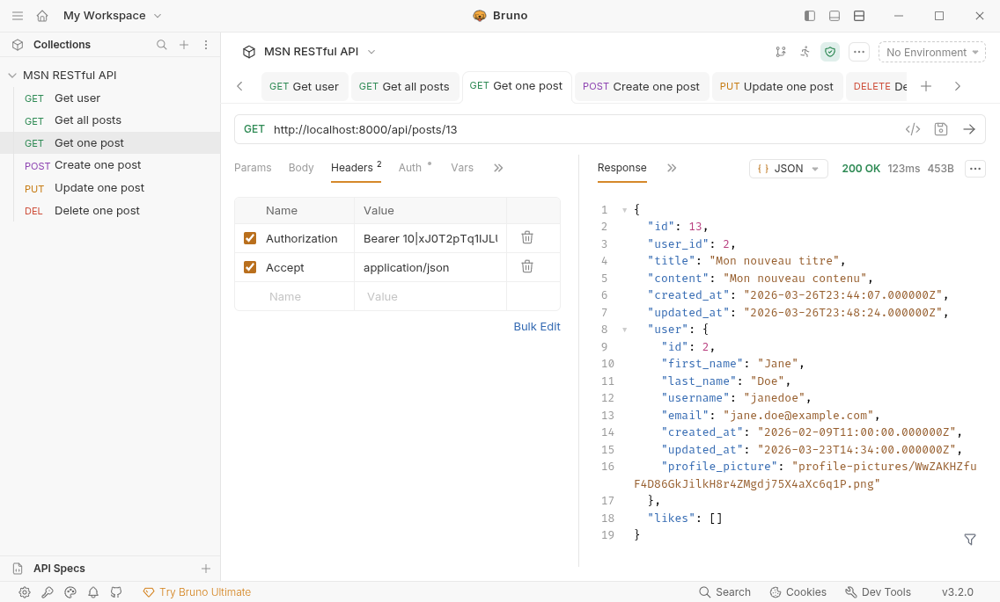
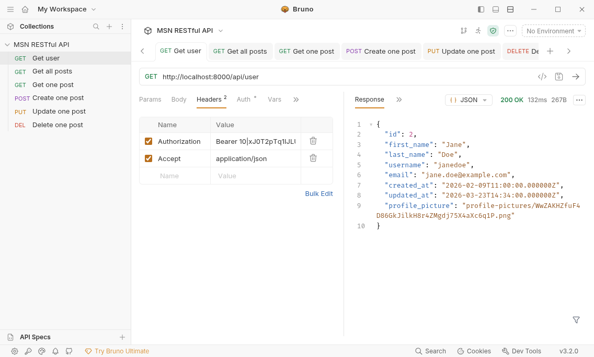
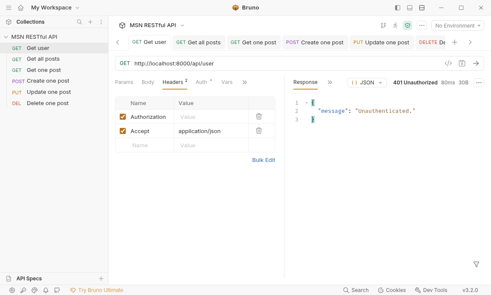
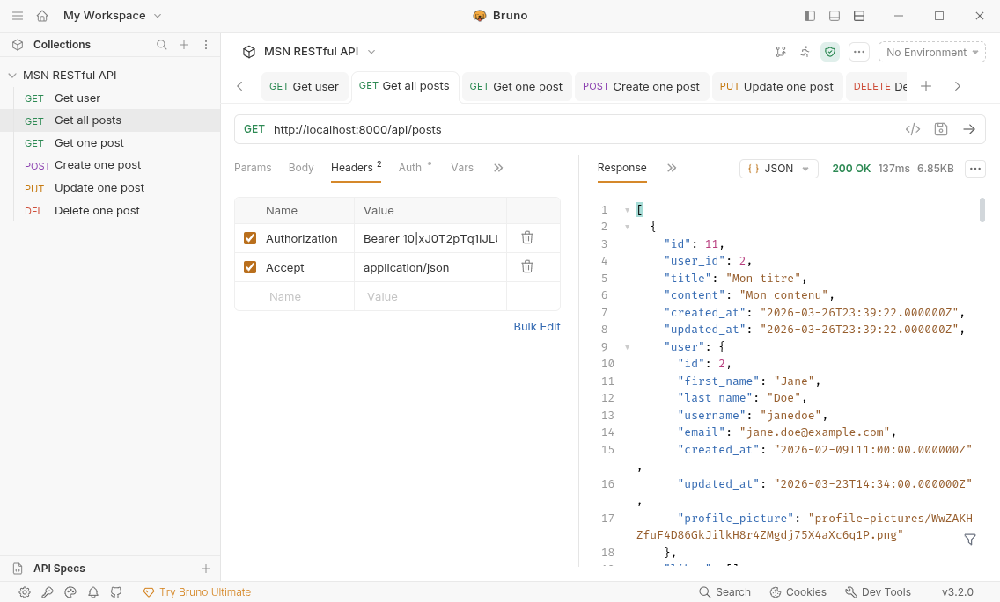
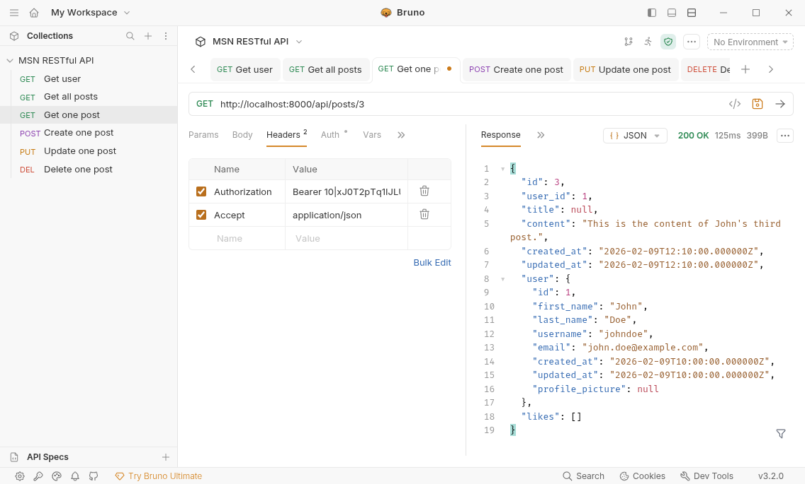
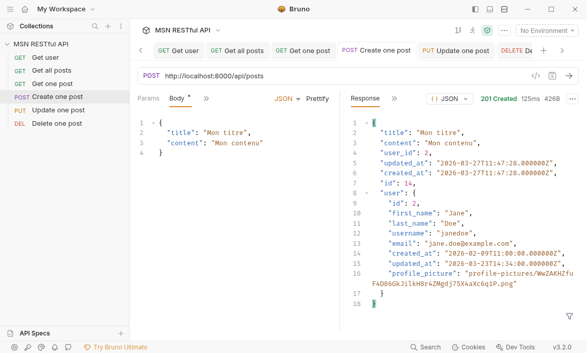
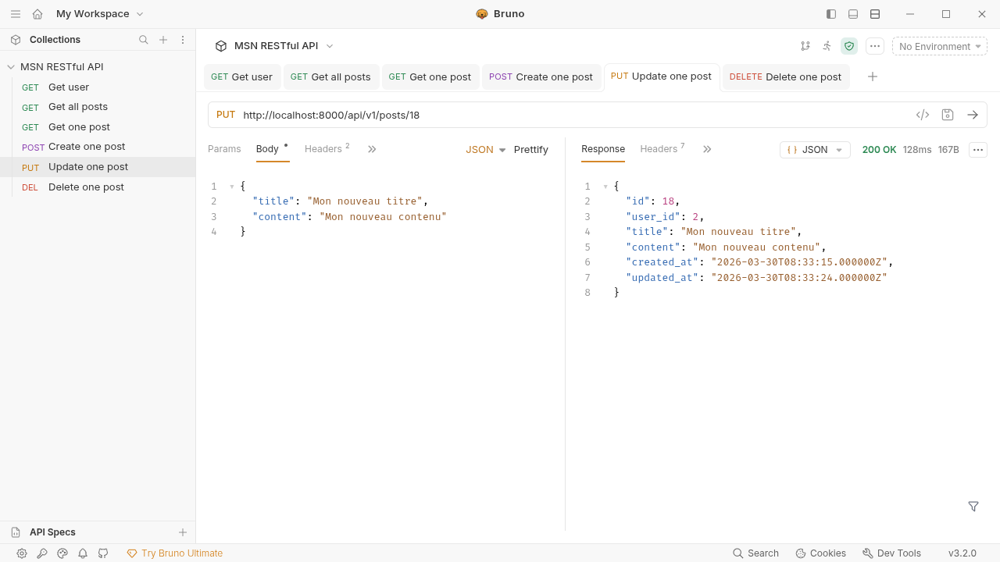

# Architecture RESTful - Mini-projet

L. Delafontaine, avec l'aide de
[GitHub Copilot](https://github.com/features/copilot).

Ce travail est sous licence [CC BY-SA 4.0][licence].

> [!TIP]
>
> Toutes les informations relatives à ce contenu sont décrites dans le
> [contenu principal](../README.md).

## Table des matières

- [Table des matières](#table-des-matières)
- [Objectifs](#objectifs)
- [Installer un outil capable d'effectuer des requêtes HTTP pour tester l'API de votre application](#installer-un-outil-capable-deffectuer-des-requêtes-http-pour-tester-lapi-de-votre-application)
  - [Installer un outil de requêtes HTTP](#installer-un-outil-de-requêtes-http)
  - [Comprendre l'interface de votre outil de requêtes HTTP](#comprendre-linterface-de-votre-outil-de-requêtes-http)
- [Installer Laravel Sanctum](#installer-laravel-sanctum)
- [Mettre à jour le modèle User](#mettre-à-jour-le-modèle-user)
- [Gérer les tokens d'accès](#gérer-les-tokens-daccès)
  - [Créer le contrôleur TokenController](#créer-le-contrôleur-tokencontroller)
  - [Implémenter le contrôleur TokenController](#implémenter-le-contrôleur-tokencontroller)
  - [Créer les vues pour la gestion des tokens](#créer-les-vues-pour-la-gestion-des-tokens)
  - [Implémenter les vues](#implémenter-les-vues)
  - [Mettre à jour les fichiers de traduction](#mettre-à-jour-les-fichiers-de-traduction)
  - [Créer et supprimer des tokens](#créer-et-supprimer-des-tokens)
  - [Tester l'authentification à l'API avec un token d'accès](#tester-lauthentification-à-lapi-avec-un-token-daccès)
  - [Filtrer le mot de passe et le token "se souvenir de moi" dans la réponse de l'endpoint /api/user](#filtrer-le-mot-de-passe-et-le-token-se-souvenir-de-moi-dans-la-réponse-de-lendpoint-apiuser)
- [Créer une API RESTful pour les posts](#créer-une-api-restful-pour-les-posts)
  - [Créer le contrôleur ApiPostController](#créer-le-contrôleur-apipostcontroller)
  - [Implémenter le contrôleur ApiPostController](#implémenter-le-contrôleur-apipostcontroller)
  - [Mettre à jour les routes API](#mettre-à-jour-les-routes-api)
- [Tester l'API](#tester-lapi)
  - [Tester la récupération des posts](#tester-la-récupération-des-posts)
  - [Tester la récupération d'un post spécifique](#tester-la-récupération-dun-post-spécifique)
  - [Tester la création de posts](#tester-la-création-de-posts)
  - [Tester la modification de posts](#tester-la-modification-de-posts)
  - [Tester la suppression de posts](#tester-la-suppression-de-posts)
- [Conclusion](#conclusion)
- [Solution](#solution)
- [Idées pour le mini-projet personnel](#idées-pour-le-mini-projet-personnel)
- [Aller plus loin](#aller-plus-loin)

## Objectifs

Mettre en place une API RESTful sécurisée avec Laravel Sanctum pour exposer les
posts de notre application à des client.es externes. Cette API sera protégée par
des tokens (jetons d'accès en français) individuels avec des permissions
granulaires, permettant à chaque utilisateur.trice de contrôler finement les
accès à ses ressources.

Pour y parvenir, nous allons :

- Installer Laravel Sanctum pour gérer l'authentification par token d'accès.
- Ajouter la gestion des tokens d'accès dans l'interface de notre application.
- Créer une API RESTful versionnée pour les posts avec des permissions
  granulaires.
- Tester l'API avec un outil de requêtes HTTP.

## Installer un outil capable d'effectuer des requêtes HTTP pour tester l'API de votre application

Afin de tester les différentes routes de votre application, il est recommandé
d'utiliser un outil capable d'effectuer des requêtes HTTP.

Pour cela, il existe de nombreux outils disponibles. Parmi les plus populaires,
on peut citer :

- [Bruno](https://www.usebruno.com/) (recommandé).
- [curl](https://curl.se/) (outil en ligne de commande - recommandé pour les
  développeur.ses avancé.es, principalement sur Linux/WSL).
- [Insomnia](https://insomnia.rest/).
- [Postman](https://www.postman.com/).

Si vous avez déjà un outil de ce type installé sur votre ordinateur, vous pouvez
l'utiliser pour tester les routes de votre application.

### Installer un outil de requêtes HTTP

Sinon, vous pouvez en installer un parmi ceux mentionnés ci-dessus. Nous
recommandons d'utiliser Bruno, un des derniers outils gratuits et open source
disponibles sur le marché, qui offre une interface utilisateur moderne et facile
à utiliser pour tester votre application.

### Comprendre l'interface de votre outil de requêtes HTTP

Ouvrez l'outil que vous avez choisi et prenez quelques minutes pour explorer son
interface.

Tous ces outils ont des fonctionnalités similaires. Pour illustrer les
différents aspects de l'interface, nous allons utiliser Bruno comme exemple,
mais les concepts sont applicables à tous les outils de ce type.



Voici les éléments clés de l'interface de Bruno :

- La barre latérale gauche : elle affiche la liste de vos projets et de vos
  requêtes enregistrées. Vous pouvez organiser vos requêtes en dossiers pour les
  regrouper par thème ou par fonctionnalité.
- Le panneau central : c'est là que vous composez vos requêtes. Vous pouvez
  sélectionner la méthode HTTP (GET, POST, PUT, DELETE, etc.), saisir l'URL de
  votre endpoint, ajouter des en-têtes personnalisés, et définir le corps de la
  requête si nécessaire.
  - Chaque requête peut avoir différents en-têtes HTTP, comme `Authorization`
    pour inclure un token d'accès, `Accept` pour spécifier le format de la
    réponse attendue, `Content-Type` pour indiquer le format des données
    envoyées, etc.
  - Le corps de la requête peut être au format JSON, form-data,
    x-www-form-urlencoded, ou d'autres formats selon les besoins de votre API.
  - Les requêtes peuvent être sauvegardées pour être réutilisées ultérieurement,
    ce qui est très pratique pour tester différentes fonctionnalités de votre
    API sans avoir à ressaisir les mêmes informations à chaque fois.
- Le panneau de droite : il affiche la réponse de votre API après avoir envoyé
  une requête. Vous pouvez voir le code de statut HTTP, les en-têtes de la
  réponse, et le corps de la réponse. Cela vous permet de vérifier que votre API
  fonctionne comme prévu et de déboguer les éventuels problèmes.
- La barre d'outils en haut : elle contient des boutons pour envoyer la requête,
  enregistrer la requête, dupliquer la requête, etc.

## Installer Laravel Sanctum

Laravel Sanctum est un paquet officiel de Laravel qui fournit un système
d'authentification basé sur des tokens pour les API. Il nous permettra de
sécuriser les routes de notre API avec des tokens d'accès personnels.

Pour l'installer, exécutez la commande suivante à la racine de votre projet
Laravel :

```bash
php artisan install:api
```

Le résultat devrait ressembler à ceci :

```text
./composer.json has been updated
Running composer update laravel/sanctum
Loading composer repositories with package information
Updating dependencies
Lock file operations: 1 install, 0 updates, 0 removals
  - Locking laravel/sanctum (v4.3.1)
Writing lock file
Installing dependencies from lock file (including require-dev)
Package operations: 1 install, 0 updates, 0 removals
  - Downloading laravel/sanctum (v4.3.1)
  - Installing laravel/sanctum (v4.3.1): Extracting archive
Generating optimized autoload files
> Illuminate\Foundation\ComposerScripts::postAutoloadDump
> @php artisan package:discover --ansi

   INFO  Discovering packages.

  laravel-lang/config ................................................... DONE
  laravel-lang/lang ..................................................... DONE
  laravel-lang/locales .................................................. DONE
  laravel-lang/publisher ................................................ DONE
  laravel/pail .......................................................... DONE
  laravel/sail .......................................................... DONE
  laravel/sanctum ....................................................... DONE
  laravel/tinker ........................................................ DONE
  nesbot/carbon ......................................................... DONE
  nunomaduro/collision .................................................. DONE
  nunomaduro/termwind ................................................... DONE
  pestphp/pest-plugin-laravel ........................................... DONE

97 packages you are using are looking for funding.
Use the `composer fund` command to find out more!
> @php artisan vendor:publish --tag=laravel-assets --ansi --force

   INFO  No publishable resources for tag [laravel-assets].

> @php artisan lang:update

   INFO  Collecting translations...

  LaravelLang\Lang\Plugin ........................................ 6.07ms DONE

   INFO  Storing changes...

  fr.json ........................................................ 0.30ms DONE
  fr/auth.php .................................................... 0.61ms DONE
  fr/pagination.php .............................................. 0.20ms DONE
  fr/passwords.php ............................................... 0.17ms DONE
  fr/validation.php .............................................. 1.83ms DONE

Found 5 security vulnerability advisories affecting 4 packages.
Run "composer audit" for a full list of advisories.

   INFO  Published API routes file.

 One new database migration has been published. Would you like to run all pending database migrations? (yes/no) [yes]:
 > yes

   INFO  Running migrations.

  2026_03_23_125948_create_personal_access_tokens_table ..................................................................... 13.97ms DONE


   INFO  API scaffolding installed. Please add the [Laravel\Sanctum\HasApiTokens] trait to your User model.
```

Cette commande réalise les opérations suivantes :

- Elle ajoute la dépendance `laravel/sanctum` à votre projet et l'installe.
- Elle crée le fichier `routes/api.php` dans lequel vous pouvez définir les
  routes de votre API, séparées des routes web du fichier `routes/web.php`.
- Elle génère et exécute une migration pour créer la table
  `personal_access_tokens` dans votre base de données. Cette table stocke les
  tokens d'accès créés par les utilisateur.trices.
- Un certain nombre d'autres fichiers sont générés ou mis à jour, pour permettre
  une intégration fluide de Sanctum dans votre application.

Une fois les migrations appliquées, prenez quelques minutes pour identifier les
colonnes qui composent la table `personal_access_tokens` et comprendre à quoi
elles servent.

Essayez de déduire le rôle de chaque colonne et comment elles sont utilisées
pour gérer les tokens d'accès dans Laravel Sanctum. Pour le moment, ne vous
inquiétez pas de comprendre tous les détails, nous reviendrons plus tard sur ces
colonnes.

## Mettre à jour le modèle User

Une fois Sanctum installé, la commande vous indique d'ajouter le trait
`HasApiTokens` au modèle `User`. Ce trait fournit les méthodes nécessaires pour
créer, lister et révoquer les tokens d'accès depuis le modèle :

> [!TIP]
>
> Un trait en PHP est un mécanisme de réutilisation de code qui permet d'inclure
> des méthodes dans une classe sans utiliser l'héritage.
>
> En ajoutant le trait `HasApiTokens` à notre modèle `User`, nous lui donnons
> accès à toutes les fonctionnalités de gestion des tokens d'accès fournies par
> Laravel Sanctum, sans avoir à écrire nous-mêmes le code pour cela.

La base de données est maintenant prête pour gérer les tokens d'accès, et notre
modèle `User` est équipé pour les créer et les gérer. Nous allons maintenant
ajouter une interface dans notre application pour permettre aux
utilisateur.trices de créer, lister et révoquer leurs tokens d'accès facilement
depuis le navigateur.

```diff
diff --git a/app/Models/User.php b/app/Models/User.php
--- a/app/Models/User.php
+++ b/app/Models/User.php
@@ -4,8 +4,10 @@ namespace App\Models;

 use Illuminate\Foundation\Auth\User as Authenticatable;
 use Illuminate\Database\Eloquent\Relations\BelongsToMany;
 use Illuminate\Database\Eloquent\Relations\HasMany;
+use Laravel\Sanctum\HasApiTokens;

 class User extends Authenticatable
 {
+    use HasApiTokens;

TODO
```

Le trait `HasApiTokens` apporte au modèle `User` les méthodes suivantes,
fournies par Sanctum :

- `createToken(string $name, array $abilities = ['*'], ...)` : crée un nouveau
  token d'accès pour l'utilisateur.trice.
- `tokens()` : retourne la relation vers les tokens de l'utilisateur.trice.

## Gérer les tokens d'accès

Nous allons maintenant créer les éléments nécessaires pour permettre aux
utilisateur.trices de gérer leurs tokens d'accès depuis l'interface web de
l'application.

### Créer le contrôleur TokenController

Créez un contrôleur de type _resource_ pour gérer les opérations CRUD sur les
tokens d'accès :

```bash
php artisan make:controller TokenController --resource
```

Le résultat devrait ressembler à ceci :

```text
   INFO  Controller [app/Http/Controllers/TokenController.php] created successfully.
```

### Implémenter le contrôleur TokenController

Modifiez le contrôleur généré pour y ajouter la logique de gestion des tokens.
Seules les méthodes `index`, `create`, `store` et `destroy` sont implémentées,
les autres opérations (affichage, modification) n'étant pas nécessaires pour la
gestion des tokens :

> [!NOTE]
>
> _"Pourquoi est-ce que les opérations d'affichage et de modification d'un token
> ne sont pas nécessaires ?"_
>
> Un token est un secret qui permet d'effectuer des requêtes authentifiées. Ce
> token peut avoir une ou plusieurs permissions associées ainsi qu'une date
> d'expiration.
>
> Pour éviter tout risque de sécurité, il est préférable de ne pas afficher les
> tokens existants (même en partie) et de ne pas permettre de les modifier.
>
> En effet, nous ne voudrions pas que quelqu'un puisse voir les tokens d'autres
> utilisateur.trices ou même les siens, car cela pourrait compromettre la
> sécurité de leur compte (n'importe qui ayant accès à un token peut l'utiliser
> pour faire des requêtes authentifiées au nom de l'utilisateur.trice).
>
> De ce fait, pour des raisons de sécurité, nous allons uniquement autoriser la
> création de nouveaux tokens et la suppression des tokens existants. Toute
> visualisation ou modification d'un token existant est interdite.
>
> En cas de besoin, il est toujours possible de révoquer un token et d'en créer
> un nouveau avec les permissions souhaitées.
>
> Nous verrons comment afficher le token de façon sécurisée à
> l'utilisateur.trice au moment de sa création, sans jamais le stocker ou
> l'afficher à nouveau par la suite.

```php
<?php

namespace App\Http\Controllers;

use Illuminate\Http\Request;
use Illuminate\Support\Facades\Auth;

class TokenController extends Controller
{
    /**
     * Display a listing of the resource.
     */
    public function index()
    {
        $user = Auth::user();

        $tokens = $user->tokens()->orderBy('created_at', 'desc')->get();

        return view('tokens.index', ['tokens' => $tokens]);
    }

    /**
     * Show the form for creating a new resource.
     */
    public function create()
    {
        return view('tokens.create');
    }

    /**
     * Store a newly created resource in storage.
     */
    public function store(Request $request)
    {
        $validated = $request->validate([
            'name' => 'required|string|max:255',
            'scopes' => 'required|array|min:1',
            'scopes.*' => 'string|in:posts:read,posts:create,posts:update,posts:delete',
            'expiration_date' => 'nullable|date|after:today',
        ]);

        $user = $request->user();

        $token_name = $validated['name'];
        $token_scopes = $validated['scopes'] ?? [];
        $expiration_date = isset($validated['expiration_date'])
            ? now()->parse($validated['expiration_date'])->endOfDay()
            : null;

        $token = $user->createToken($token_name, $token_scopes, $expiration_date);

        return redirect('/tokens')->with('plain_text_token', $token->plainTextToken);
    }

    /**
     * Remove the specified resource from storage.
     */
    public function destroy(string $id)
    {
        $user = Auth::user();

        $user->tokens()->where('id', $id)->delete();

        return redirect('/tokens');
    }
}
```

Prenez quelques minutes pour lire et comprendre ce code. Essayez de répondre aux
questions suivantes :

- Que fait la règle de validation `required|array|min:1` pour le champ `scopes`
  ?
- Que signifie la règle de validation `scopes.*` ?
- Que fait la règle de validation `expiration_date` ?
- Que fait la méthode `now()->parse($validated['expiration_date'])->endOfDay()`
  ?
- Que fait la méthode `createToken` du modèle `User` et quels sont les
  paramètres qu'elle accepte ?
- Que fait la méthode `with('plain_text_token', $token->plainTextToken)` dans la
  redirection à la fin de la méthode `store` ?

<details>
<summary>Afficher les réponses</summary>

- La règle de validation `required|array|min:1` pour le champ `scopes` signifie
  que ce champ est obligatoire, doit être un tableau et doit contenir au moins
  un élément. Cela garantit que l'utilisateur.trice sélectionne au moins une
  permission pour le token d'accès.
- La règle de validation `scopes.*` signifie que chaque élément du tableau
  `scopes` doit être une chaîne de caractères et doit être l'une des valeurs
  suivantes : `posts:read`, `posts:create`, `posts:update`, ou `posts:delete`.
  Cela garantit que les permissions sélectionnées sont valides et reconnues par
  l'application.
- La règle de validation `expiration_date` signifie que ce champ est facultatif
  (`nullable`), doit être une date valide (`date`) et doit être une date future
  par rapport à aujourd'hui (`after:today`). Cela garantit que si une date
  d'expiration est fournie, elle est valide et ne peut pas être dans le passé.
- La méthode `now()->parse($validated['expiration_date'])->endOfDay()` prend la
  date d'expiration fournie par l'utilisateur.trice, la convertit en un objet de
  date/heure, et ajuste l'heure à la fin de la journée (23:59:59). Cela signifie
  que le token expirera à la fin du jour spécifié, offrant ainsi une durée
  d'accès complète pour ce jour-là.
- La méthode `createToken` du modèle `User` crée un nouveau token d'accès pour
  l'utilisateur.trice. Elle accepte les paramètres suivants :
  - `$name` : le nom du token, qui est une chaîne de caractères utilisée pour
    identifier le token.
  - `$abilities` : un tableau de permissions associées au token, qui contrôle ce
    que le token peut faire lorsqu'il est utilisé pour authentifier des
    requêtes.
  - `$expiration` : une date d'expiration optionnelle pour le token, après
    laquelle il ne sera plus valide.
- La méthode `with('plain_text_token', $token->plainTextToken)` dans la
  redirection à la fin de la méthode `store` ajoute une variable de session
  flash appelée `plain_text_token` contenant le token en clair (non haché) qui
  vient d'être créé. Cette variable est disponible uniquement pour la prochaine
  requête, ce qui permet d'afficher le token à l'utilisateur.trice immédiatement
  après sa création, sans jamais le stocker ou l'afficher à nouveau par la suite
  pour des raisons de sécurité.

> [!NOTE]
>
> Un message _"flash"_ est un message qui est stocké dans la session et qui est
> disponible uniquement pour la prochaine requête. Après avoir été affiché une
> fois, il est automatiquement supprimé de la session. Cela permet de
> transmettre des informations temporaires à l'utilisateur.trice, comme des
> notifications ou des données sensibles (comme un token en clair) qui ne
> doivent pas être stockées de manière permanente.

</details>

Quelques points importants à noter dans ce contrôleur :

- La méthode `index` récupère tous les tokens de l'utilisateur.trice connecté.e,
  triés par date de création décroissante.
- La méthode `store` valide les données du formulaire, crée un nouveau token
  avec les permissions et la date d'expiration spécifiées, puis redirige vers la
  liste des tokens en passant le token en clair dans la session. Ce token en
  clair n'est disponible qu'une seule fois, au moment de la création.
- La méthode `destroy` supprime le token correspondant à l'identifiant fourni
  pour l'utilisateur.trice connecté.e.

### Créer les vues pour la gestion des tokens

Créez les vues nécessaires pour la liste des tokens :

```bash
php artisan make:view tokens.index
```

Le résultat devrait ressembler à ceci :

```text
   INFO  View [resources/views/tokens/index.blade.php] created successfully.
```

Créez la vue pour le formulaire de création d'un nouveau token :

```bash
php artisan make:view tokens.create
```

Le résultat devrait ressembler à ceci :

```text
   INFO  View [resources/views/tokens/create.blade.php] created successfully.
```

### Implémenter les vues

Remplissez la vue `resources/views/tokens/index.blade.php` pour afficher la
liste des tokens de l'utilisateur.trice :

```html
<x-default-layout>
    <x-slot:title>
        {{ __('ui.tokens.index.title') }}
    </x-slot>

    <x-slot:description>
        {{ __('ui.tokens.index.description', ['app_name' => config('app.name')]) }}
    </x-slot>

    <h1 class="text-2xl font-bold dark:text-white">
        {{ __('ui.tokens.index.title') }}
    </h1>

    <p class="mt-4 dark:text-gray-300">
        {{ __('ui.tokens.index.description', ['app_name' => config('app.name')]) }}
    </p>

    @if (session('plain_text_token'))
        <div class="mt-6 p-4 bg-yellow-50 dark:bg-yellow-900 border border-yellow-400 dark:border-yellow-600 rounded-md">
            <p class="text-sm font-medium text-yellow-800 dark:text-yellow-200 mb-2">
                {{ __('ui.tokens.index.created.notice') }}
            </p>
            <code
                class="block break-all text-sm bg-white dark:bg-slate-800 text-gray-900 dark:text-gray-100 p-2 rounded border border-yellow-300 dark:border-yellow-700">TODO
                {{ session('plain_text_token') }}
            </code>
        </div>
    @endif

    <a href="{{ url('/tokens/create') }}"
        class="mt-6 block w-full px-4 py-2 bg-teal-600 dark:bg-purple-900 text-white rounded-md hover:bg-teal-700 dark:hover:bg-purple-800 text-center">
        {{ __('ui.tokens.create.title') }}
    </a>

    <div class="mt-8">
        @if ($tokens->isEmpty())
            <p class="text-gray-500 dark:text-gray-400">{{ __('ui.tokens.index.no_tokens') }}</p>
        @else
            <table class="w-full text-left border-collapse">
                <thead>
                    <tr class="border-b border-gray-200 dark:border-gray-700">
                        <th class="py-2 pr-4 text-sm font-medium text-gray-700 dark:text-gray-300">
                            {{ __('ui.tokens.index.table.name') }}
                        </th>
                        <th class="py-2 pr-4 text-sm font-medium text-gray-700 dark:text-gray-300">
                            {{ __('ui.tokens.index.table.scopes') }}
                        </th>
                        <th class="py-2 pr-4 text-sm font-medium text-gray-700 dark:text-gray-300">
                            {{ __('ui.tokens.index.table.last_used_at') }}
                        </th>
                        <th class="py-2 pr-4 text-sm font-medium text-gray-700 dark:text-gray-300">
                            {{ __('ui.tokens.index.table.expiration_date') }}
                        </th>
                        <th class="py-2 text-sm font-medium text-gray-700 dark:text-gray-300">
                            {{ __('ui.tokens.index.table.actions') }}
                        </th>
                    </tr>
                </thead>
                <tbody>
                    @foreach ($tokens as $token)
                        <tr class="border-b border-gray-100 dark:border-gray-800">
                            <td class="py-3 pr-4 text-sm dark:text-white">{{ $token->name }}</td>
                            <td class="py-3 pr-4">
                                <div class="flex flex-wrap gap-1">
                                    @foreach ($token->abilities as $ability)
                                        <span
                                            class="px-2 py-0.5 text-xs rounded bg-gray-100 dark:bg-slate-700 text-gray-700 dark:text-gray-300">
                                            {{ $ability }}
                                        </span>
                                    @endforeach
                                </div>
                            </td>
                            <td class="py-3 pr-4 text-sm text-gray-500 dark:text-gray-400">
                                {{ $token->last_used_at?->diffForHumans() ?? __('ui.tokens.index.table.never') }}
                            </td>
                            <td class="py-3 pr-4 text-sm text-gray-500 dark:text-gray-400">
                                {{ $token->expires_at?->isoFormat('L') ?? __('ui.tokens.index.table.no_expiry') }}
                            </td>
                            <td class="py-3">
                                <form method="POST" action="{{ url('/tokens/' . $token->id) }}">
                                    @csrf
                                    @method('DELETE')
                                    <button type="submit"
                                        onclick="return confirm('{{ __('ui.tokens.index.table.delete_confirm') }}')"
                                        class="px-3 py-1 text-sm bg-red-600 text-white rounded hover:bg-red-700 cursor-pointer">
                                        {{ __('ui.tokens.index.table.delete') }}
                                    </button>
                                </form>
                            </td>
                        </tr>
                    @endforeach
                </tbody>
            </table>
        @endif
    </div>
</x-default-layout>
```

Cette vue affiche :

- Un message de confirmation avec le token en clair si un token vient d'être
  créé. Ce message est affiché une seule fois grâce à la session flash de
  Laravel et la directive `session()`. La directive
  `session('plain_text_token')` vérifie si la variable de session
  `plain_text_token` est définie, et si c'est le cas, elle affiche le message de
  confirmation avec le token en clair.
- Un bouton pour accéder au formulaire de création d'un nouveau token.
- Un tableau listant les tokens existants avec leur nom, leurs permissions, leur
  date de dernière utilisation, leur date d'expiration et un bouton de
  suppression.

La force d'utiliser la session flash pour afficher le token en clair est que ce
token n'est disponible que pour la prochaine requête, ce qui permet de garantir
qu'il ne sera jamais stocké ou affiché à nouveau par la suite, assurant ainsi
une meilleure sécurité pour les utilisateur.trices.

Le token est bien stocké de manière sécurisée dans la base de données (hâché et
non en clair), et il n'est affiché qu'une seule fois à l'utilisateur.trice au
moment de sa création, grâce à la session flash. Par la suite, il n'est jamais
affiché ou stocké en clair, ce qui garantit que les tokens d'accès restent
secrets et sécurisés.

Remplissez ensuite la vue `resources/views/tokens/create.blade.php` avec le
formulaire de création de token :

```html
<x-default-layout>
    <x-slot:title>
        {{ __('ui.tokens.create.title') }}
    </x-slot>

    <x-slot:description>
        {{ __('ui.tokens.create.description', ['app_name' => config('app.name')]) }}
    </x-slot>

    <article class="bg-white dark:bg-slate-800 rounded-lg shadow-md p-6">
        <header class="mb-6">
            <h1 class="text-3xl font-bold dark:text-white mb-2">
                {{ __('ui.tokens.create.title') }}
            </h1>

            <p class="mt-4 dark:text-gray-300">
                {{ __('ui.tokens.create.description', ['app_name' => config('app.name')]) }}
            </p>
        </header>

        <form method="POST" action="{{ url('/tokens') }}">
            @csrf

            <div class="mb-4">
                <label for="name" class="block text-sm font-medium text-gray-700 dark:text-gray-300 mb-2">
                    {{ __('ui.tokens.form.fields.name.label') }}
                </label>
                <input id="name" type="text" name="name" value="{{ old('name') }}"
                    placeholder="{{ __('ui.tokens.form.fields.name.placeholder') }}"
                    class="w-full px-3 py-2 border rounded-md">
                @error('name')
                    <p class="mt-1 text-sm text-red-600 dark:text-red-400">{{ $message }}</p>
                @enderror
            </div>

            <div class="mb-6">
                <fieldset>
                    <legend class="block text-sm font-medium text-gray-700 dark:text-gray-300 mb-2">
                        {{ __('ui.tokens.form.fields.scopes.label') }}
                    </legend>
                    TODO: Remplacer la boucle par des valeurs en dur pour la simplicité de l'exemple
                    @foreach (['posts:create', 'posts:read', 'posts:update', 'posts:delete'] as $scope)
                        <div class="flex items-center mb-2">
                            <input type="checkbox" id="scope-{{ $scope }}" name="scopes[]"
                                value="{{ $scope }}" {{ in_array($scope, old('scopes', [])) ? 'checked' : '' }}
                                class="mr-2">
                            <label for="scope-{{ $scope }}" class="text-sm text-gray-700 dark:text-gray-300">
                                {{ __('ui.tokens.form.fields.scopes.options.' . str_replace(':', '_', $scope)) }}
                            </label>
                        </div>
                    @endforeach
                    @error('scopes')
                        <p class="mt-1 text-sm text-red-600 dark:text-red-400">{{ $message }}</p>
                    @enderror
                </fieldset>
            </div>

            <div class="mb-6">
                <label for="expiration_date"
                    class="block text-sm font-medium text-gray-700 dark:text-gray-300 mb-2">
                    {{ __('ui.tokens.form.fields.expiration_date.label') }}
                </label>
                <input id="expiration_date" type="date" name="expiration_date"
                    value="{{ old('expiration_date') }}"
                    min="{{ now()->addDay()->toDateString() }}"
                    class="w-full px-3 py-2 border rounded-md">
                <p class="mt-1 text-xs text-gray-500 dark:text-gray-400">
                    {{ __('ui.tokens.form.fields.expiration_date.help') }}</p>
                @error('expiration_date')
                    <p class="mt-1 text-sm text-red-600 dark:text-red-400">{{ $message }}</p>
                @enderror
            </div>

            <footer class="pt-4 border-t border-gray-200 dark:border-gray-700">
                <div class="flex items-center justify-between">
                    <a href="{{ url('/tokens') }}"
                        class="px-4 py-2 bg-gray-200 dark:bg-gray-700 text-gray-800 dark:text-gray-200 rounded-md">
                        {{ __('ui.tokens.form.actions.cancel') }}
                    </a>
                    <button type="submit"
                        class="px-4 py-2 bg-teal-600 dark:bg-purple-900 text-white rounded-md cursor-pointer">
                        {{ __('ui.tokens.form.actions.submit') }}
                    </button>
                </div>
            </footer>
        </form>
    </article>
</x-default-layout>
```

Ce formulaire permet à l'utilisateur.trice de :

- Donner un nom à son token.
- Sélectionner les permissions du token parmi : `posts:create`, `posts:read`,
  `posts:update` et `posts:delete`.
- Définir une date d'expiration optionnelle.

Le fait de pouvoir donner un nom à chaque token permet à l'utilisateur.trice de
les identifier facilement dans la liste des tokens existants. Par exemple, si la
personne crée un token pour une application tierce spécifique, elle peut lui
donner le nom de cette application pour s'en souvenir plus tard.

Les permissions du token permettent à l'utilisateur.trice de contrôler finement
ce que chaque token peut faire lorsqu'il est utilisé pour authentifier des
requêtes à l'API. Par exemple, un token avec uniquement la permission
`posts:read` ne pourra être utilisé que pour lire les posts, tandis qu'un token
avec la permission `posts:create` pourra être utilisé pour créer de nouveaux
posts.

Si souhaité, l'utilisateur.trice peut également définir une date d'expiration
pour le token, ce qui ajoute une couche de sécurité supplémentaire en limitant
la durée de validité du token.

Mettez ensuite à jour la page de profil pour ajouter un lien vers la gestion des
tokens d'accès :

```diff
TODO
```

### Mettre à jour les fichiers de traduction

Ajoutez les traductions nécessaires dans le fichier `lang/fr/ui.php` pour les
nouveaux éléments de l'interface de gestion des tokens :

TODO: faire un vrai diff. et ajouter les traductions au profil.

```diff
diff --git a/lang/fr/ui.php b/lang/fr/ui.php
--- a/lang/fr/ui.php
+++ b/lang/fr/ui.php
@@ -130,6 +130,62 @@ return [
         'copyright' => '© :year Tous droits réservés.',
     ],
+    'tokens' => [
+        'index' => [
+            'title' => 'tokens d\'accès',
+            'description' => 'Gérez vos tokens d\'accès pour :app_name.',
+            'created' => [
+                'notice' => 'Votre token a été créé. Copiez-le maintenant, il ne sera plus affiché.',
+            ],
+            'no_tokens' => 'Aucun token d\'accès.',
+            'table' => [
+                'name' => 'Nom',
+                'scopes' => 'Permissions',
+                'last_used_at' => 'Dernière utilisation',
+                'expiration_date' => 'Expiration',
+                'never' => 'Jamais',
+                'no_expiry' => 'Sans expiration',
+                'actions' => 'Actions',
+                'delete' => 'Supprimer',
+                'delete_confirm' => 'Souhaitez-vous vraiment supprimer ce token ? Cette action est irréversible.',
+            ],
+        ],
+        'create' => [
+            'title' => 'Créer un nouveau token d\'accès',
+            'description' => 'Créez un nouveau token d\'accès pour :app_name.',
+        ],
+        'form' => [
+            'fields' => [
+                'name' => [
+                    'label' => 'Nom',
+                    'placeholder' => 'Nom du token',
+                ],
+                'scopes' => [
+                    'label' => 'Permissions',
+                    'options' => [
+                        'posts_create' => 'Créer des posts',
+                        'posts_read' => 'Lire les posts',
+                        'posts_update' => 'Modifier des posts',
+                        'posts_delete' => 'Supprimer des posts',
+                    ],
+                ],
+                'expiration_date' => [
+                    'label' => 'Expiration (optionnel)',
+                    'help' => 'Laissez vide pour un token sans expiration.',
+                ],
+            ],
+            'actions' => [
+                'submit' => 'Créer le token',
+                'cancel' => 'Annuler',
+            ],
+        ],
+    ],
     'posts' => [
```

### Créer et supprimer des tokens

Testez la création, la liste et la suppression des tokens d'accès en accédant à
la page de gestion des tokens.

Essayez de créer plusieurs tokens avec différentes combinaisons de permissions
et de dates d'expiration. Vérifiez que les tokens sont correctement affichés
dans la liste avec les bonnes informations, et que vous pouvez les supprimer.

Vous devriez remarquer qu'à chaque création de token, un message de confirmation
s'affiche avec le token en clair, et que ce message n'apparaît qu'une seule
fois.

Conservez au moins un de ces tokens pour les étapes suivantes, car nous allons
l'utiliser pour tester l'authentification à l'API.

Si vous rafraîchissez la page ou revenez plus tard, le token en clair ne sera
plus affiché, ce qui garantit que les tokens d'accès restent sécurisés et ne
sont jamais exposés à nouveau après leur création.

Ouvrez la base de données et vérifiez que les tokens sont bien stockés dans la
table `personal_access_tokens` avec les bonnes informations (nom, permissions,
date d'expiration, etc.). Vous devriez voir que les tokens sont stockés de
manière sécurisée (hâchés) et qu'ils ne sont jamais enregistrés en clair.

Essayez de répondre aux questions suivantes :

- Comment est-ce qu'un token est lié à un utilisateur.trice dans la base de
  données ?
- Comment les permissions d'un token sont-elles stockées dans la base de données
  ?

<details>
<summary>Afficher les réponses</summary>

- Un token est lié à un utilisateur.trice dans la base de données grâce à la
  colonne `tokenable_id` qui contient l'identifiant de l'utilisateur.trice, et à
  la colonne `tokenable_type` qui contient le nom de la classe du modèle (dans
  ce cas, `App\Models\User`). Cela permet de faire le lien entre un token et
  l'utilisateur.trice auquel il appartient. C'est la raison principale pour
  laquelle nous n'avons pas besoin de faire de relation explicite dans le modèle
  `User`, car Sanctum gère cette relation de manière transparente grâce à ces
  colonnes polymorphiques.
- Les permissions d'un token sont stockées dans la colonne `abilities` de la
  table `personal_access_tokens`. Cette colonne contient un tableau sérialisé
  des permissions associées au token. Lorsque un token est créé avec certaines
  permissions, ces permissions sont enregistrées dans cette colonne, ce qui
  permet de vérifier les permissions d'un token lors de son utilisation pour
  authentifier des requêtes à l'API.

</details>

### Tester l'authentification à l'API avec un token d'accès

Lors de l'installation de Sanctum, une route par défaut est créée pour tester
l'authentification des requêtes à l'API. Cette route est définie dans le fichier
`routes/api.php` et ressemble à ceci :

```php
Route::get('/user', function (Request $request) {
    return $request->user();
})->middleware('auth:sanctum');
```

Cette route permet de vérifier que l'authentification avec un token d'accès
fonctionne correctement. Lorsque vous faites une requête GET à l'endpoint
`/api/user` avec un token d'accès valide dans les en-têtes, vous devriez
recevoir une réponse contenant les informations de l'utilisateur.trice associé.e
à ce token.

Dans Bruno, créez une nouvelle collection d'API pour votre application et
ajoutez une requête pour tester l'authentification avec un token d'accès :

- Méthode : GET
- URL : `http://localhost:8000/api/user`
- En-têtes :
  - `Authorization: Bearer <votre_token_d'accès>`
  - `Accept: application/json`

Notez l'utilisation de l'en-tête `Authorization` avec la valeur
`Bearer <votre-token>` pour authentifier la requête avec le token d'accès et
l'en-tête `Accept: application/json` pour indiquer que nous attendons une
réponse au format JSON.

Envoyez la requête et vérifiez que vous obtenez une réponse 200 OK avec les
informations de l'utilisateur.trice. Si vous obtenez une erreur
d'authentification, vérifiez que votre token d'accès est correct et qu'il n'est
pas expiré. Comme cette route utilise le middleware `auth:sanctum`, elle
nécessite un token d'accès valide pour fonctionner.

Le résultat de cette requête devrait ressembler à ceci :



Si vous obtenez cette réponse, cela signifie que l'authentification avec le
token d'accès fonctionne correctement, et que vous pouvez maintenant utiliser ce
token pour faire des requêtes authentifiées à votre API !

Essayez maintenant de faire une requête à l'endpoint `/api/user` sans le token
d'accès ou avec un token invalide, et vérifiez que vous obtenez une réponse
d'erreur d'authentification (401 Unauthorized). Cela confirme que l'endpoint est
bien protégé par le middleware `auth:sanctum` et que seuls les tokens d'accès
valides peuvent y accéder.



### Filtrer le mot de passe et le token "se souvenir de moi" dans la réponse de l'endpoint /api/user

Vous avez peut-être remarqué que la route `/api/user` retourne toutes les
informations de l'utilisateur.trice, y compris des champs sensibles comme
`password` et `remember_token`.

Bien que ces champs soient hachés et ne contiennent pas les mots de passe en
clair, il est préférable de ne pas les exposer du tout via l'API pour des
raisons de sécurité et de confidentialité.

Pour filtrer ces champs de la réponse de l'endpoint `/api/user`, nous pouvons
mettre à jour le modèle `User` pour y ajouter une propriété `$hidden` qui
indique les champs à exclure lors de la sérialisation en JSON :

```diff
TODO
```

Cette modification indique à Laravel de ne pas inclure les champs `password` et
`remember_token` dans les réponses JSON lorsque le modèle `User` est sérialisé,
ce qui garantit que ces informations sensibles ne seront jamais exposées via
l'API.

Retestez à nouveau la route `/api/user` avec un token d'accès valide, et vous
devriez voir que les champs `password` et `remember_token` ne sont plus présents
dans la réponse JSON !

## Créer une API RESTful pour les posts

Actuellement, seul la route `/api/user` est définie dans le fichier
`routes/api.php`, et elle est principalement utilisée pour tester
l'authentification avec les tokens d'accès.

Nous allons maintenant créer le contrôleur API pour exposer les posts via notre
API RESTful. Ce contrôleur sera distinct du contrôleur web `PostController` car
il ne retournera que des données JSON et ne gérera pas les vues.

### Créer le contrôleur ApiPostController

Créez le contrôleur dans le sous-répertoire `Api/v1/` pour respecter la
convention de versionnement de l'API. L'option `--api` génère un contrôleur de
type _"api"_ sans les méthodes `create` et `edit`, qui sont réservées aux
formulaires HTML et inutiles dans le contexte d'une API :

```bash
php artisan make:controller Api/v1/ApiPostController --api
```

Le résultat devrait ressembler à ceci :

```text
   INFO  Controller [app/Http/Controllers/Api/v1/ApiPostController.php] created successfully.
```

Le contrôleur est créé dans le répertoire `app/Http/Controllers/Api/v1/`, ce qui
reflète la version de l'API (`v1`) et permet de faire évoluer l'API en créant de
nouvelles versions sans modifier l'existant.

### Implémenter le contrôleur ApiPostController

Modifiez le contrôleur généré pour y ajouter la logique de gestion des posts via
l'API. Contrairement au contrôleur web, ce contrôleur retourne directement des
objets Eloquent sérialisés automatiquement en JSON par Laravel :

```php
<?php

namespace App\Http\Controllers\Api\v1;

use App\Http\Controllers\Controller;
use App\Models\Post;
use Illuminate\Http\Request;
use Illuminate\Support\Facades\Gate;

class ApiPostController extends Controller
{
    /**
     * Display a listing of the resource.
     */
    public function index()
    {
        $posts = Post::orderBy('created_at', 'desc')->with('user')->with('likes')->get();

        return $posts;
    }

    /**
     * Store a newly created resource in storage.
     */
    public function store(Request $request)
    {
        $validated = $request->validate([
            'title' => 'nullable|string|max:255',
            'content' => 'required|string|max:5000',
        ]);

        $user = $request->user();
        $post = new Post();

        $post->title = $validated['title'];
        $post->content = $validated['content'];
        $post->user()->associate($user);

        $post->save();

        return $post;
    }

    /**
     * Display the specified resource.
     */
    public function show(string $id)
    {
        $post = Post::with('user')->with('likes')->findOrFail($id);

        return $post;
    }

    /**
     * Update the specified resource in storage.
     */
    public function update(Request $request, string $id)
    {
        $validated = $request->validate([
            'title' => 'nullable|string|max:255',
            'content' => 'required|string|max:5000',
        ]);

        $post = Post::findOrFail($id);

        Gate::authorize('update', $post);

        $post->title = $validated['title'];
        $post->content = $validated['content'];

        $post->save();

        return $post;
    }

    /**
     * Remove the specified resource from storage.
     */
    public function destroy(string $id)
    {
        $post = Post::findOrFail($id);

        Gate::authorize('delete', $post);

        $post->delete();
    }
}
```

Quelques points importants à noter :

- Quasi tout est similaire au contrôleur web `PostController`, à l'exception du
  fait que nous ne retournons pas de vues, mais directement les objets `Post`.
  Laravel se charge de les sérialiser en JSON automatiquement.
- Les méthodes `update` et `destroy` utilisent la classe `Gate` pour vérifier
  que l'utilisateur.trice a la permission d'effectuer l'action sur le post. Cela
  garantit que même si un token d'accès possède la permission `posts:update` ou
  `posts:delete`, il ne pourra modifier ou supprimer que les posts pour lesquels
  l'utilisateur.trice est autorisé.e (par exemple, ses propres posts).

### Mettre à jour les routes API

Mettez à jour le fichier `routes/api.php` pour y déclarer les routes de l'API
des posts. Chaque action est protégée par le middleware `auth:sanctum` et
requiert une permission (_"ability"_) spécifique du token :

```diff
diff --git a/routes/api.php b/routes/api.php
--- a/routes/api.php
+++ b/routes/api.php
@@ -1,9 +1,16 @@
 <?php

+use App\Http\Controllers\Api\v1\ApiPostController;
 use Illuminate\Http\Request;
 use Illuminate\Support\Facades\Route;

 Route::get('/user', function (Request $request) {
     return $request->user();
 })->middleware('auth:sanctum');
+
+Route::apiResource('posts', ApiPostController::class)
+    ->middlewareFor(['index', 'show'], ['auth:sanctum', 'abilities:posts:read'])
+    ->middlewareFor(['store'], ['auth:sanctum', 'abilities:posts:create'])
+    ->middlewareFor(['update'], ['auth:sanctum', 'abilities:posts:update'])
+    ->middlewareFor(['destroy'], ['auth:sanctum', 'abilities:posts:delete']);
```

Les routes générées par `Route::apiResource('posts', ...)` sont les suivantes :

| Méthode HTTP  | URI               | Action    | Permission requise |
| :------------ | :---------------- | :-------- | :----------------- |
| `GET`         | `/api/posts       | `index`   | `posts:read`       |
| `GET`         | `/api/posts/{id}` | `show`    | `posts:read`       |
| `POST`        | `/api/posts       | `store`   | `posts:create`     |
| `PUT`/`PATCH` | `/api/posts/{id}` | `update`  | `posts:update`     |
| `DELETE`      | `/api/posts/{id}` | `destroy` | `posts:delete`     |

La méthode `middlewareFor` permet d'appliquer des middlewares différents selon
l'action.

Par exemple, `abilities:posts:read` vérifie que le token utilisé possède la
permission `posts:read` avant d'autoriser l'accès à la liste ou au détail d'un
post.

Le même principe s'applique pour les autres actions avec leurs permissions
respectives.

## Tester l'API

Une fois votre application démarrée, vous pouvez tester les routes de l'API avec
l'outil de requêtes HTTP de votre choix.

### Tester la récupération des posts

Commencez par créer un token avec les permissions suivantes :

- `posts:read`.

Une fois le token crée, utilisez-le pour faire une requête GET à l'endpoint
`/api/posts`.

Votre requête et sa réponse associée devraient ressembler à ceci :



### Tester la récupération d'un post spécifique

Faites une requête GET à l'endpoint `/api/posts/{id}` en remplaçant `{id}` par
l'identifiant d'un post existant. Par exemple, si vous avez un post avec
l'identifiant `1`, faites une requête GET à l'endpoint `/api/posts/1`.

Votre requête et sa réponse associée devraient ressembler à ceci :



### Tester la création de posts

Commencez par créer un token avec les permissions suivantes :

- `posts:create`.

Une fois le token crée, utilisez-le pour faire une requête POST à l'endpoint
`/api/posts` en incluant les données du post à créer dans le corps de la requête
au format JSON. Par exemple, vous pouvez envoyer le JSON suivant dans le corps
de la requête pour créer un nouveau post :

```json
{
	"title": "Mon nouveau post",
	"content": "Voici le contenu de mon nouveau post."
}
```

Votre requête et sa réponse associée devraient ressembler à ceci :



Essayez également de faire une requête POST avec un token qui n'a pas la
permission `posts:create`, et vérifiez que vous obtenez une réponse d'erreur
d'autorisation (403 Forbidden).

Cela confirme que l'endpoint de création de post est bien protégé par le
middleware `abilities:posts:create` et que seuls les tokens d'accès avec la
permission appropriée peuvent créer des posts.

### Tester la modification de posts

Commencez par créer un token avec les permissions suivantes :

- `posts:update`.

Une fois le token crée, utilisez-le pour faire une requête PUT à l'endpoint
`/api/posts/{id}` en remplaçant `{id}` par l'identifiant d'un post existant, et
en incluant les données modifiées du post dans le corps de la requête au format
JSON. Par exemple, vous pouvez envoyer le JSON suivant dans le corps de la
requête pour modifier un post :

```json
{
	"title": "Titre modifié",
	"content": "Contenu modifié."
}
```

Votre requête et sa réponse associée devraient ressembler à ceci :



A nouveau, essayez de faire une requête PUT avec un token qui n'a pas la
permission `posts:update`, et vérifiez que vous obtenez une réponse d'erreur
d'autorisation (403 Forbidden).

### Tester la suppression de posts

Commencez par créer un token avec les permissions suivantes :

- `posts:delete`.

Une fois le token crée, utilisez-le pour faire une requête DELETE à l'endpoint
`/api/posts/{id}` en remplaçant `{id}` par l'identifiant d'un post existant. Par
exemple, si vous avez un post avec l'identifiant `1`, faites une requête DELETE
à l'endpoint `/api/posts/1`.

Votre requête devrait ressembler à ceci :
`13|W3RuKVCOpJmiiFtdYIL5fP2evYDcnNGUBfu99xsf018f7073`

Créez d'abord un token d'accès depuis l'interface web de votre application
(accessible à l'adresse `/tokens`), puis utilisez-le pour authentifier vos
requêtes.

Voici quelques exemples avec `curl` :

```bash
# Récupérer la liste des posts
curl -s \
  -H "Authorization: Bearer <votre-token>" \
  http://localhost:8000/api/posts
```

```bash
# Récupérer un post spécifique
curl -s \
  -H "Authorization: Bearer <votre-token>" \
  http://localhost:8000/api/posts/1
```

```bash
# Créer un nouveau post
curl -s -X POST \
  -H "Authorization: Bearer <votre-token>" \
  -H "Content-Type: application/json" \
  -d '{"title": "Mon titre", "content": "Mon contenu"}' \
  http://localhost:8000/api/posts
```

```bash
# Modifier un post
curl -s -X PUT \
  -H "Authorization: Bearer <votre-token>" \
  -H "Content-Type: application/json" \
  -d '{"title": "Titre modifié", "content": "Contenu modifié"}' \
  http://localhost:8000/api/posts/1
```

```bash
# Supprimer un post
curl -s -X DELETE \
  -H "Authorization: Bearer <votre-token>" \
  http://localhost:8000/api/posts/1
```

Remplacez `<votre-token>` par le token en clair affiché lors de sa création.

> [!TIP]
>
> Si vous utilisez Bruno ou Postman, vous pouvez créer une collection de
> requêtes et y stocker votre token d'accès pour l'utiliser dans toutes les
> requêtes de la collection sans avoir à le saisir à chaque fois.

## Conclusion

Notre application dispose désormais d'une API RESTful sécurisée avec Laravel
Sanctum. Les utilisateur.trices peuvent créer des tokens d'accès personnels avec
des permissions granulaires (`posts:read`, `posts:create`, `posts:update`,
`posts:delete`) directement depuis l'interface web de l'application. Ces tokens
permettent à des client.es externes d'interagir avec les posts de l'application
de manière sécurisée et contrôlée.

## Solution

La solution du mini-projet est accessible dans un dépôt GitHub dédié à l'adresse
suivante :
<https://github.com/heig-vd-devprodmed-course/heig-vd-devprodmed-mini-projet/tree/mini-projet-3>.

> [!NOTE]
>
> La solution est fournie à titre indicatif uniquement. Il est fortement
> recommandé de développer votre propre version du mini-projet avant de
> consulter la solution.
>
> De plus, cette solution référence un commit spécifique. Des modifications
> peuvent avoir été apportées au dépôt depuis ce commit.
>
> Pour accéder à la version exacte de la solution correspondant à ce commit/tag,
> vous pouvez cloner le dépôt et utiliser la commande Git suivante pour basculer
> sur le commit/tag spécifique :
>
> ```bash
> git checkout <commit-hash> # ou git checkout <tag>
> ```
>
> Remplacez `<commit-hash>` ou `<tag>` par l'identifiant du commit ou du tag
> correspondant à la solution.

## Idées pour le mini-projet personnel

> [!TIP]
>
> Plus tard dans le cours, vous aurez l'occasion de rajouter des fonctionnalités
> à votre mini-projet personnel. Voici quelques idées de fonctionnalités que
> vous pourriez implémenter.

- Seriez-vous capable d'ajouter d'autres ressources à votre API RESTful, comme
  les likes ou les profils des utilisateur.trices ?
- Seriez-vous capable de mettre en place des permissions supplémentaires pour
  votre API RESTful, comme `likes:create` ou `profile:update` ?

## Aller plus loin

> [!TIP]
>
> Cette section est optionnelle.
>
> Vous pouvez y revenir si vous avez du temps ou si vous souhaitez approfondir
> vos connaissances après avoir terminé les exercices et le mini-projet.

- Seriez-vous capable de mettre en place des tests automatisés pour les routes
  et les contrôleurs de votre application Laravel ? Pour cela, vous pouvez vous
  aider de la documentation officielle de Laravel sur les tests :
  <https://laravel.com/docs/10.x/testing>, et plus particulièrement la page
  <https://laravel.com/docs/12.x/http-tests>.

<!-- URLs -->

[licence]:
	https://github.com/heig-vd-devprodmed-course/heig-vd-devprodmed-course/blob/main/LICENSE.md
