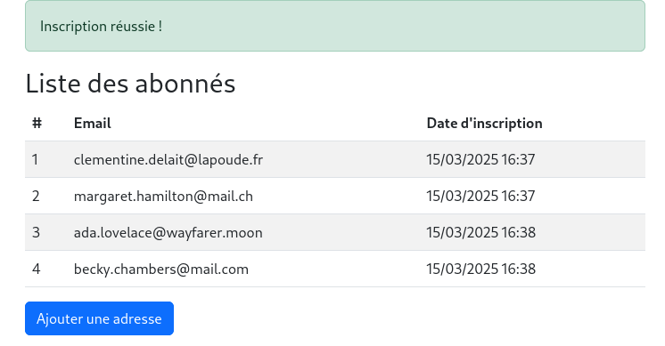

# Support de cours - Bases de données avec Laravel

Aujourd'hui, nous allons aborder le thème des bases de données avec Laravel, en
utilisant SQLite comme exemple pratique.

## Table des matières

- [Table des matières](#table-des-matières)
- [Objectifs](#objectifs)
- [Résultat](#résultat)
- [Présentation complète de SQLite](#présentation-complète-de-sqlite)
- [Présentation de l'ORM (Eloquent)](#présentation-de-lorm-eloquent)
- [Scénario](#scénario)
- [Votre projet Laravel](#votre-projet-laravel)
- [Création du modèle Newsletter et de la migration](#création-du-modèle-newsletter-et-de-la-migration)
	- [Qu'est-ce que le "Mass Assignment" ?](#quest-ce-que-le-mass-assignment-)
- [Formulaire pour la newsletter](#formulaire-pour-la-newsletter)
- [Validation des données](#validation-des-données)
- [Contrôleur NewsletterController](#contrôleur-newslettercontroller)
- [Routes](#routes)
- [Vérifier les données](#vérifier-les-données)
- [Ressources complémentaires](#ressources-complémentaires)

## Objectifs

À l'issue de ce cours, les personnes qui étudient devraient être capables de :

- Lister les étapes nécessaires pour intégrer SQLite avec Laravel.
- Décrire comment configurer Laravel pour utiliser une base de données SQLite.
- Identifier les étapes de création et d'utilisation des migrations Laravel.
- Appliquer le modèle Eloquent pour manipuler simplement une base de données.
- Énumérer les étapes pour créer, valider et traiter un formulaire.
- Vérifier les données avec l'outil DB Browser for SQLite.

## Résultat

Vous pouvez trouver le code source complet de ce support de cours dans le dépôt
GitHub suivant
<https://github.com/heig-vd-devprodmed-course/05-database-support-de-cours>

## Présentation complète de SQLite

[SQLite](https://www.sqlite.org/index.html) est une bibliothèque logicielle
écrite en langage C, qui propose un moteur de base de données relationnelle
accessible via le langage SQL. SQlite est un SGBD (Système de Gestion de Bases
de Données).

Contrairement aux serveurs classiques comme MySQL ou PostgreSQL, SQLite
n'utilise pas un schéma client-serveur mais est directement intégrée aux
applications qui l'utilisent. La totalité de la base de données est stockée dans
un fichier indépendant, compatible avec toutes les plateformes.

Son auteur, D. Richard Hipp, a placé SQLite dans le domaine public, ce qui
permet une utilisation libre sans aucune restriction, aussi bien pour des
projets open-source que des projets commerciaux.

SQLite est extrêmement populaire grâce à son intégration dans de nombreux
logiciels grand public (Firefox, Skype, applications Apple et Android, etc.) et
est particulièrement adaptée aux systèmes embarqués et applications mobiles du
fait de sa légèreté (moins de 600 Ko).

Points clés :

- **Léger** (moins de 600 Ko)
- **Intégré** directement dans les applications
- **Stockage** dans un seul fichier
- **Très utilisé** (Firefox, Chrome, iOS, Android, etc.)

## Présentation de l'ORM (Eloquent)

Un **ORM (Object-Relational Mapping)** est un outil de programmation qui permet
de manipuler une base de données relationnelle à travers une représentation en
objets.

Autrement dit, un ORM permet aux développeurs d'interagir avec une base de
données sans écrire directement du code SQL. Les interactions (comme créer,
lire, modifier, ou supprimer des données) se font via des objets et des méthodes
en langage de programmation orienté objet, ce qui facilite la gestion des
données et la maintenance du code.

Dans Laravel, l'ORM utilisé est appelé **Eloquent**. Il offre une syntaxe simple
et intuitive pour manipuler les données de la base. Chaque table de la base de
données est représentée par une classe (modèle) et chaque ligne de la table
devient une instance de cette classe.

**Exemple sans ORM (SQL direct) :**

```sql
INSERT INTO newsletters (email) VALUES ('exemple@exemple.com');
```

Avec Eloquent :

```php
// Avec le modèle Email (Eloquent)
Newsletter::create(['email' => 'exemple@exemple.com']);
```

La deuxième version est beaucoup plus simple à lire, à maintenir, et évite les
erreurs SQL courantes.

Documentation officielle :
[Laravel Eloquent ORM](https://laravel.com/docs/eloquent)

## Scénario

Nous allons permettre à une personne de s'inscrire à une newsletter. Une
personne saisira son email via un formulaire, que Laravel enregistrera ensuite
dans une base SQLite.

## Votre projet Laravel

> Vous n'avez pas besoin de créer un nouveau projet si vous avez déjà suivi les
> cours précédents. Vous pouvez continuer avec le projet existant.

Créons une nouvelle application `Laravel` à l'aide de la commande :

```bash
# Terminal (dans le dossier de votre choix)
laravel new cours-5-database --database=sqlite --pest --no-interaction
```

- `--database=sqlite` : Utilise SQLite comme base de données par défaut
- `--pest` : Utilise le framework de test Pest
- `--no-interaction` : Évite les questions interactives et utilise les valeurs
  par défaut

Utiliser les options dans une commande nous permet de gagner du temps et
d'éviter les questions répétitives.

Si vous voulez plus d'information sur les options disponibles, tapez :

```bash
# Terminal
laravel new --help
```

Initialiser votre projet avec l'option `--database=sqlite` vous permet de
commencer à travailler directement avec SQLite sans avoir à modifier la
configuration de Laravel.

Un fichier `database.sqlite` sera créé dans le dossier `database` de votre
projet.

```bash
database/
    factories/
	migrations/
	seeders/
	database.sqlite
	.gitignore
```

Vérifiez que l'extension `pdo_sqlite` est activée dans votre fichier `php.ini` :

```
extension=pdo_sqlite
extension=sqlite3
```

Aussi, remarquez le fichier `.env` qui contient la configuration de votre
application Laravel :

```env
DB_CONNECTION=sqlite
# DB_HOST=127.0.0.1
# DB_PORT=3306
# DB_DATABASE=laravel
# DB_USERNAME=root
# DB_PASSWORD=
```

Nous pouvons voir que la connexion à la base de données est configurée pour
SQLite.

## Création du modèle Newsletter et de la migration

Créez un modèle `Newsletter` et une migration pour la table `newsletters` :

```bash
# Terminal (dans le dossier racine de votre projet)
php artisan make:model Newsletter --migration --controller
```

La commande ci-dessus crée un modèle `Newsletter` dans le dossier `app/Models`,
une migration dans le dossier `database/migrations` et un contrôleur
`NewsletterController` dans le dossier `app/Http/Controllers`.

```bash
app/
    Http/
		Controllers/
		    NewsletterController.php
	Models/
	    Newsletter.php
		User.php
database/
	migrations/
	    ...
		aaaa_mm_jj_hhmmss_create_newsletters_table.php
```

Modifier le fichier du modèle `Newsletter` :

```php
<?php

namespace App\Models;

use Illuminate\Database\Eloquent\Model;

class Newsletter extends Model
{
	/**
	 * Les attributs qui sont assignables en masse.
	 *
	 * @var list<string>
	 */
	protected $fillable = ['email'];
}
```

Modifier le fichier de migration `create_newsletters_table` :

Ajoutez le champ `email` à la table `newsletters` :

```php
// database/migrations/aaaa_mm_jj_hhmmss_create_newsletters_table.php
use Illuminate\Database\Migrations\Migration;
use Illuminate\Database\Schema\Blueprint;
use Illuminate\Support\Facades\Schema;

return new class extends Migration {
	/**
	 * Run the migrations.
	 */
	public function up()
	{
		Schema::create('newsletters', function (Blueprint $table) {
			$table->id();
			$table->string('email')->unique();
			$table->timestamps();
		});
	}

	/**
	 * Reverse the migrations.
	 */
	public function down(): void
	{
		Schema::dropIfExists('newsletters');
	}
};
```

- La méthode `up()` crée la table `newsletters` avec les champs `id`, `email` et
  `timestamps`.
- La méthode `down()` supprime la table `newsletters`. Elle est utilisée pour
  annuler la migration. Très utile en cas d'erreur ou dans le cadre de tests.

Lancez la migration :

```bash
# Terminal (dans le dossier racine de votre projet)
php artisan migrate
```

### Qu'est-ce que le "Mass Assignment" ?

En Laravel (et plus généralement en programmation), **le mass assignment** (ou
"assignation de masse") est une fonctionnalité qui permet d'attribuer plusieurs
valeurs à un modèle en une seule commande.

**Pourquoi est-ce utile ?**

Imaginons que nous ayons un modèle `User` avec les champs suivants :

- `name`
- `email`
- `password`
- `is_admin` (pour savoir si c'est un·e administrateur·rice)

Au lieu d'assigner chaque valeur une par une comme ceci :

```php
$user = new User();
$user->name = 'Alice';
$user->email = 'alice@example.com';
$user->password = bcrypt('secret');
$user->save();
```

On peut utiliser **l'assignation de masse** avec la méthode `create()` :

```php
User::create([
	'name' => 'Alice',
	'email' => 'alice@example.com',
	'password' => bcrypt('secret'),
]);
```

Cela rend le code plus **court, lisible et efficace**.

**Le problème de sécurité du "Mass Assignment"**

Le problème, c'est que si on ne définit pas **précisément** quels champs sont
modifiables en masse, un·e attaquant·e pourrait envoyer des données
malveillantes.

**Exemple d'attaque**

Un·e pirate pourrait envoyer une requête HTTP contenant un champ supplémentaire
:

```json
{
	"name": "Alice",
	"email": "alice@example.com",
	"password": "secret",
	"is_admin": true
}
```

Si Laravel accepte ce champ et l'enregistre, la personne devient administratrice
!

**Comment se protéger ?**

Laravel propose une **protection intégrée** grâce à la propriété `$fillable`.
Elle permet de lister **uniquement** les champs autorisés à être remplis via
l'assignation de masse.

**Exemple de protection avec `$fillable`**

Dans notre modèle `User` (`app/Models/User.php`), on définit :

```php
class User extends Model
{
	protected $fillable = ['name', 'email', 'password'];
}
```

Avec cette configuration, si quelqu'un essaie d'envoyer `is_admin`, Laravel
**ignorera** ce champ.

## Formulaire pour la newsletter

Créez un template Blade nommé `template.blade.php` :

```bash
# Terminal (dans le dossier racine de votre projet)
php artisan make:view template
```

```php
<!-- resources/views/template.blade.php -->
<!DOCTYPE html>
<html lang="fr">
	<head>
		<meta charset="UTF-8" />
		<title>@yield('titre')</title>
		<link
			rel="stylesheet"
			href="https://cdn.jsdelivr.net/npm/bootstrap@5.3.0/dist/css/bootstrap.min.css"
		/>
	</head>
	<body>
		<div class="container">@yield('contenu')</div>
	</body>
</html>
```

Créez la vue pour le formulaire d'inscription :

```bash
# Terminal (dans le dossier racine de votre projet)
php artisan make:view newsletters.create
```

> [!TIP]
>
> C'est bien d'organiser vos vues dans des dossiers pour mieux les retrouver.
> Ici, nous avons créé un dossier `newsletters` pour y stocker les vues liées à
> la newsletter.

```php
<!-- resources/views/newsletters/create.blade.php -->
@extends('template')

@section('titre')
	Inscription Newsletter
@endsection

@section('contenu')
	<form method="POST" action="{{ url('newsletters') }}">
		@csrf
		<input
			name="email"
			type="email"
			placeholder="Votre email"
			value="{{ old('email') }}"
			required
		/>
		@error('email')
			<div class="text-danger">{{ $message }}</div>
		@enderror

		<button type="submit">Envoyer</button>
	</form>
@endsection
```

- La directive `old('email')` permet de conserver la valeur saisie par
  l'utilisateur en cas d'erreur.
- La directive `@error('email')` affiche un message d'erreur si le champ `email`
  n'est pas valide.

Créez une vue pour afficher toutes les inscriptions à la newsletter :

```bash
# Terminal (dans le dossier racine de votre projet)
php artisan make:view newsletters.index
```

```php
<!-- resources/views/newsletters/index.blade.php -->
@extends('template')

@section('titre')
	Liste des inscriptions à la newsletter
@endsection

@section('contenu')
	@if (session('success'))
		<div class="alert alert-success">
			{{ session('success') }}
		</div>
	@endif

	<h2>Liste des abonnés</h2>

	<table class="table table-striped">
		<thead>
			<tr>
				<th>N°</th>
				<th>Email</th>
				<th>Date d&apos;inscription</th>
			</tr>
		</thead>
		<tbody>
			@foreach ($newsletters as $newsletter)
				<tr>
					<td>{{ $loop->iteration }}</td>
					<td>{{ $newsletter->email }}</td>
					<td>{{ $newsletter->created_at->format('d/m/Y H:i') }}</td>
				</tr>
			@endforeach
		</tbody>
	</table>

	<a href="{{ route('newsletters.createView') }}" class="btn btn-primary">
		Ajouter une adresse
	</a>
@endsection
```

- `&apos;` est le code HTML pour l'apostrophe `'`.
- `@if (session('success'))` affiche un message de succès si l'inscription a
  réussi.
- `@foreach ($newsletters as $newsletter)` parcourt la liste des inscriptions à
  la newsletter.

## Validation des données

Créez une classe `NewsletterRequest` pour valider les données :

```bash
# Terminal (dans le dossier racine du projet)
php artisan make:request NewsletterRequest
```

Modifiez le fichier `NewsletterRequest` pour valider les données :

```php
// app/Http/Requests/NewsletterRequest.php
public function authorize(): bool {
	return true;
}

public function rules(): array {
	return ['email' => 'required|email|unique:newsletters'];
}
```

## Contrôleur NewsletterController

Modifiez le contrôleur `NewsletterController` pour traiter les données :

```php
// app/Http/Controllers/NewsletterController.php
<?php namespace App\Http\Controllers;

use App\Models\Newsletter;
use App\Http\Requests\NewsletterRequest;

class NewsletterController extends Controller
{
	public function createView()
	{
		return view('newsletters.create');
	}

	public function create(NewsletterRequest $request)
	{
		Newsletter::create(['email' => $request->email]);
		return redirect()
			->route('newsletters.index')
			->with('success', 'Inscription réussie !');
	}

	// Affiche la liste des emails inscrits
	public function index()
	{
		$newsletters = Newsletter::all();
		return view('newsletters.index', compact('newsletters'));
	}
}
```

- La méthode `createView()` affiche le formulaire d'inscription.
- La méthode `create()` traite les données du formulaire. Si les données sont
  valides, elles sont enregistrées dans la base de données. Et l'utilisateur est
  redirigé vers la liste des inscriptions.
- La méthode `index()` affiche la liste des emails inscrits.

## Routes

Définissez vos routes dans `web.php` :

```php
// routes/web.php
<?php
use App\Models\Newsletter;
use Illuminate\Support\Facades\Route;

use App\Http\Controllers\NewsletterController;

Route::get('/newsletters/create', [
	NewsletterController::class,
	'createView',
])->name('newsletters.createView');
Route::post('/newsletters', [NewsletterController::class, 'create'])->name(
	'newsletters.create'
);

Route::get('/newsletters', [NewsletterController::class, 'index'])->name(
	'newsletters.index'
);

```

Il peut être utile de nommer vos routes pour les retrouver plus facilement.
Aussi, prenez l'habitude de nommer vos routes avec des noms explicites. Le
pluriel est souvent utilisé pour les noms de ressources.

Lancez votre serveur :

```bash
# Terminal (dans le dossier racine de votre projet)
php artisan serve
```

Ouvrez votre navigateur et allez à l'adresse
<http://localhost:8000/newsletters/>.

Vous devriez voir le formulaire d'inscription à la newsletter :



## Vérifier les données

Plusieurs méthodes pour vérifier les données :

- Installez [DB Browser for SQLite](https://sqlitebrowser.org/dl/) pour
  visualiser facilement le contenu de votre base `database.sqlite`.

  - Lancez l'outil
  - Ouvrez votre fichier `database.sqlite`
  - Vérifiez la présence et le contenu de la table `emails`

- Intallez l'extension `qwtel.sqlite-viewer` dans Visual Studio Code pour
  visualiser les données directement dans l'éditeur. La version gratuite est
  suffisante pour visualiser les données.

## Ressources complémentaires

- [Documentation officielle Laravel Database](https://laravel.com/docs/database)
- [Eloquent ORM - Laravel](https://laravel.com/docs/eloquent)
- [DB Browser for SQLite](https://sqlitebrowser.org/dl/)
