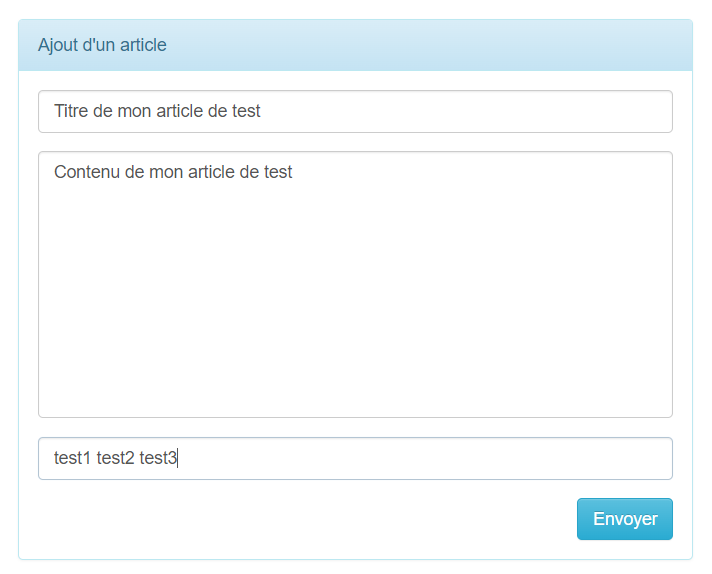
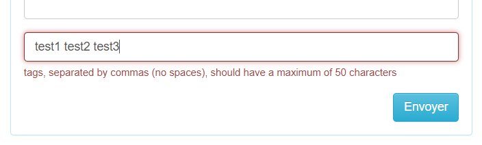

# Programme Jour 8 (Relation n:n)

## Table des matières

- [Table des matières](#table-des-matières)
- [Objectifs](#objectifs)
- [Mise à jour importante (disclaimer)](#mise-à-jour-importante-disclaimer)
- [Ajout de la colonne `admin` à la table `users`](#ajout-de-la-colonne-admin-à-la-table-users)
- [Déroulement](#déroulement)
- [Remarque importante pour le nommage de la table pivot](#remarque-importante-pour-le-nommage-de-la-table-pivot)
- [Mise en place de la relation `n:n` pour `Eloquent`](#mise-en-place-de-la-relation-nn-pour-eloquent)
- [Récapitulatif](#récapitulatif)
- [Questions fréquentes (FAQ)](#questions-fréquentes-faq)
	- [Pourquoi faut-il créer une table pivot pour une relation n:n ?](#pourquoi-faut-il-créer-une-table-pivot-pour-une-relation-nn-)
	- [Peut-on ajouter des champs dans une table pivot ?](#peut-on-ajouter-des-champs-dans-une-table-pivot-)
	- [Quelle est la différence entre `attach()`, `sync()` et `save()` ?](#quelle-est-la-différence-entre-attach-sync-et-save-)
	- [Que se passe-t-il si je ne respecte pas l’ordre alphabétique ou le singulier dans le nom de la table pivot ?](#que-se-passe-t-il-si-je-ne-respecte-pas-lordre-alphabétique-ou-le-singulier-dans-le-nom-de-la-table-pivot-)
	- [Comment tester rapidement une relation `n:n` ?](#comment-tester-rapidement-une-relation-nn-)
- [Ressources complémentaires](#ressources-complémentaires)

## Objectifs

À l'issue de ce cours, les personnes qui étudient devraient être capables de :

- Identifier les situations nécessitant une relation many-to-many.
- Appliquer les bonnes pratiques pour créer une table pivot avec Laravel.
- Définir correctement les relations `belongsToMany` dans les modèles.
- Peupler les tables liées avec des seeders.
- Attacher et détacher dynamiquement des relations dans un contrôleur.
- Valider et afficher des champs liés à une relation `n:n` dans une vue Blade.

## Mise à jour importante (disclaimer)

Une mauvaise pratique a été proposée dans le cours précédent : **la modification
directe de la migration `create_users_table` a été pratiquée**.

Ce n'est **pas une bonne pratique**, même si cela peut fonctionner localement
dans un contexte d'apprentissage.

**On ne modifie pas les anciennes migrations**, mais on crée une **nouvelle
migration** dédiée pour chaque ajout de colonne ou modification de structure.

Cela garantit :

- Une meilleure lisibilité de l’historique des modifications de la base.
- Une compatibilité avec le travail en équipe et les environnements de
  production.

Voici la section mise à jour :

## Ajout de la colonne `admin` à la table `users`

> **Rappel** : Chaque modification de structure (ajout, suppression de colonnes)
> doit se faire via une migration dédiée.

Création de la migration :

```bash
php artisan make:migration add_admin_to_users_table --table=users
```

Extrait du contenu :

```php
$table->boolean('admin')->default(false)->after('password');
```

## Déroulement

[Documentation officielle concernant toutes les relations possibles](https://laravel.com/docs/11.x/eloquent-relationships)

Lors du dernier cours nous avons appris à gérer la relation dite 1:n.
Aujourd'hui nous allons nous occuper de la relation dite `n:n` (`many to many`)
qui nécessite une table dédiée (table pivot).

La relation `n:n` consiste à avoir :

- un enregistrement d'une table T1 pouvant être en relation avec plusieurs
  enregistrements d'une table T2

- un enregistrement d'une table T2 pouvant être en relation avec plusieurs
  enregistrements d'une table T1

Nous allons poursuivre l'exemple du cours précédant qui consistait à avoir des
personnes qui rédigent des articles, en ajoutant la possibilité d'ajouter des
mots-clés aux articles.

- un article peut avoir plusieurs mots-clés.
- un mot-clé peut être attaché à plusieurs articles.

C'est ce que l'on nomme une relation `n:n`

Tables mises en place lors Tables à mettre du dernier cours en place ──────────
aujourd'hui | | ──────────── | | | | | | (table pivot) | `users` `articles`
`article_motcle` `motcles`

Pour ne pas tout refaire depuis le début, nous allons dupliquer le projet
réalisé lors du dernier cours et nous ajouterons les fichiers et le code
nécessaire pour la gestion des mots-clés.

> Créons une nouvelle base de données et modifions le fichier `.env` pour que
> `Laravel` puisse s'y connecter.
>
> Dans le cas de l'utilisation de `Sqlite`, il faut :
>
> - Ouvrir le fichier `database.sqlite` avec un éditeur de texte,
> - sélectionner tout le texte et le supprimer,
> - ne pas oublier de sauver.
> - Quitter l'éditeur de texte.

Pour tester que tout est fonctionnel, que devons nous faire ?

> Voici la marche à suivre :
>
> - Créer la table `migrations` nécessaire au bon fonctionnement d'`Eloquent`.
> - Exécuter la migration des tables `users` et `articles`
> - Exécuter le peuplement de nos deux tables `users` et `articles`
> - Contrôler que nos données soient bien présentes dans les tables à l'aide de
>   `tinker`

Commençons par créer la table `migrations`:

```bash
php artisan migrate:install
```

Créons maintenant les tables `users` et `articles`

```bash
php artisan migrate
```

Passons maintenant au peuplement des tables `users` et `articles`

```bash
php artisan db:seed
```

Pour la suite, soit nous pouvons utiliser `tinker` pour vérifier que les données
sont bien présentes, soit nous pouvons utiliser un outil de gestion de base de
données.

Lançons `tinker` pour voir si nos données sont présentes :

```bash
php artisan tinker
```

Pour voir les trois premiers articles

```bash
App\Models\Article::limit(3)->get();
```

Ce qui nous retourne :

```php
= Illuminate\Database\Eloquent\Collection {#6099
    all: [
      App\Models\Article {#6101
        id: 1,
        created_at: "2017-02-06 09:17:22",
        updated_at: "2017-02-06 09:17:22",
        titre: "Titre1",
        contenu: "Contenu 1 Lorem ipsum dolor sit amet, consectetur adipiscing elit. Proin vel auctor libero, quis venenatis augue. Curabitur a pulvinar tortor, vitae condimentum libero. Cras eu massa sed lorem mattis lacinia. Vestibulum id feugiat turpis. Proin a lorem ligula.",
        user_id: 8,
      },
      App\Models\Article {#6102
        id: 2,
        created_at: "2023-12-17 09:17:22",
        updated_at: "2023-12-17 09:17:22",
        titre: "Titre2",
        contenu: "Contenu 2 Lorem ipsum dolor sit amet, consectetur adipiscing elit. Proin vel auctor libero, quis venenatis augue. Curabitur a pulvinar tortor, vitae condimentum libero. Cras eu massa sed lorem mattis lacinia. Vestibulum id feugiat turpis. Proin a lorem ligula.",
        user_id: 8,
      },
      App\Models\Article {#6103
        id: 3,
        created_at: "2023-10-12 09:17:22",
        updated_at: "2023-10-12 09:17:22",
        titre: "Titre3",
        contenu: "Contenu 3 Lorem ipsum dolor sit amet, consectetur adipiscing elit. Proin vel auctor libero, quis venenatis augue. Curabitur a pulvinar tortor, vitae condimentum libero. Cras eu massa sed lorem mattis lacinia. Vestibulum id feugiat turpis. Proin a lorem ligula.",
        user_id: 10,
      },
    ],
  }
```

Créons maintenant le fichier qui permettra la création de la table `motcles` à
l'aide de la commande :

```bash
php artisan make:migration create_motcles_table
```

Ajoutons le code nécessaire au typage et au nommage des champs :

```php
<?php

use Illuminate\Database\Migrations\Migration;
use Illuminate\Database\Schema\Blueprint;
use Illuminate\Support\Facades\Schema;

return new class extends Migration {
	/**
	 * Run the migrations.
	 */
	public function up(): void
	{
		Schema::create('motcles', function (Blueprint $table) {
			$table->increments('id');
			$table->timestamps();
			$table->string('mot', 50)->unique();
			$table->string('mot_url', 60)->unique();
		});
	}

	/**
	 * Reverse the migrations.
	 */
	public function down(): void
	{
		Schema::dropIfExists('motcles');
	}
};
```

> Remarque : Le champ mot_url permettra la recherche par mot clé (que l'on devra
> transmettre dans une url). Comme l'utilisateur peut entrer des caractères
> spéciaux (apostrophe par ex.), nous convertirons ces caractères pour qu'ils
> puissent êtres adaptés aux `urls`.

## Remarque importante pour le nommage de la table pivot

Par convention, le nom de la table pivot comprend les noms des deux tables en
relation mais au **SINGULIER** et par **ORDRE ALPHABETIQUE** !

Voici comment procéder obtenir le nom de la table pivot :

La première table est `articles`, le singulier de `articles` est `article`. La
seconde table est `motcles`, le singulier de `motcles` est `motcle` `article`
vient avant `motcle` (ordre alphabétique) donc le nom de la table pivot sera
`article_motcle`

Créons le fichier qui permettra la création de la table pivot `article_motcle` à
l'aide de la commande :

```bash
php artisan make:migration create_article_motcle_table
```

Et modifions la méthode `up()` pour obtenir le contenu suivant :

```php
<?php

use Illuminate\Database\Migrations\Migration;
use Illuminate\Database\Schema\Blueprint;
use Illuminate\Support\Facades\Schema;

return new class extends Migration {
	/**
	 * Run the migrations.
	 */
	public function up(): void
	{
		Schema::create('article_motcle', function (Blueprint $table) {
			$table->increments('id');
			$table->timestamps();
			$table->integer('article_id')->unsigned();
			$table->integer('motcle_id')->unsigned();
			$table
				->foreign('article_id')
				->references('id')
				->on('articles')
				->onDelete('restrict')
				->onUpdate('restrict');
			$table
				->foreign('motcle_id')
				->references('id')
				->on('motcles')
				->onDelete('restrict')
				->onUpdate('restrict');
		});
	}

	/**
	 * Reverse the migrations.
	 */
	public function down(): void
	{
		Schema::dropIfExists('article_motcle');
	}
};
```

Nous pouvons maintenant créer ces deux tables à l'aide de la commande :

```bash
php artisan migrate
```

```bash
2024_04_21_133851_create_motcles_table ............................................. 80.29ms DONE
2024_04_21_134041_create_article_motcle_table ....................................... 4.86ms DONE
```

Les tables (`users` et `articles`) ne sont pas impliquées par la migration (car
elles existent déjà ;-).

> Remarque : Pour ne pas obtenir d'erreurs lors de la migration, il faut que la
> création des tables soient effectués dans le bon ordre. L'ordre des migrations
> est déterminé par la date (voir le nom du fichier migration). Si l'ordre des
> migrations doit être changé, il suffit de modifier la date dans le nom des
> fichiers de migrations.

## Mise en place de la relation `n:n` pour `Eloquent`

La relation `n:n` entre les articles et les mot-clés se définit dans deux
classes `modèles`.

La classe modèle `Article.php` existe déjà (nous l'avons créee lors du dernier
cours) Il nous faut créer la nouvelle classe modèle : `Motcle.php` et ajoutons
la relation qui indique qu'un mot-clé peut être référencé par plusieurs
articles.

```php
<?php

namespace App\Models;

use Illuminate\Database\Eloquent\Factories\HasFactory;
use Illuminate\Database\Eloquent\Model;

class Motcle extends Model
{
	use HasFactory;

	protected $fillable = ['mot', 'mot_url'];

	public function articles()
	{
		return $this->belongsToMany(Article::class); // chaque mot-clé peut être référencé par
		// plusieurs articles
	}
}
```

Il nous reste encore à indiquer qu'un article peut avoir des mots-clés.

Edition le fichier `Article.php` existant et ajoutons cette relation :

```php
<?php

namespace App\Models;

use Illuminate\Database\Eloquent\Factories\HasFactory;
use Illuminate\Database\Eloquent\Model;

class Article extends Model
{
	use HasFactory;

	// sans rien indiquer de plus, Laravel rattache automatiquement
	// ce modèle à la table "articles"
	// Il cherche une table nommée comme la classe mais en rajoutant un 's'
	// => nom de la classe Article => recherche la table "articles" dans la bd

	protected $fillable = ['titre', 'contenu', 'user_id']; // pour l'assignation de masse

	// Relation 1:n entre un article et un user
	// (Définie lors du dernier cours)
	public function user()
	{
		return $this->belongsTo(User::class);
	}

	// Relation n:n entre un article et les mots-clés
	public function motcles()
	{
		return $this->belongsToMany(Motcle::class);
	}
}
```

Maintenant que les classes-modèles ont été adaptée nous pouvons passer au
peuplement des différentes tables grâce aux seeders (voir dernier cours)

Ajoutons quelques données aux tables `motcles` et `article_motcle` que nous
venons de créer.

> (De la même manière que nous avions fait lors du dernier cours pour les tables
> `users` et `articles` en utilisant les `seeders`)

Créons un fichier `MotclesTableSeeder.php` dans le répertoire
`\database\seeders` :

```bash
php artisan make:seeder MotclesTableSeeder
```

Et complétons le :

```php
<?php

namespace Database\Seeders;

use Illuminate\Database\Console\Seeds\WithoutModelEvents;
use Illuminate\Database\Seeder;
use Carbon\Carbon;
use App\Models\Motcle;

class MotclesTableSeeder extends Seeder
{
	private function randDate()
	{
		return Carbon::createFromDate(null, rand(1, 12), rand(1, 28));
	}

	/**
	 * Run the database seeds.
	 */
	public function run(): void
	{
		for ($i = 1; $i <= 20; $i++) {
			$date = $this->randDate();
			Motcle::create([
				'mot' => 'mot' . $i,
				'mot_url' => 'mot' . $i,
				'created_at' => $date,
				'updated_at' => $date,
			]);
		}
	}
}
```

Nous obtiendrons de cette manière vingt mots-clés (mot1, mot2, ..., mot20)

Créons maintenant un nouveau fichier permettant le peuplement de la table
`article_motcle` et complétons-le :

> Remarque : Attention au nom

```php
<?php

namespace Database\Seeders;

use Illuminate\Database\Console\Seeds\WithoutModelEvents;
use Illuminate\Database\Seeder;
use App\Models\Article;
use App\Models\Motcle;

class ArticleMotcleTableSeeder extends Seeder
{
	/**
	 * Run the database seeds.
	 */
	public function run(): void
	{
		for ($i = 1; $i <= 100; $i++) {
			// on dispose de 20 mots-clés
			$numbers = range(1, 20);
			shuffle($numbers);
			// on prend entre 3 et 6 mots-clés au hasard
			$n = rand(3, 6);
			for ($j = 1; $j <= $n; $j++) {
				// on récupère l'article ayant l'id = $i
				$article = Article::find($i);
				// on ajoute la relation dans la table ArticleMotcle
				$article->motcles()->attach($numbers[$j]);
				// ou
				// $motcle = Motcle::find($j);
				// $motcle->articles()->attach($i);
			}
		}
	}
}
```

Ce code ajoute aléatoirement entre 3 et 6 des 20 mots-clés aux 100 articles de
notre base de données.

> (Plus vraiment nécessaire avec `Laravel` 11) Pour s'assurer que `Laravel`
> tienne compte de tous les fichiers que nous venons de créer (mise à jour du
> fichier autoload), lançons la commande :
>
> ```bash
> composer dumpautoload
> ```

Nous avons vu lors du dernier cours qu'il fallait renseigner un fichier pour que
les peuplements de nos tables se fassent dans le bon ordre. Il s'agit du fichier
: `DatabaseSeeder.php` qui se trouve dans le même répertoire que les `seeders`
que nous venons de créer.

Editons ce fichier pour le mettre à jour :

```php
<?php

namespace Database\Seeders;

// use Illuminate\Database\Console\Seeds\WithoutModelEvents;
use Illuminate\Database\Seeder;

class DatabaseSeeder extends Seeder
{
	/**
	 * Seed the application's database.
	 */
	public function run(): void
	{
		//$this->call(UsersTableSeeder::class);              // <-----
		//$this->call(ArticlesTableSeeder::class);           // <-----
		$this->call(MotclesTableSeeder::class); // <-----
		$this->call(ArticleMotcleTableSeeder::class); // <-----
	}
}
```

> Puisque les données existent déjà dans les tables `users` et `articles`, il
> faut commenter les deux premières lignes ! (Sinon cela générerait une erreur)

Peuplons nos deux tables (`motcles` et `article_motcle`) à l'aide de la commande
:

```bash
php artisan db:seed
```

> Si pour une raison ou une autre vous aimeriez supprimer les tables dans la
> base de donnée (autre que SQLite), voici les commandes SQL nécessaires (à
> faire dans cet ordre dans votre SGBD ;-)
>
> - ```
>   drop table article_motcle;
>   ```
> - ```
>   drop table motcles;
>   ```
> - ```
>   drop table articles;
>   ```
> - ```
>   drop table users;
>   ```
> - ```
>   drop table migrations;
>   ```
>
> Si vous avez utilisé SQLite :
>
> - Il suffit de supprimer le fichier `database.sqlite` et le créer à nouveau
>   (ou vider son contenu)
>
> Remarque : Pour lancer la création des tables et leur peuplement
> simultanément, il existe la commande :
>
> ```bash
> php artisan migrate --seed
> ```

Lançons `tinker` pour contrôler que tout fonctionne :

```bash
php artisan tinker
```

Pour visualiser les trois premiers mots-clés :

```bash
App\Models\MotCle::limit(3)->get()
```

Qui nous retourne :

```php
= Illuminate\Database\Eloquent\Collection {#6073
    all: [
      App\Models\Motcle {#6086
        id: 1,
        created_at: "2024-10-10 14:20:12",
        updated_at: "2024-10-10 14:20:12",
        mot: "mot1",
        mot_url: "mot1",
      },
      App\Models\Motcle {#6085
        id: 2,
        created_at: "2024-08-10 14:20:12",
        updated_at: "2024-08-10 14:20:12",
        mot: "mot2",
        mot_url: "mot2",
      },
      App\Models\Motcle {#6084
        id: 3,
        created_at: "2024-07-06 14:20:12",
        updated_at: "2024-07-06 14:20:12",
        mot: "mot3",
        mot_url: "mot3",
      },
    ],
  }
```

Pour contrôler que notre relation `n:n` fonctionne bien, nous allons tout
d'abord demander la liste des mots-clés de l'article ayant l'identifiant : 1

```bash
App\Models\Article::findOrFail(1)->motcles()->get()
```

```php
= Illuminate\Database\Eloquent\Collection {#6105
    all: [
      App\Models\Motcle {#6082
        id: 1,
        created_at: "2024-10-10 14:20:12",
        updated_at: "2024-10-10 14:20:12",
        mot: "mot1",
        mot_url: "mot1",
        pivot: Illuminate\Database\Eloquent\Relations\Pivot {#6112
          article_id: 1,
          motcle_id: 1,
        },
      },
      App\Models\Motcle {#6093
        id: 2,
        created_at: "2024-08-10 14:20:12",
        updated_at: "2024-08-10 14:20:12",
        mot: "mot2",
        mot_url: "mot2",
        pivot: Illuminate\Database\Eloquent\Relations\Pivot {#6076
          article_id: 1,
          motcle_id: 2,
        },
      },
      App\Models\Motcle {#6089
        id: 3,
        created_at: "2024-07-06 14:20:12",
        updated_at: "2024-07-06 14:20:12",
        mot: "mot3",
        mot_url: "mot3",
        pivot: Illuminate\Database\Eloquent\Relations\Pivot {#6111
          article_id: 1,
          motcle_id: 3,
        },
      },
      App\Models\Motcle {#6091
        id: 4,
        created_at: "2024-04-22 14:20:12",
        updated_at: "2024-04-22 14:20:12",
        mot: "mot4",
        mot_url: "mot4",
        pivot: Illuminate\Database\Eloquent\Relations\Pivot {#6096
          article_id: 1,
          motcle_id: 4,
        },
      },
      App\Models\Motcle {#6088
        id: 5,
        created_at: "2024-08-21 14:20:12",
        updated_at: "2024-08-21 14:20:12",
        mot: "mot5",
        mot_url: "mot5",
        pivot: Illuminate\Database\Eloquent\Relations\Pivot {#6113
          article_id: 1,
          motcle_id: 5,
        },
      },
      App\Models\Motcle {#6090
        id: 6,
        created_at: "2024-11-10 14:20:12",
        updated_at: "2024-11-10 14:20:12",
        mot: "mot6",
        mot_url: "mot6",
        pivot: Illuminate\Database\Eloquent\Relations\Pivot {#6114
          article_id: 1,
          motcle_id: 6,
        },
      },
    ],
  }
```

Testons maintenant que la relation fonctionne aussi dans l'autre sens. Nous
allons demander la liste des trois premiers articles contenant le mot-clé ayant
l'identifiant : 1

```bash
App\Models\Motcle::findOrFail(1)->articles()->limit(3)->get()
```

```php
= Illuminate\Database\Eloquent\Collection {#6124
    all: [
      App\Models\Article {#6241
        id: 1,
        created_at: "2018-12-11 14:20:12",
        updated_at: "2018-12-11 14:20:12",
        titre: "Titre1",
        contenu: "Contenu 1 Lorem ipsum dolor sit amet, consectetur adipiscing elit. Proin vel auctor libero, quis venenatis augue. Curabitur a pulvinar tortor, vitae condimentum libero. Cras eu massa sed lorem mattis lacinia. Vestibulum id feugiat turpis. Proin a lorem ligula.",
        user_id: 7,
        pivot: Illuminate\Database\Eloquent\Relations\Pivot {#6119
          motcle_id: 1,
          article_id: 1,
        },
      },
      App\Models\Article {#6240
        id: 2,
        created_at: "2021-04-13 14:20:12",
        updated_at: "2021-04-13 14:20:12",
        titre: "Titre2",
        contenu: "Contenu 2 Lorem ipsum dolor sit amet, consectetur adipiscing elit. Proin vel auctor libero, quis venenatis augue. Curabitur a pulvinar tortor, vitae condimentum libero. Cras eu massa sed lorem mattis lacinia. Vestibulum id feugiat turpis. Proin a lorem ligula.",
        user_id: 6,
        pivot: Illuminate\Database\Eloquent\Relations\Pivot {#6117
          motcle_id: 1,
          article_id: 2,
        },
      },
      App\Models\Article {#6242
        id: 3,
        created_at: "2021-05-21 14:20:12",
        updated_at: "2021-05-21 14:20:12",
        titre: "Titre3",
        contenu: "Contenu 3 Lorem ipsum dolor sit amet, consectetur adipiscing elit. Proin vel auctor libero, quis venenatis augue. Curabitur a pulvinar tortor, vitae condimentum libero. Cras eu massa sed lorem mattis lacinia. Vestibulum id feugiat turpis. Proin a lorem ligula.",
        user_id: 1,
        pivot: Illuminate\Database\Eloquent\Relations\Pivot {#6118
          motcle_id: 1,
          article_id: 3,
        },
      },
    ],
  }
```

Maintenant que tout fonctionne au niveau des données, nous pouvons peaufiner
l'interface utilisateur de notre application et ajouter la gestion des
mots-clés.

Les mots-clés vont être entrés dans un champ texte et devront être séparés par
des virgules (pas d'espaces entre les mots-clés). Malgré le grand nombre de
validations offertes par défaut, Laravel ne dispose pas d'une telle règle. Nous
allons donc créer une règle de validation personnalisée pour ce cas.

Editons le fichier `ArticleRequest.php` que nous avions créé lors du dernier
cours et ajoutons notre nouvelle règle à l'aide d'une expression régulière :

```php
<?php

namespace App\Http\Requests;

use Illuminate\Foundation\Http\FormRequest;

class ArticleRequest extends FormRequest
{
	/**
	 * Determine if the user is authorized to make this request.
	 */
	public function authorize(): bool
	{
		return true;
	}

	/**
	 * Get the validation rules that apply to the request.
	 *
	 * @return array<string, \Illuminate\Contracts\Validation\ValidationRule|array<mixed>|string>
	 */
	public function rules(): array
	{
		return [
			'titre' => 'required|max:80',
			'contenu' => 'required',
			// ajout de l'expression régulière de validation des mots-clés
			'motcles' => ['regex:/^[\pL0-9_-]+(,[\pL0-9_-]+)*$/u'],
		];
	}
}
```

Il nous faut aussi personnaliser le message d'erreur correspondant dans le
fichier
`laravel\vendor\laravel\framework\src\Illuminate\Translation\lang\en\validation.php`
Aux alentours de la ligne 173, nous trouvons les lignes suivantes :

```php
'custom' => [
     'attribute-name' => [
         'rule-name' => 'custom-message',
     ]
],
```

Cette section nous permet d'ajouter des message personnalisés. Modifions cette
section de la manière suivante :

```php
'custom' => [
        'motcles' => [
            'regex' => 'tags, separated by commas (no spaces), should have a maximum of 50 characters',
        ],
    ],
```

Nous pouvons maintenant passer à la modification de notre contrôleur :

Voici son contenu tel que nous l'avons laissé lors du dernier cours (sans la
gestion des mot-clés) :

```php
<?php

namespace App\Http\Controllers;

use App\Http\Requests\ArticleRequest;
use App\Models\Article;
use Illuminate\Routing\Controllers\HasMiddleware;
use Illuminate\Routing\Controllers\Middleware;

class ArticleController extends Controller implements HasMiddleware
{
	protected $nbArticlesParPage = 4;

	public static function middleware(): array
	{
		return [
			new Middleware('auth', except: ['index']),
			new Middleware('admin', only: ['destroy']),
		];
	}

	public function index()
	{
		$articles = Article::with('user')
			->orderBy('articles.created_at', 'desc')
			->paginate($this->nbArticlesParPage);
		$links = $articles->render();
		return view('view_articles', compact('articles', 'links'));
	}

	/**
	 * Show the form for creating a new resource.
	 */
	public function create()
	{
		return view('view_ajoute_article');
	}

	/**
	 * Store a newly created resource in storage.
	 */
	public function store(ArticleRequest $request)
	{
		$inputs = array_merge($request->all(), ['user_id' => $request->user()->id]);
		Article::create($inputs);
		return redirect(route('articles.index'));
	}

	/**
	 * Remove the specified resource from storage.
	 */
	public function destroy($id)
	{
		Article::findOrFail($id)->delete();
		return redirect()->back();
	}
}
```

Adaptons le code pour que celui-ci prenne en compte la gestion des mots-clés :

```php
<?php

namespace App\Http\Controllers;

use App\Http\Requests\ArticleRequest;
use App\Models\Article;
use App\Models\Motcle;
use Illuminate\Support\Str;
use Illuminate\Routing\Controllers\HasMiddleware;
use Illuminate\Routing\Controllers\Middleware;

class ArticleController extends Controller implements HasMiddleware
{
	protected $nbArticlesParPage = 4;

	public static function middleware(): array
	{
		return [
			new Middleware('auth', except: ['index']),
			new Middleware('admin', only: ['destroy']),
		];
	}

	public function index()
	{
		$articles = Article::with('user')
			->orderBy('articles.created_at', 'desc')
			->paginate($this->nbArticlesParPage);
		$links = $articles->render();
		return view('view_articles', compact('articles', 'links'));
	}

	/**
	 * Show the form for creating a new resource.
	 */
	public function create()
	{
		return view('view_ajoute_article');
	}

	/**
	 * Store a newly created resource in storage.
	 */
	public function store(ArticleRequest $request)
	{
		$inputs = array_merge($request->all(), ['user_id' => $request->user()->id]);
		$article = Article::create($inputs);
		if (isset($inputs['motcles'])) {
			$tabMotcles = explode(',', $inputs['motcles']);
			foreach ($tabMotcles as $motcle) {
				// trim(...) enlève les espaces superflux en début et en fin de chaîne
				$motcle = trim($motcle);
				// Str::slug génère une nouvelle chaîne similaire à $motcle mais adaptée aus URLs
				// adaptation des caractères accentués et/ou caractères spéciaux
				$mot_url = Str::slug($motcle);
				$mot_ref = Motcle::where('mot_url', $mot_url)->first();
				if (is_null($mot_ref)) {
					$mot_ref = new Motcle([
						'mot' => $motcle,
						'mot_url' => $mot_url,
					]);
					$article->motcles()->save($mot_ref);
				} else {
					$article->motcles()->attach($mot_ref->id);
				}
			}
		}
		return redirect(route('articles.index'));
	}

	/**
	 * Remove the specified resource from storage.
	 */
	public function destroy($id)
	{
		$article = Article::findOrFail($id);
		$article->motcles()->detach();
		$article->delete();
		return redirect()->back();
	}

	public function articlesAyantMotcle($motcle)
	{
		$articles = Article::with('user', 'motcles')
			->orderBy('articles.created_at', 'desc')
			->whereRelation('motcles', 'mot_url', $motcle)
			// Il existe pleins de possibilités :-)
			// ->whereRelation('motcles', 'mot_url', 'like', '%'.$motcle.'%')
			// ->whereRelation('reviews', 'stars', '>=', 3)
			->paginate($this->nbArticlesParPage);
		$links = $articles->render();
		return view('view_articles', compact('articles', 'links'))->with(
			'info',
			'Résultats pour la recherche du mot-clé : ' . $motcle
		);
	}
}
```

> Remarque : C'est dans la méthode `store(...)` du contrôleur qu'on attache
> le/les mot-clés à un article; grâce à l'instruction :
>
> ```php
> ...
> $article->motcles()->attach($mot_ref->id);
> ...
> ```
>
> (Exactement comme on a fait dans le seeder : `ArticleMotcleTableSeeder.php`)
>
> C'est dans la méthode `destroy(...)` du contrôleur qu'on supprime les
> relations de la table pivot avant la destruction d'un article; grâce à
> l'instruction :
>
> ```php
> ...
> $article->motcles()->detach();
> ...
> ```

Comme nous avons ajouté une méthode `articlesAyantMotcle(...)` permettant la
recherche des articles qui comportent le mot-clé passé en paramètre, il faut
ajouter une nouvelle route dans le fichier `web.php`

```bash
Route::get('articles/motcle/{motcle}', [ArticleController::class, 'articlesAyantMotcle']);
```

Nous pouvons passer à la mise à jour de la vue permettant l'affichage des
articles. Il faut ajouter l'implémentation de l'affichage des mots-clés de
chaque article. (La seule chose à modifier est la balise `<header>...</header>`
de la section `@section('contenu')` `\resources\views\view_articles.blade.php`

```php
@extends('template')

@section('header')
@if(Auth::check())
<div class="btn-group pull-right">
    <a href="{{route('articles.create')}}" class="btn btn-info">Cr&eacute;er un article</a>
    <a href="{{url("logout")}}" class="btn btn-warning">Deconnexion</a>
</div>
@else
<a href="{{url("login")}}" class="btn btn-info pull-right">Se connecter</a>
@endif
@endsection

@section('contenu')
@if(isset($info))
<div class='row alert alert-info'> {{$info}}</div>
@endif
{!!$links!!}
@foreach($articles as $article)
<article class="row bg-primary">
    <div class="col-md-12">
        <header>
            <h1>{{$article->titre}}</h1>
            <div class="pull-right">
                @foreach($article->motcles as $motcle)
                <a href="{{url('articles/motcle', [$motcle->mot_url])}}" class="btn btn-xs btn-info">{{$motcle->mot}}</a>
                @endforeach
            </div>
        </header>
        <hr>
        <section>
            <p>{{$article->contenu}}</p>
            @if(Auth::check() and Auth::user()->admin)
            <form method="POST" action="{{route('articles.destroy', [$article->id])}}" accept-charset="UTF-8">
                @csrf
                @method('DELETE')
                <input class="btn btn-danger btn-xs" onclick="return confirm('Vraiment supprimer cet article ?')" type="submit" value="Supprimer cet article">
            </form>
            @endif
            <em class="pull-right">
                <span class="gliphicon glyphicon-pencil"></span>
                {{$article->user->name}} le {!! $article->created_at->format('d-m-Y') !!}
            </em>
        </section>
        </hr>
    </div>
</article>
<br>
@endforeach
{!! $links !!}
@endsection
```

Pour pouvoir visualiser l'effet de nos modifications, il suffit de taper l'url
suivante :

```bash
http://localhost:8000/articles
```


Yes !, les mots-clés s'affichent !

Il reste encore l'implémentation de l'ajout de mot(s)-clé(s) lors de la création
d'un nouvel article.

Ajoutons un champ texte permettant la saisie des mots-clés dans la vue existante
`\resources\views\view_ajoute_article.blade.php`

```php
@extends('template')

@section('contenu')
<BR>
<div class="col-sm-offset-3 col-sm-6">
    <div class="panel panel-info">
        <div class="panel-heading">Ajout d'un article</div>
        <div class="panel-body">
            <form method="POST" action="{{route('articles.store')}}" accept-charset="UTF-8">
            @csrf
            <div class="form-group {!! $errors->has('titre') ? 'has-error' : '' !!}">
                <input class="form-control" placeholder="Titre" name="titre" type="text">
                {!! $errors->first('titre', '<small class="help-block">:message</small>') !!}
            </div>
            <div class="form-group {!! $errors->has('contenu') ? 'has-error' : '' !!}">
                <textarea class="form-control" placeholder="Contenu" name="contenu" cols="50" rows="10"></textarea>
                {!! $errors->first('contenu', '<small class="help-block">:message</small>') !!}
            </div>
            <div class="form-group {!! $errors->has('motcles') ? 'has-error' : '' !!}">
                <input class="form-control" placeholder="Entrez les mots-clés séparés par des virgules (pas d'espaces)" name="motcles" type="text">
                {!! $errors->first('motcles', '<small class="help-block">:message</small>') !!}
            </div>
            <input class="btn btn-info pull-right" type="submit" value="Envoyer">
            </form>
        </div>
    </div>
    <a href="javascript:history.back()" class="btn btn-primary"><span class="glyphicon glyphicon-circle-arrow-left"></span>Retour</a>
</div>
@endsection
```

Nous avons terminé les adaptations de notre code.

Pour pouvoir tester les nouvelles fonctionnalités de notre application, il
suffit de s'authentifier et créer un nouvel article.






Yes ! nous avons implémenté correctement une relation n:n dans `Laravel`

## Récapitulatif

- Utilisation de `php artisan make:migration` pour chaque table.
- Création d’un modèle et déclaration explicite des relations avec
  `belongsToMany()`.
- Peuplements des tables via des seeders.
- Validation d’un champ personnalisé via regex.
- Association dynamique de données à l’aide de `attach()` et `detach()`.
- Vérification du bon fonctionnement via `php artisan tinker`.
- Affichage dynamique dans la vue avec Blade.

## Questions fréquentes (FAQ)

### Pourquoi faut-il créer une table pivot pour une relation n:n ?

Une table pivot est nécessaire pour enregistrer les associations entre deux
entités sans introduire de redondance. Elle représente la **jointure** entre
deux tables.

### Peut-on ajouter des champs dans une table pivot ?

Oui. Par exemple : `created_by`, `ordre`, `status`, etc. Dans ce cas, il faut
créer un **modèle explicite** pour la table pivot et utiliser la méthode
`withPivot(...)` dans la relation `belongsToMany()`.

### Quelle est la différence entre `attach()`, `sync()` et `save()` ?

- `attach()` : ajoute une relation (ou plusieurs) sans supprimer les existantes.
- `sync()` : remplace toutes les relations par celles fournies.
- `save()` : utilisé quand on insère un modèle via la relation (ex.
  `$article->motcles()->save($motcle)`).

### Que se passe-t-il si je ne respecte pas l’ordre alphabétique ou le singulier dans le nom de la table pivot ?

Laravel n’identifiera pas automatiquement la table pivot. Il faudra alors
utiliser la méthode `belongsToMany(...)->usingTable('nom_personnalisé')`.

### Comment tester rapidement une relation `n:n` ?

Utiliser `php artisan tinker` avec les méthodes `find()`, `motcles()` ou
`articles()` selon le modèle. Exemples :

```php
App\Models\Article::find(1)->motcles
App\Models\Motcle::find(1)->articles
```

## Ressources complémentaires

- [Laravel Eloquent Relationships (doc officielle)](https://laravel.com/docs/eloquent-relationships)
- [belongsToMany](https://laravel.com/docs/eloquent-relationships#many-to-many)
- [Laravel Migration Structure](https://laravel.com/docs/migrations)
- [Tinker documentation](https://laravel.com/docs/artisan#tinker)
- [Laravel Validation Rules](https://laravel.com/docs/validation#available-validation-rules)
