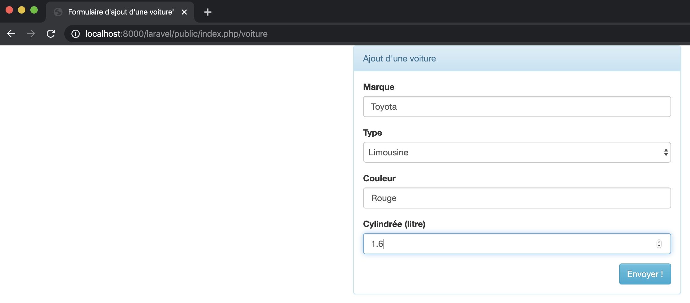

# Corrigé exercice Voiture

## Création d'un fichier texte nommé `database.sqlite`

Cette étape consiste à créer un fichier texte vide nommé `database.sqlite` dans le répertoire `laravel\database`

Une fois que ce fichier a été créé, il faut configurer le ficher `.env`

```
DB_CONNECTION=sqlite
// A EFFACER ! DB_HOST=
// A EFFACER ! DB_PORT=
// A EFFACER ! DB_DATABASE=
// A EFFACER ! DB_USERNAME=
// A EFFACER ! DB_PASSWORD=
```

Pour s'assurer que tout fonctionne, on lance la commande :

```
php artisan migrate:install
```

Ce qui crée la table `migrations` que Laravel a besoin.

## Partie Laravel

Maintenant que notre base de données est prête nous pouvons nous occuper de notre application.

### Migration

Pour pouvoir stocker les informations relatives à une voiture, il nous faut une nouvelle table dans notre base de données.

```
php artisan make:migration create_voitures_table
```

Ce qui a pour effet de créer un nouveau fichier dans le répertoire `\database\migrations` :

`2021_03_26_152254_create_voitures_table.php`

Editions maintenant ce fichier pour y mettre les informations relatives à notre table et ses champs :

```php
<?php

use Illuminate\Database\Migrations\Migration;
use Illuminate\Database\Schema\Blueprint;
use Illuminate\Support\Facades\Schema;

class CreateVoituresTable extends Migration
{
    /**
     * Run the migrations.
     *
     * @return void
     */
    public function up()
    {
        Schema::create('voitures', function (Blueprint $table) {
            $table->increments('id');
            $table->string('marque', 30);
            $table->string('type', 30);
            $table->string('couleur', 30);
            $table->decimal('cylindree', 3, 1);
        });
    }

    /**
     * Reverse the migrations.
     *
     * @return void
     */
    public function down()
    {
        Schema::dropIfExists('voitures');
    }
}

```

Pour créer la table dans notre base de données, il faut lancer la commande :

```
php artisan migrate
```

Pour voir les tables crées dans `DB Browser for SQLite`, il suffit d'ouvrir à nouveau le fichier `database.sqlite`

Passons maintenant à la `classe-modèle` pour que les commandes `Eloquent` puissent fonctionner

Rappelons-nous : Une table => une `classe-modèle`

Pour créer la `classe-modèle` : `Voiture.php`

```
php artisan make:model Voiture
```

Voilà, la classe est prête dans le répertoire `app\Models\Voiture.php`

Complétons là pour indiquer ce cette classe est en lien avec la table `voitures`

```php
<?php

namespace App\Models;

use Illuminate\Database\Eloquent\Factories\HasFactory;
use Illuminate\Database\Eloquent\Model;

class Voiture extends Model
{
    use HasFactory;
    protected $table='voitures';
    public $timestamps=false;    
}
```

Maintenant que la classe existe tout est prêt pour `Eloquent`.

Nous pouvons lancer `tinker` pour tester que tout fonctionne. :slightly_smiling_face:

```
php artisan tinker
```

```
>>> $voiture = new App\Models\Voiture
=> App\Voiture {#3014}
>>> $voiture->marque = 'Toyota';
=> "Toyota"
>>> $voiture->type = 'Limousine';
=> "Limousine"
>>> $voiture->couleur = 'Verte';
=> "verte"
>>> $voiture->cylindree = 1.2;
=> 1.2
>>> $voiture->save();
=> true
>>> 
```

`Youpee`, notre voiture a été crée.

Pour s'en rendre compte :

```
>>> App\Models\Voiture::all();
=> Illuminate\Database\Eloquent\Collection {#3502
     all: [
       App\Models\Voiture {#3504
         id: 1,
         marque: "Toyota",
         type: "Limousine",
         couleur: "Verte",
         cylindree: 1.2,
       },
     ],
   }
```

Tout est fonctionnel :thumbsup:

Pour notre formulaire nous avons besoin d'une vue et pour une vue nous avons besoin d'un `template`.

Commençons par notre `template : template.blade.php` :

```php+HTML
<!doctype html>
<html lang="fr">
    <head>
        <title>@yield('titre')</title>
       	<meta charset="UTF-8">
        <meta name="viewport" content="width=device-width, initial-scale=1.0">
        <link media="all" type="text/css" rel="stylesheet" href="https://netdna.bootstrapcdn.com/bootstrap/3.3.6/css/bootstrap.min.css">
        <link media="all" type="text/css" rel="stylesheet" href="https://netdna.bootstrapcdn.com/bootstrap/3.3.6/css/bootstrap-theme.min.css">
        <style> textarea {resize:none} </style>
    </head>
    <body>
        @yield('contenu')
    </body>
</html>
```

Puis ajoutons notre vue pour le formulaire `view_rend_formulaire_voiture.blade.php`

```php+HTML
@extends('template')

@section('titre')
Formulaire d'ajout d'une voiture'
@endsection

@section('contenu')
<div class="col-sm-offset-4 col-sm-4">
  <div class="panel panel-info">
    <div class="panel-heading">Ajout d'une voiture</div>
    <div class="panel-body">
      <form method="POST" action="{{ url('voiture') }}" accept-charset="UTF-8">
        @csrf
        <div class="form-group ">
            <label for="marque">Marque</label>
            <input class="form-control" placeholder="Marque" name="marque" type="text">
            {!! $errors->first('marque', '<small class="help-block">:message</small>') !!}
        </div>
        <div class="form-group ">
            <label for="type">Type</label>
            <select class="form-control" name="type" type="date">
              <option value="break">Break</option>
              <option value="cabriolet">Cabriolet</option>
              <option value="SUV">SUV</option>
              <option value="limousine">Limousine</option>
              <option value="pickup">Pickup</option>
            </select>
            {!! $errors->first('type', '<small class="help-block">:message</small>') !!}
        </div>
        <div class="form-group ">
            <label for="couleur">Couleur</label>
            <input class="form-control" placeholder="Couleur" name="couleur" type="text"/>
            {!! $errors->first('couleur', '<small class="help-block">:message</small>') !!}
        </div>
        <div class="form-group ">
            <label for="cylindree">Cylindrée (litre)</label>
            <input class="form-control" placeholder="Cylindree en litres" name="cylindree" type="text"/>
            {!! $errors->first('cylindree', '<small class="help-block">:message</small>') !!}
        </div>
        <input class="btn btn-info pull-right" type="submit" value="Envoyer !">
      </form>
    </div>
  </div>
<div>
@endsection
```

Il nous faut maintenant un contrôleur qui s'occupera d'aller chercher notre vue.

```
php artisan make:controller VoitureController
```

Le contrôleur est disponible dans le répertoire `app\Http\Controllers\VoitureController.php`

Ajoutons lui la méthode pour afficher notre vue :

```php
<?php

namespace App\Http\Controllers;

class VoitureController extends Controller
{
    public function rendFormulaire() {
        return view('view_rend_formulaire_voiture');
    }
}

```

Il ne reste plus qu'à faire une route pour notre contrôleur. Editons le fichier `\routes\web.php`et ajoutons la route :

```php
Route::get('voiture', [VoitureController::class,'rendFormulaire']);
```

Testons voir si cela fonctionne :




C'est pas mal !

Pour valider notre requête (valider les champs de notre formulaire), il nous faut une fichier `Request`

```
php artisan make:request VoitureRequest
```

La commande nous crée le fichier `app\Http\Requests\VoitureRequest.php` que nous pouvons compléter avec nos contraintes :

```php
<?php

namespace App\Http\Requests;

use Illuminate\Foundation\Http\FormRequest;

class VoitureRequest extends FormRequest
{
    /**
     * Determine if the user is authorized to make this request.
     *
     * @return bool
     */
    public function authorize()
    {
        return true;
    }

    /**
     * Get the validation rules that apply to the request.
     *
     * @return array
     */
    public function rules()
    {
        return [
            'marque'=>'required|min:2|max:30|alpha',
        	'type'=>'required|in:break,cabriolet,SUV,limousine,pickup',
            'couleur'=>'required|min:2|max:30|alpha',
            'cylindree'=>'required|regex:/^[0-9]+(\.[0-9]?)?$/',
        ];
    }
}

```

Nous pouvons ajouter la méthode qui permettra la validation de nos champs :

```php
<?php

namespace App\Http\Controllers;

use App\Http\Requests\VoitureRequest;
use App\Models\Voiture;

class VoitureController extends Controller
{
    public function rendFormulaire() {
        return view('view_rend_formulaire_voiture');
    }

    public function traiteFormulaire(VoitureRequest $request) {
    
        $unModeleVoiture = new Voiture;
        $unModeleVoiture->marque = $request->input('marque');
        $unModeleVoiture->type = $request->input('type');
        $unModeleVoiture->couleur = $request->input('couleur');
        $unModeleVoiture->cylindree = $request->input('cylindree');
        $unModeleVoiture->save();
    
        return view('view_confirmation_voiture');
    }
}

```

Il nous manque la vue permettant de savoir que tout s'est bien passé `view_confirmation_voiture.blade.php`

```php+HTML
@extends('template')

@section('titre')
Confirmation d'ajout d'une voiture
@endsection

@section('contenu')
    <br>
    <div class="col-sm-offset-3 col-sm-6">
        <div class="panel panel-info">
            <div class="panel-heading">Voiture ajoutée avec succès</div>
            <div class="panel-body">
                Voiture ajoutée avec succès
            </div>
        </div>
    </div>                 
@endsection
```

Il ne nous reste plus qu'à ajouter la route pour la méthode de notre contrôleur :

```
Route::post('voiture', [VoitureController::class,'traiteFormulaire']);
```

Voilà, notre application est fonctionnelle :slightly_smiling_face: